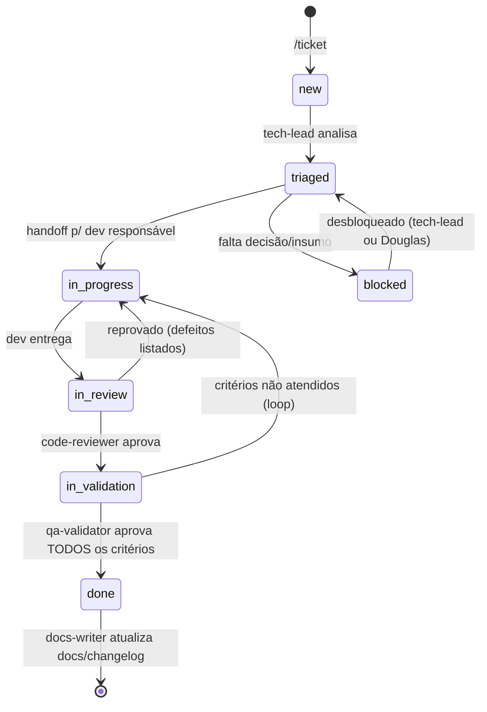

# Protocolo de Handoff e Loop de Validação

> Contrato entre agentes. Objetivo: qualquer ferramenta de IA (Claude, Copilot, Codex, Gemini, GPT) consegue pegar um ticket no meio do fluxo e saber exatamente o estado, o que falta e quem fez o quê.

## Ciclo de vida do ticket



**Regra do loop:** reprovação sempre volta para **quem produziu** o artefato, com a lista numerada de defeitos. Após **3 loops** no mesmo par, o tech-lead assume a decisão (redesenha, divide o ticket ou escala ao Douglas).

## Execução automática (sem invocação manual)

Handoff registrado = próximo agente **executa imediatamente**, no mesmo fluxo — a transição nunca fica esperando o Douglas invocar algo. O ciclo criado por `/ticket` corre sozinho (triagem → design/dev → review → QA → docs) e só para em três condições:

1. **`done`** — qa-validator aprovou todos os critérios; docs-writer é acionado se a entrega muda UI/comportamento; relatório final ao Douglas.
2. **`blocked: human-input`** — falta decisão ou insumo que só o Douglas tem; a entrada no log lista as perguntas objetivas.
3. **Escalada por 3 loops** — o tech-lead assume; se nem ele resolve, vira `blocked: human-input` com o resumo do impasse e opções.

O Douglas interage apenas nesses pontos. Invocar `/dev-loop TCK-NNNN` manualmente serve para **retomar** um ticket parado, não é pré-requisito do fluxo.

## Subagentes (delegação e paralelismo)

Todo agente pode **invocar subagentes** para não virar gargalo. O caso principal: o agente está ocupado com um ticket e chega um ticket novo da sua área — em vez de enfileirar, ele spawna uma instância de si mesmo que assume o novo ticket. Também vale para dividir trabalho pesado dentro de um mesmo ticket.

**Identidade**: a instância principal usa o nome puro (`frontend-developer`); subagentes são numerados (`frontend-developer#2`, `#3`…). A identidade completa aparece em toda entrada de log e no `owner:` do ticket — cada ticket continua tendo exatamente **um** dono (uma instância) por vez.

**Quando spawnar (e quando não):**

| Situação | Ação |
|---|---|
| Agente ocupado + ticket novo da **mesma área** | Spawnar subagente do próprio tipo; ele assume o novo ticket como dono pleno |
| Subtarefas divisíveis dentro de um ticket | Spawnar subagentes para as partes; o agente-pai consolida e responde pelo resultado |
| Apoio de leitura/pesquisa (explorar código, ler docs, buscar referência) | Subagente read-only livre — não altera artefatos, dispensa entrada de log |
| Trabalho da área de **outro** agente | **Nunca** subagente — handoff normal (o escopo exclusivo continua valendo) |

**Regras duras:**

1. Subagente **herda todas as regras** da definição do agente-pai (escopo exclusivo, convenções, log, ADRs) — é o mesmo papel em outra instância, não um papel novo.
2. Independência de validação vale **pela cadeia**: quem produziu um artefato — a instância ou qualquer subagente spawnado por ela para produzi-lo — jamais o revisa ou valida. Review e QA de um ticket vêm sempre de cadeia distinta da do autor.
3. `STOP` em um ticket para o dono **e** todos os subagentes atuando nele.
4. O limite de **3 loops** conta por ticket, independentemente de quantas instâncias participaram.
5. Dentro do próprio ticket, o agente-pai responde pelo que delegou; em ticket novo, o subagente é dono pleno e responde ao fluxo normal (handoffs, log, escalada).
6. Todo spawn que altera artefatos é registrado com a entrada `SPAWN` no log do ticket em que o subagente vai atuar; o trabalho subsequente é logado com a identidade completa (`<agente>#N`).

## Formato do spawn (append em `tickets/TCK-NNNN/log.md`)

```markdown
## [SEQ] SPAWN — AAAA-MM-DD HH:MM
- Por: <agente> (ocupado com TCK-XXXX) → Subagente: <agente>#N
- Motivo: <novo ticket com o dono ocupado | paralelizar subtarefa | apoio>
- Escopo delegado: <ticket inteiro | subtarefa específica, com limites claros>
```

O `SPAWN` não muda status — se o subagente assume um ticket, a transição de dono continua sendo uma entrada `HANDOFF` normal (com `Para: <agente>#N`).

## Memória persistente (lições e contexto)

Sessões de agente são efêmeras; **o repositório é a memória**. Para o mesmo erro nunca ser cometido duas vezes e para todo agente começar com contexto, [`agents/memory/`](memory/README.md) mantém dois artefatos:

- **[`memory/lessons.md`](memory/lessons.md)** — lições aprendidas (`L-NNN`), **append-only**: erro cometido → causa raiz → como evitar. Leitura obrigatória antes de trabalhar; escrita obrigatória ao resolver erro generalizável.
- **[`memory/context/<área>.md`](memory/context/)** — documento **vivo** por área (process, frontend, backend, devops, qa, security): pegadinhas do ambiente, estado atual, decisões operacionais em vigor. Atualizado (com data) ao final de qualquer ticket que mude esse conhecimento.

**Gatilhos de escrita de lição** (quem errou registra; reviewer/QA cobram):

1. REJECT resolvido cuja causa raiz pode se repetir — a `ACTION` que resolve o defeito **termina com a linha** `Lição: L-NNN` (ou `Lição: n/a — erro pontual`, justificado).
2. Escalada por 3 loops — o tech-lead registra a lição do impasse.
3. CI/build/deploy quebrado por comportamento não óbvio de ferramenta, ambiente ou convenção.
4. Retrabalho causado por falta de contexto que um doc teria evitado.

**Formato da lição (append em `agents/memory/lessons.md`):**

```markdown
## [L-NNN] AAAA-MM-DD — <área> — <título curto>
- Contexto: <o que se tentava fazer; ticket TCK-NNNN>
- Erro: <o que deu errado, sintoma observável>
- Causa raiz: <o porquê de verdade, não o sintoma>
- Como evitar: <regra prática e verificável para o próximo agente>
- Refs: <arquivos, commits, entradas de log>
```

**Regras:**

1. **Ler antes de trabalhar**: ao assumir um ticket, o agente lê o contexto da sua área + varre `lessons.md` pela área/palavras-chave; lição que mudou a abordagem é citada no log (`aplicada L-NNN`).
2. `lessons.md` segue a disciplina do log: append-only; lição superada = **nova** lição referenciando a antiga.
3. Lição é conhecimento **generalizável** — detalhe pontual de um ticket fica no `log.md` do ticket.
4. Contexto é vivo, mas datado; **PII jamais** (LGPD/privacidade do visitante — ver [05-analytics-privacy.md](../docs/implementation-plan/05-analytics-privacy.md)).
5. **Repetir erro que já tem lição registrada é defeito bloqueante** em review/QA; resolver REJECT sem a linha `Lição:` também é.

## Formato do handoff (append em `tickets/TCK-NNNN/log.md`)

```markdown
## [SEQ] HANDOFF — AAAA-MM-DD HH:MM
- De: <agente> → Para: <agente>
- Status novo: <triaged|in_progress|in_review|in_validation|done|blocked>
- O que foi feito: <resumo objetivo, 2–5 linhas>
- Artefatos: <arquivos tocados, commits (hash), screenshots, PRs>
- Como validar: <comandos/passos para reproduzir e conferir>
- Pendências e riscos: <o que NÃO foi feito, dívidas assumidas>
- Critérios de aceite: [x] atendidos / [ ] restantes (copiar checklist do ticket)
```

## Formato de ação (trabalho sem troca de dono)

```markdown
## [SEQ] ACTION — AAAA-MM-DD HH:MM — <agente>
- Ação: <o que fez>
- Motivo: <por quê>
- Resultado: <ok|falha + evidência (saída de teste, link, hash)>
```

## Formato de devolução (reprovação)

```markdown
## [SEQ] REJECT — AAAA-MM-DD HH:MM
- De: <validador> → Para: <autor>  · Loop nº: <n>/3
- Defeitos (numerados, cada um com evidência e critério violado):
  1. ...
  2. ...
- O que já está bom (não refazer): ...
```

## Formato de parada (STOP — decisão humana de interromper)

Registrado pelo Douglas (entrada `STOP` no `log.md` do ticket). Um ticket com `STOP` ativo fica `blocked: human-input` e **nenhum agente o continua** até um novo handoff explícito — a parada vale a partir do próximo checkpoint do agente em execução.

```markdown
## [SEQ] STOP — AAAA-MM-DD HH:MM — <quem parou>
- Ação: PARADA SOLICITADA — nenhum agente deve continuar este ticket até novo handoff
- Motivo: <por quê>
- Resultado: status alterado para blocked: human-input
```

## Regras de auditoria

1. `log.md` é **append-only** — corrigir registro errado = nova entrada `CORRECTION` referenciando o `[SEQ]` original.
2. Toda entrada tem `[SEQ]` incremental — buracos na sequência indicam ação não logada (violação).
3. Evidência > afirmação: "testes passam" exige a saída do comando; "tela pronta" exige screenshot.
4. Quem detectar erro de outro agente: registra `ACTION` com o diagnóstico e faz handoff ao tech-lead — **não** conserta silenciosamente na área do outro.
5. O log do ticket + commits com prefixo `TCK-NNNN:` formam a trilha completa de auditoria; a skill `/handoff` automatiza o formato.
