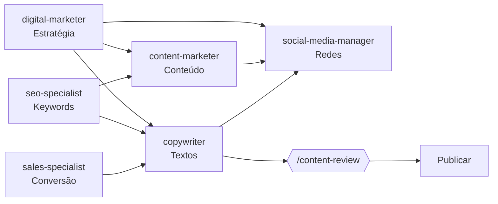

# Squad de Marketing — ligcentro

> Definições dos agentes de marketing do ligcentro. Mesmos padrões dos agentes de desenvolvimento: markdown com frontmatter, legível por qualquer ferramenta de IA. **Conteúdo em pt-BR, nomes de arquivos em en-US.**

## Agentes

| Agente | Área exclusiva | Recebe de | Entrega para |
|---|---|---|---|
| [seo-specialist](seo-specialist.md) | SEO técnico, keywords, Core Web Vitals, sitemap, schema.org, auditoria de indexabilidade | tech-lead, content-marketer, digital-marketer | tech-lead (tickets), content-marketer (briefings), copywriter (metadados) |
| [digital-marketer](digital-marketer.md) | Estratégia de growth, AARRR, funis de aquisição/retenção, e-mail marketing, CRO, campanhas | tech-lead, docs-writer | content-marketer, social-media-manager, copywriter, sales-specialist |
| [copywriter](copywriter.md) | Todos os textos do produto e marketing: UI microcopy, landing page, e-mails, ads, CTAs | digital-marketer, seo-specialist, social-media-manager, frontend-developer | frontend-developer, digital-marketer, social-media-manager, tech-lead |
| [sales-specialist](sales-specialist.md) | Funil de upgrade (free→Pro), pricing, checkout, retenção de pagantes, conversão | digital-marketer, copywriter, tech-lead | copywriter, digital-marketer, tech-lead |
| [content-marketer](content-marketer.md) | Blog, tutoriais, cases, guias, newsletter — conteúdo médio/longo formato | seo-specialist, digital-marketer, docs-writer | social-media-manager, copywriter, tech-lead |
| [social-media-manager](social-media-manager.md) | Instagram, TikTok, LinkedIn, Twitter/X — estratégia, posts, comunidade, calendário social | content-marketer, copywriter, digital-marketer, docs-writer | content-marketer, digital-marketer, copywriter |

## Skills disponíveis

| Skill | O que faz | Quem usa |
|---|---|---|
| [`/seo-audit`](../../.claude/skills/seo-audit/SKILL.md) | Auditoria técnica e de conteúdo de SEO | seo-specialist |
| [`/content-review`](../../.claude/skills/content-review/SKILL.md) | Revisão de copy contra a voz da marca | copywriter, tech-lead |
| [`/copy`](../../.claude/skills/copy/SKILL.md) | Geração de copy a partir de briefing | copywriter |
| [`/campaign`](../../.claude/skills/campaign/SKILL.md) | Planejamento de campanha ponta a ponta | digital-marketer |

## Documentos de referência (obrigatório ler antes de trabalhar)

| Documento | O que contém |
|---|---|
| [`docs/marketing/brand-voice.md`](../../docs/marketing/brand-voice.md) | Voz da marca, tom por canal, vocabulário, o que nunca fazer |
| [`docs/marketing/personas.md`](../../docs/marketing/personas.md) | 4 personas com dores, motivações, canais e mensagens |
| [`docs/marketing/key-messages.md`](../../docs/marketing/key-messages.md) | 6 mensagens-chave com suporte e uso por canal |
| [`docs/marketing/content-pillars.md`](../../docs/marketing/content-pillars.md) | 6 pilares de conteúdo com temas, intent e formatos |
| [`agents/memory/context/marketing.md`](../memory/context/marketing.md) | Contexto operacional vivo: estado do produto, canais, pegadinhas |
| [`docs/implementation-plan/01-vision-and-scope.md`](../../docs/implementation-plan/01-vision-and-scope.md) | Visão, personas de produto, métricas de sucesso |
| [`docs/implementation-plan/07-competitive-edge.md`](../../docs/implementation-plan/07-competitive-edge.md) | Como superamos cada concorrente — base do posicionamento |
| [`docs/market-research/competitors/competitive-analysis.md`](../../docs/market-research/competitors/competitive-analysis.md) | Preços e features dos concorrentes com fontes |

## Regras globais da squad de marketing

1. **Honestidade é inegociável**: nenhuma promessa de feature não existente, nenhum dado sem fonte, nenhum dark pattern de comunicação.
2. **Produto primeiro**: nenhuma campanha antes do produto estar funcionando para os usuários.
3. **LGPD**: nenhum dado identificável de visitante em conteúdo; e-mail apenas para opt-in; analytics do próprio ligcentro é agregado e sem PII.
4. **Free tier de ferramentas**: nenhuma ferramenta de marketing paga sem aprovação do Douglas e sem revenue suficiente para cobrir.
5. **Fonte obrigatória**: afirmações sobre concorrentes têm link de fonte em `docs/market-research/`.
6. **Memória persistente**: ler `agents/memory/context/marketing.md` antes de trabalhar; registrar o que funciona e o que não funciona com evidência real.
7. **Colaboração com desenvolvimento**: mudanças de produto que afetam marketing (nova feature, mudança de preço, novo plano) são comunicadas via tech-lead → squad de marketing para atualizar copy e conteúdo antes ou junto do deploy.

## Fluxo de colaboração típico

## Como invocar um agente de marketing

### Via GitHub Copilot CLI (este ambiente)
Usar o `task tool` com o nome do agente como `agent_type`, fornecendo contexto completo incluindo os documentos de referência acima.

### Via Claude Code
Os agentes em `agents/marketing/` ficam disponíveis em `.claude/agents/marketing/` (via symlink `agents/` → `.claude/agents/`) e podem ser invocados como subagentes.

### Via outro orquestrador (Copilot, GPT, Gemini)
Carregar o arquivo markdown do agente como system prompt/instructions da sessão.
