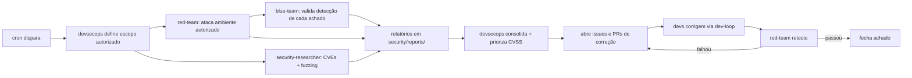

# Protocolo de Auditoria de Segurança

> Como a squad de segurança (devsecops, red-team, blue-team, security-researcher) opera em ciclos periódicos. Complementa o [handoff-protocol](../handoff-protocol.md) geral. Agendamento automatizado: workflow agendado no GitHub Actions (a cargo do [devops-engineer](../devops-engineer.md), quando o CI/CD existir).

## Cadência

| Ciclo | Frequência | Escopo | Executa |
|---|---|---|---|
| **Contínuo** | a cada PR | SAST/SCA/secret scanning no CI (bloqueante) | devsecops (automatizado) |
| **Quinzenal** | dia 1 e 15 | varredura de dependências/CVEs + smoke de segurança (headers, authn básica) | security-researcher + devsecops |
| **Mensal** | 1º dia do mês | auditoria completa: modelagem de ameaças, testes ofensivos (red), validação de detecção (blue) | red-team + blue-team + devsecops |
| **Trimestral** | por fase do roadmap | pentest aprofundado + simulação de incidente (runbook) | squad completa |

Datas relativas convertidas em cron no workflow agendado (custo baixo — GitHub Actions).

## Fluxo de um ciclo mensal

## Regras

1. **Escopo autorizado sempre**: nada contra produção com dados reais sem janela/autorização explícita ([red-team](red-team.md) regras duras). Padrão: local + preview.
2. **Todo achado** vira entrada num relatório datado em `security/reports/AAAA-MM-DD-<time>.md` **e** uma issue (label `security` + severidade CVSS: `sev:critical|high|medium|low`).
3. **Loop de correção**: achado → issue → PR (dev) → reteste (red-team) → fecha. Crítico não fechado bloqueia release ([security-workflow](security-workflow.md)).
4. **Sem PoC público** que arme atacantes antes do fix; disclosure responsável para dependências de terceiros.
5. **Trilha de auditoria**: relatórios versionados no git; issues/PRs referenciam o relatório; nada de correção silenciosa.
6. Custo baixo: CodeQL, gitleaks, Trivy, OWASP ZAP baseline, Dependabot — todas gratuitas/open source.
