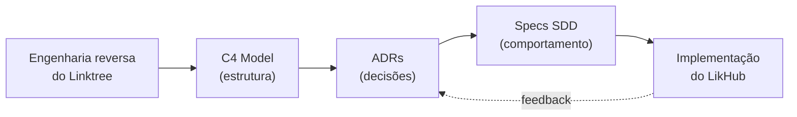

# Documentação de Arquitetura — LikHub

> **Origem deste documento**
> Este conjunto de documentos nasceu de uma **engenharia reversa do Linktree**
> (`https://linktr.ee/`), realizada via inspeção do site público, análise da stack
> tecnológica divulgada e pesquisa de material de engenharia. O objetivo é servir
> como **arquitetura de referência** para a construção do **LikHub**, um produto
> do tipo *link-in-bio* (agregador de links "na bio").
>
> As decisões documentadas aqui refletem *o que o Linktree faz e por quê*, e são a
> base a partir da qual o LikHub define suas próprias escolhas. Quando uma decisão
> se afasta do Linktree, isso é registrado explicitamente na ADR correspondente.

## Como esta documentação está organizada

Usamos três frameworks complementares. Cada um responde a uma pergunta diferente:

| Framework | Pergunta que responde | Onde está |
|-----------|----------------------|-----------|
| **C4 Model** | *Como o sistema é estruturado?* (visão estática, do contexto ao código) | [`c4/`](./c4/) |
| **ADR** (Architecture Decision Records) | *Por que decidimos assim?* (decisões e seus trade-offs) | [`adr/`](./adr/) |
| **SDD** (Spec-Driven Development) | *O que exatamente deve ser construído?* (especificações executáveis) | [`specs/`](./specs/) |

O fluxo de leitura recomendado é: **C4 (contexto) → ADR (decisões) → SPEC (o que construir)**.

## Índice

### C4 Model — estrutura do sistema
- [C1 — Diagrama de Contexto](./c4/01-context.md)
- [C2 — Diagrama de Contêineres](./c4/02-container.md)
- [C3 — Componentes: Página de Perfil Público](./c4/03-component-profile.md)
- [C3 — Componentes: Editor / Painel do Criador](./c4/04-component-editor.md)
- [C3 — Componentes: Pipeline de Analytics](./c4/05-component-analytics.md)

### ADR — decisões de arquitetura
- [ADR-0000 — Template](./adr/0000-template.md)
- [ADR-0001 — Registrar decisões de arquitetura](./adr/0001-registrar-decisoes.md)
- [ADR-0002 — React com renderização no servidor (SSR) para perfis públicos](./adr/0002-frontend-react-ssr.md)
- [ADR-0003 — Backend serverless em AWS Lambda](./adr/0003-backend-serverless-lambda.md)
- [ADR-0004 — GraphQL como camada de API](./adr/0004-api-graphql.md)
- [ADR-0005 — Persistência: PostgreSQL + DynamoDB + Elasticsearch](./adr/0005-persistencia-poliglota.md)
- [ADR-0006 — Pipeline de analytics orientado a eventos (EventBridge)](./adr/0006-pipeline-analytics-eventos.md)
- [ADR-0007 — Theming com styled-components e design tokens](./adr/0007-theming-styled-components.md)
- [ADR-0008 — Marketing desacoplado com CMS (Contentful/Webflow)](./adr/0008-marketing-cms-desacoplado.md)

### SPEC — especificações (Spec-Driven Development)
- [SPEC-000 — Workflow de Spec-Driven Development](./specs/SPEC-000-workflow-sdd.md)
- [SPEC-001 — Página de Perfil Público](./specs/SPEC-001-perfil-publico.md)
- [SPEC-002 — Gestão de Links](./specs/SPEC-002-gestao-de-links.md)
- [SPEC-003 — Aparência e Temas](./specs/SPEC-003-aparencia-e-temas.md)
- [SPEC-004 — Analytics de Visualizações e Cliques](./specs/SPEC-004-analytics.md)

## Resumo da stack observada no Linktree (engenharia reversa)

| Camada | Tecnologias identificadas |
|--------|---------------------------|
| Frontend | React, TypeScript, styled-components, Storybook, Webpack; Gatsby (sites de marketing) |
| Backend | Node.js, GraphQL, AWS Lambda (serverless); PHP (legado) |
| Dados | PostgreSQL (transacional), DynamoDB (serving de analytics in-app), Elasticsearch (busca), Snowflake (data warehouse) |
| Pipeline de dados | AWS EventBridge, Glue, S3 |
| Infra | Terraform (IaC), AWS |
| Analytics/Marketing | Google Tag Manager, Google Optimize, Contentful (CMS), Webflow, SendGrid (e-mail transacional) |
| Descoberta / SEO | SSR para perfis, `robots.txt`, sitemaps segmentados, `llms.txt`, content negotiation (`Accept: text/markdown`) |

> **Nota de confiabilidade:** a stack acima combina fatos observáveis publicamente
> (headers, comportamento do site, `llms.txt`) com tecnologias divulgadas em
> agregadores e no blog de engenharia do Linktree. Detalhes internos (nomes de
> serviços, limites, esquemas) são **inferências fundamentadas**, sinalizadas como
> tal ao longo dos documentos.
