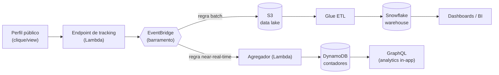

# ADR-0006 — Pipeline de analytics orientado a eventos (EventBridge)

- **Status:** Aceito
- **Data:** 2026-07-19
- **Decisores:** Time LikHub
- **Contexto técnico:** Contêiner *Analytics Pipeline* (C4-C2, detalhado em C4-C3)

## Contexto e problema

Cada visualização de perfil e cada clique em link é um evento. Em escala, isso é
um firehose de eventos. Precisamos:

- ingerir eventos sem impactar a latência da página de perfil;
- alimentar tanto os **contadores in-app** (near-real-time) quanto o **warehouse**
  (histórico para BI);
- permitir múltiplos consumidores futuros (antifraude, notificações, ML) sem
  reescrever o produtor.

## Alternativas consideradas

1. **Escrita síncrona no banco a cada clique** — simples, mas acopla a latência do
   perfil ao banco e não escala nos picos.
2. **Fila única (SQS) → worker** — desacopla, mas um único consumidor; adicionar
   novos consumidores exige mudanças no produtor.
3. **Barramento de eventos (EventBridge) com múltiplos alvos** — o produtor emite
   um evento; roteamento por regras para vários consumidores independentes.

## Decisão

Emitir eventos de domínio (`ProfileViewed`, `LinkClicked`) para um **barramento
EventBridge**. O produtor (endpoint de tracking em Lambda) responde rápido e
apenas publica. Consumidores independentes processam:

- **Serving near-real-time:** agrega e grava contadores no **DynamoDB**
  (ver [ADR-0005](./0005-persistencia-poliglota.md)).
- **Batch/BI:** eventos vão para **S3** (data lake), transformados por **Glue** e
  carregados no **Snowflake**.

## Consequências

- **Positivas:** produtor desacoplado e rápido; novos consumidores sem tocar no
  produtor; escala independente por consumidor; resiliência (retry/DLQ por alvo).
- **Negativas / custos:** consistência eventual nos contadores; complexidade
  operacional de um sistema distribuído; necessidade de idempotência.
- **Riscos e mitigação:** eventos duplicados → dedupe/idempotência por `event_id`;
  perda de eventos → DLQ + replay a partir do S3.

## Referência ao Linktree (engenharia reversa)

O blog de engenharia do Linktree descreve explicitamente o envio de eventos para
**EventBridge** ("pode ter várias fontes de entrada"), com **Glue** e **S3** no
processamento e **Snowflake** como warehouse, além de **DynamoDB** como serving
layer dos analytics in-app. Esta ADR reproduz esse desenho.
