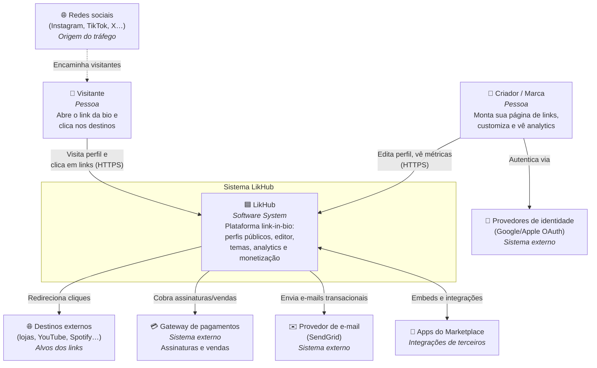

# C4 — Nível 1: Diagrama de Contexto (System Context)

> **Escopo:** o sistema LikHub visto de fora — quem o usa e com quais sistemas
> externos ele conversa. Baseado na engenharia reversa do Linktree.

## Diagrama

## Atores

| Ator | Tipo | Objetivo principal |
|------|------|--------------------|
| **Criador / Marca** | Pessoa | Centralizar seus links em uma página, personalizar a aparência, monetizar e entender a audiência via analytics. |
| **Visitante** | Pessoa | Chegar via bio de rede social e acessar rapidamente o destino desejado. |

## Sistemas externos

| Sistema | Papel | Referência (Linktree) |
|---------|-------|-----------------------|
| Redes sociais | Origem do tráfego (a URL fica "na bio") | Modelo de negócio central |
| Destinos externos | Alvos dos links (a plataforma redireciona) | Toda página de perfil |
| Gateway de pagamentos | Assinaturas (Free/Starter/Pro/Premium) e vendas | Planos observados no `llms.txt` |
| Provedor de e-mail (SendGrid) | E-mails transacionais | Confirmado na stack |
| Identidade (OAuth) | Login social do criador | Padrão de mercado |
| Apps do Marketplace | Integrações (música, monetização, crescimento) | Marketplace observado no `llms.txt` |

## Notas

- **Duas audiências, uma plataforma.** O visitante (leitura, altíssimo volume,
  anônimo) e o criador (escrita, baixo volume, autenticado) impõem requisitos
  arquiteturais opostos — o que justifica separar perfil público (SSR) do editor
  (SPA). Ver [ADR-0002](../adr/0002-frontend-react-ssr.md).
- **O clique é o evento de negócio.** Cada redirecionamento para um destino externo
  é capturado como evento e alimenta o pipeline de analytics
  ([ADR-0006](../adr/0006-pipeline-analytics-eventos.md)).
