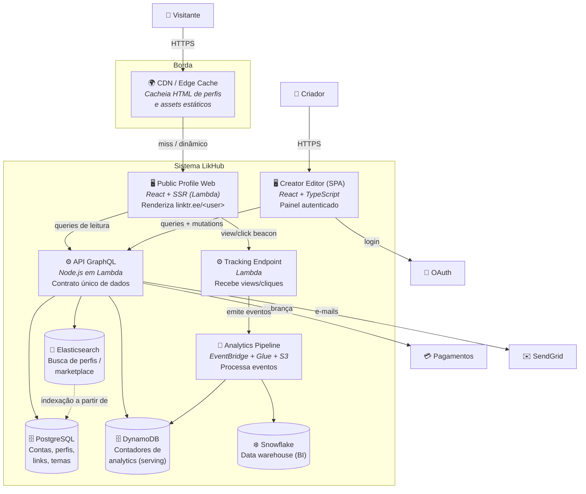

# C4 — Nível 2: Diagrama de Contêineres (Containers)

> **Escopo:** as unidades executáveis/implantáveis do LikHub e como se comunicam.
> Um "contêiner" no C4 é uma aplicação ou data store, não necessariamente Docker.

## Diagrama

## Contêineres

| Contêiner | Tecnologia | Responsabilidade | ADR |
|-----------|-----------|------------------|-----|
| **Public Profile Web** | React + SSR em Lambda | Renderiza a página pública do criador, otimizada para SEO/first-paint; hidrata tracking e tema | [0002](../adr/0002-frontend-react-ssr.md) |
| **Creator Editor (SPA)** | React + TypeScript + styled-components | Painel autenticado: edição de links, aparência, dashboard de analytics | [0002](../adr/0002-frontend-react-ssr.md), [0007](../adr/0007-theming-styled-components.md) |
| **API GraphQL** | Node.js em Lambda | Contrato único de dados para todos os clientes; resolvers falam com os stores | [0003](../adr/0003-backend-serverless-lambda.md), [0004](../adr/0004-api-graphql.md) |
| **Tracking Endpoint** | Lambda | Ingestão de baixa latência de views/cliques; só publica eventos | [0006](../adr/0006-pipeline-analytics-eventos.md) |
| **Analytics Pipeline** | EventBridge + Glue + S3 | Roteia e transforma eventos para serving e warehouse | [0006](../adr/0006-pipeline-analytics-eventos.md) |
| **PostgreSQL** | RDS | Fonte da verdade transacional (contas, perfis, links, temas, planos) | [0005](../adr/0005-persistencia-poliglota.md) |
| **DynamoDB** | DynamoDB | Serving near-real-time de contadores de analytics | [0005](../adr/0005-persistencia-poliglota.md), [0006](../adr/0006-pipeline-analytics-eventos.md) |
| **Elasticsearch** | Elasticsearch | Busca full-text de perfis e do marketplace | [0005](../adr/0005-persistencia-poliglota.md) |
| **Snowflake** | Snowflake | Data warehouse para BI e relatórios históricos | [0005](../adr/0005-persistencia-poliglota.md) |
| **CDN / Edge** | CDN | Cache de HTML de perfis por `username`+versão e de assets | [0002](../adr/0002-frontend-react-ssr.md) |

## Fluxos-chave

1. **Visita a perfil (leitura, altíssimo volume):**
   `Visitante → CDN → (miss) Public Profile Web → API GraphQL → PostgreSQL/DynamoDB`.
   A maioria das visitas é servida direto pela CDN.

2. **Clique em link (evento de negócio):**
   `Visitante → Tracking Endpoint → EventBridge → {DynamoDB (contador), S3→Glue→Snowflake}`.
   O redirecionamento ao destino é imediato; o processamento é assíncrono.

3. **Edição de perfil (escrita, baixo volume):**
   `Criador → Editor SPA → API GraphQL (mutation) → PostgreSQL`, seguido de
   **invalidação de cache** do perfil na CDN e **reindexação** no Elasticsearch.

## Fronteiras e princípios

- **PostgreSQL é a fonte da verdade**; DynamoDB, Elasticsearch e Snowflake são
  **derivados** e reconstruíveis a partir de eventos/replicação.
- **Leitura e escrita escalam separadamente**: perfil público (leitura) atrás de
  CDN + SSR; editor (escrita) direto na API.
- **Ingestão desacoplada de processamento**: o tracking apenas publica; quem
  processa são consumidores independentes do barramento.
