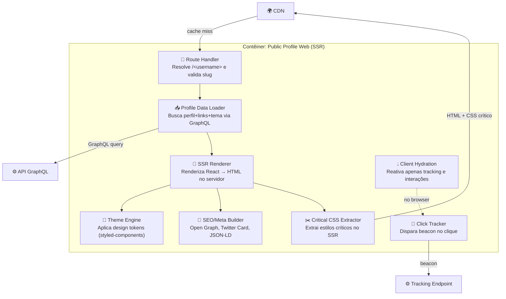

# C4 — Nível 3: Componentes — Public Profile Web

> **Escopo:** decomposição interna do contêiner **Public Profile Web** (React + SSR).
> Este é o contêiner de maior tráfego do sistema.

## Diagrama

## Componentes

| Componente | Responsabilidade | Notas de design |
|-----------|------------------|-----------------|
| **Route Handler** | Resolve `/<username>`, valida o slug, trata 404 e perfis desativados | Reservar rotas de sistema (`/s/…`, `/templates`, etc.) para não colidir com usernames |
| **Profile Data Loader** | Busca perfil, links e tema via GraphQL numa única query | Usa *persisted query*; tolera dados parciais (degradação graciosa) |
| **SSR Renderer** | Renderiza a árvore React em HTML no servidor | Roda em Lambda; alvo de first-paint rápido |
| **Theme Engine** | Aplica design tokens do criador ao componente | Mesma engine usada no preview do editor ([ADR-0007](../adr/0007-theming-styled-components.md)) |
| **Critical CSS Extractor** | Extrai CSS crítico para evitar FOUC e reduzir payload | Essencial pelo custo de runtime do CSS-in-JS |
| **SEO/Meta Builder** | Gera Open Graph, Twitter Cards e dados estruturados | Fundamenta o forte SEO observado no Linktree |
| **Client Hydration** | Hidrata só o necessário no browser | Minimiza JS enviado; a página é majoritariamente estática |
| **Click Tracker** | Emite beacon de clique/visualização | Usa `navigator.sendBeacon`; não bloqueia o redirecionamento |

## Decisões locais

- **Renderizar no servidor, hidratar pouco.** O perfil é quase estático; só o
  tracking e pequenas animações precisam de JS no cliente.
- **O clique nunca espera pela rede.** O redirecionamento ao destino é imediato; o
  beacon de analytics vai em paralelo (`sendBeacon`) — se falhar, o usuário não
  percebe. Ver [SPEC-004](../specs/SPEC-004-analytics.md).
- **Cache primeiro.** A CDN serve a maioria das visitas; o SSR só executa em cache
  miss ou após invalidação por publicação.
