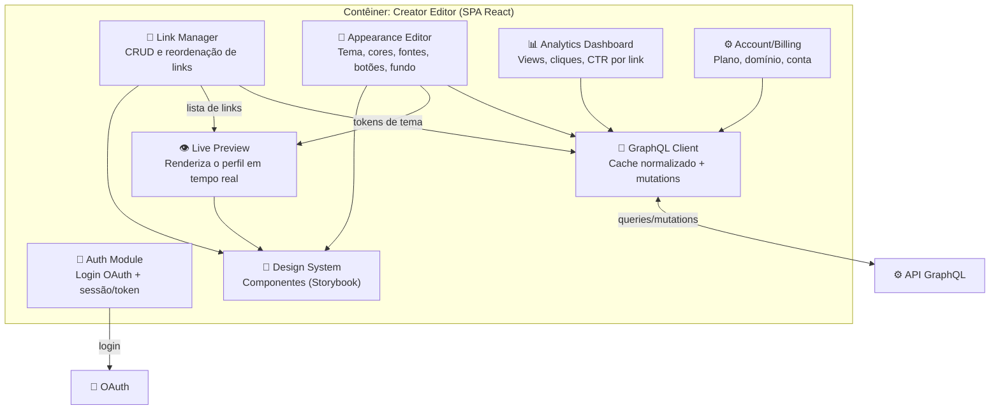

# C4 — Nível 3: Componentes — Creator Editor (SPA)

> **Escopo:** decomposição interna do contêiner **Creator Editor**, o painel
> autenticado onde o criador monta e gerencia sua página.

## Diagrama

## Componentes

| Componente | Responsabilidade | Notas de design |
|-----------|------------------|-----------------|
| **Auth Module** | Login social (OAuth), sessão e renovação de token | Ver [SPEC-002](../specs/SPEC-002-gestao-de-links.md) para autorização por perfil |
| **Link Manager** | Criar, editar, remover, ativar/desativar e **reordenar** links (drag-and-drop) | Ordem persistida; otimista na UI, confirmada por mutation |
| **Appearance Editor** | Editar design tokens do tema (cores, fontes, botões, fundo) | Alimenta o `ThemeProvider` compartilhado ([ADR-0007](../adr/0007-theming-styled-components.md)) |
| **Live Preview** | Renderizar o perfil como o visitante verá, em tempo real | Usa a **mesma engine de tema** do SSR — WYSIWYG fiel |
| **Analytics Dashboard** | Exibir views, cliques e CTR por link e por período | Lê contadores do DynamoDB via GraphQL ([SPEC-004](../specs/SPEC-004-analytics.md)) |
| **Account/Billing** | Gerir plano, domínio personalizado e dados da conta | Integra com gateway de pagamentos |
| **GraphQL Client** | Cache normalizado, atualizações otimistas, dedupe de queries | Um único ponto de acesso à API |
| **Design System** | Biblioteca de componentes documentada em Storybook | Reutilizada entre editor e perfil |

## Decisões locais

- **Preview = produção.** O Live Preview reaproveita a engine de tema do SSR, então
  o que o criador vê no editor é exatamente o que o visitante recebe.
- **Atualizações otimistas.** Reordenar links e trocar cores refletem na hora na UI;
  a mutation confirma em segundo plano e reverte em caso de erro.
- **Publicação invalida cache.** Salvar mudanças dispara invalidação do HTML do
  perfil na CDN e reindexação no Elasticsearch (ver [C2](./02-container.md)).
