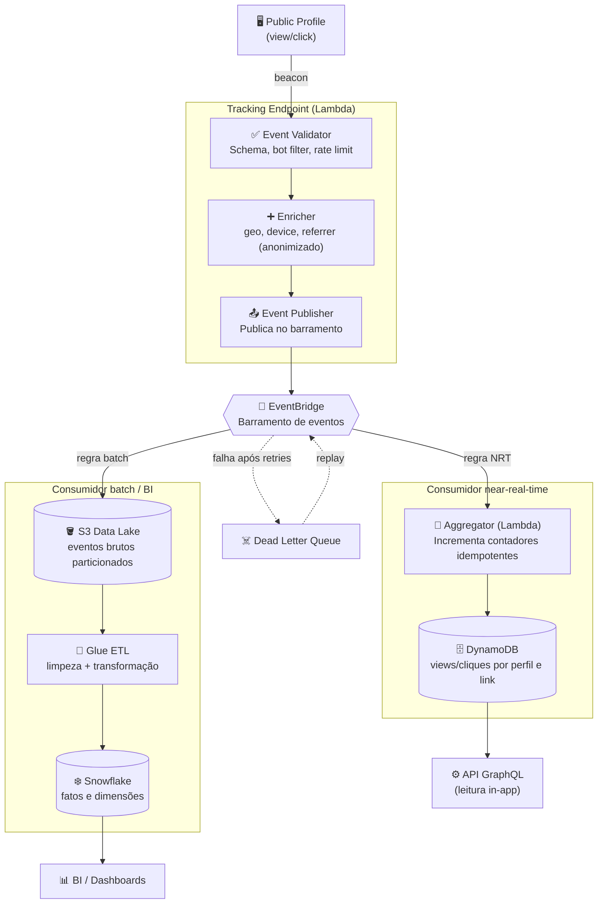

# C4 — Nível 3: Componentes — Analytics Pipeline

> **Escopo:** decomposição interna do **Tracking Endpoint** + **Analytics Pipeline**,
> o subsistema orientado a eventos que transforma cliques/views em métricas.

## Diagrama

## Componentes

| Componente | Responsabilidade | Notas de design |
|-----------|------------------|-----------------|
| **Event Validator** | Validar schema do evento, filtrar bots e aplicar rate limit | Rejeita cedo para não poluir métricas |
| **Enricher** | Adicionar geo/device/referrer de forma **anonimizada** (privacidade) | Sem PII; agrega antes de persistir |
| **Event Publisher** | Publicar `ProfileViewed` / `LinkClicked` no barramento e responder rápido | Fire-and-forget; latência mínima |
| **EventBridge** | Rotear eventos por regras a múltiplos consumidores | Novos consumidores sem tocar no produtor ([ADR-0006](../adr/0006-pipeline-analytics-eventos.md)) |
| **Aggregator** | Incrementar contadores **idempotentes** por `event_id` | Consistência eventual; janela near-real-time |
| **DynamoDB** | Servir contadores ao dashboard via GraphQL | Chave por perfil/link/período |
| **S3 Data Lake** | Guardar eventos brutos particionados por tempo | Fonte para replay e reprocessamento |
| **Glue ETL** | Transformar eventos brutos em fatos/dimensões | Alimenta o warehouse |
| **Snowflake** | Consultas analíticas e relatórios históricos | Base para BI |
| **Dead Letter Queue** | Reter eventos que falharam após retries | Permite replay sem perda |

## Decisões locais

- **Idempotência é obrigatória.** Cada evento carrega um `event_id`; o Aggregator
  deduplica para que retries não inflem contadores.
- **Dois caminhos, uma fonte.** O mesmo evento alimenta o serving (DynamoDB, rápido
  e aproximado) e o warehouse (Snowflake, preciso e histórico).
- **Privacidade por design.** O Enricher anonimiza e agrega; não persistimos PII do
  visitante. Ver requisitos em [SPEC-004](../specs/SPEC-004-analytics.md).
- **Sem perda silenciosa.** Falhas vão para DLQ e podem ser reprocessadas a partir
  do S3.
