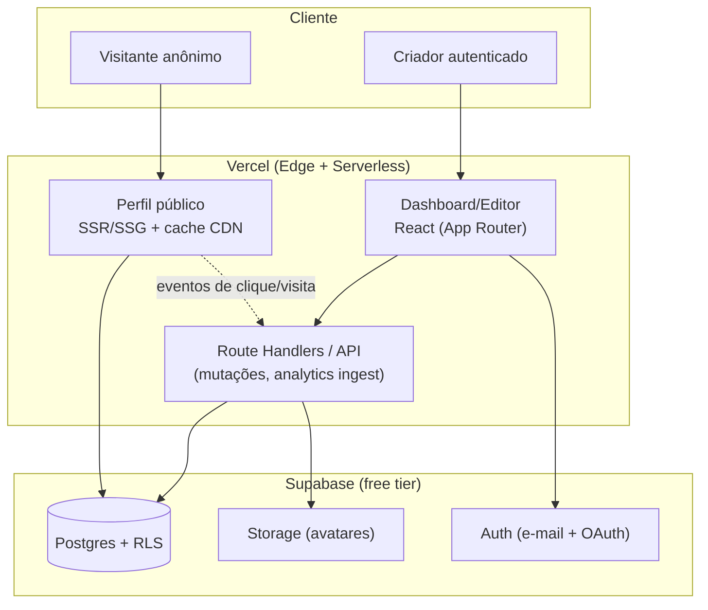

# 02 — Arquitetura

> Como o ligcentro é construído. As decisões aqui são **rascunhos de ADR**: quando
> a construção começar, cada uma vira um ADR numerado próprio do ligcentro. O
> referencial é a [engenharia reversa do
> Linktree](../market-research/reverse-engineering/linktree/README.md) — divergimos
> dele de propósito onde a escala não justifica a complexidade.

## Princípio-guia: dois modos, uma base

O produto tem **dois perfis de carga muito diferentes**, e a arquitetura respeita isso:

1. **Perfil público** (`/usuario`) — altíssimo volume de leitura, precisa de SEO e
   primeira pintura instantânea. → **renderizado no servidor / estático + CDN**.
2. **Editor/dashboard** — baixo volume, interativo, autenticado. → **app rico**,
   pode carregar mais JS.

## Stack proposto

| Camada | Escolha | Por quê |
|---|---|---|
| Framework | **Next.js 15 (App Router) + TypeScript** | Unifica SSR/SSG do perfil público e o dashboard React num só projeto; ótimo no free tier da Vercel |
| Hospedagem | **Vercel (Hobby/free)** | Deploy trivial, CDN global, serverless/edge inclusos; caminho de portabilidade documentado |
| Dados | **Supabase — Postgres + RLS** | Postgres gerenciado grátis; RLS dá multi-tenant seguro sem backend custom pesado |
| Auth | **Supabase Auth** | E-mail/senha + OAuth (Google/GitHub) prontos; barato de operar |
| Storage | **Supabase Storage** | Avatares e imagens de fundo |
| Estilo | **Tailwind CSS + design tokens** | Velocidade de UI, temas claro/escuro via CSS variables |
| Analytics | **Ingestão própria (tabela de eventos) + agregação** | Analytics por link no grátis, sob nosso controle e LGPD (ver [doc 05](./05-analytics-privacy.md)) |
| i18n | **next-intl (ou equivalente)** | pt-BR + en-US; string hardcoded é defeito |

### Divergências deliberadas do referencial (Linktree)

| Linktree (referência) | ligcentro (MVP) | Motivo |
|---|---|---|
| GraphQL | REST/Route Handlers tipados | Simplicidade; não temos N clientes nem times separados |
| Persistência poliglota (Postgres + DynamoDB + Elasticsearch + Snowflake) | **Só Postgres** (analytics em tabela + agregação; busca com índices/`tsvector` se preciso) | Escala do MVP não justifica; um banco reduz custo e complexidade |
| AWS Lambda + EventBridge + Glue | Serverless da Vercel + ingest simples | Free tier, menos peças móveis |
| CMS externo (Contentful/Webflow) p/ marketing | Páginas de marketing no próprio Next | Custo zero, um repo só |

> Estas divergências existem porque o ligcentro **começa pequeno**. Os documentos de
> referência descrevem uma arquitetura de escala global; adotá-la no dia 1 seria
> over-engineering. Cada divergência é reversível — se um subsistema (ex.: analytics)
> crescer, promovemos para uma solução dedicada via novo ADR.

## Portabilidade (não amarrar a fornecedor)

Herança direta do referencial e da cultura open source: **o específico de
plataforma fica isolado atrás de adaptadores**.

- Acesso a dados via uma camada de repositórios; trocar Supabase por um Postgres em
  VPS não deve tocar a lógica de produto.
- Nada de `import` de SDK proprietário espalhado pelo código — concentrar em
  `adapters/`.
- Meta: subir o ligcentro num `docker compose` local (Postgres + app) sem depender
  de nenhum serviço pago. É também o ambiente onde o **qa-validator** valida.

## Performance do perfil público (é feature)

- **SSG com revalidação** para perfis; HTML no CDN, sem round-trip a cada visita.
- Payload mínimo: sem framework pesado na página pública além do necessário;
  imagens otimizadas (`next/image`), fontes com `display: swap`.
- Meta de LCP mobile p75 **< 1,2 s** (ver [métricas](./01-vision-and-scope.md#métricas-de-sucesso)).
- Ingestão de analytics **não bloqueia** a renderização (fire-and-forget/`sendBeacon`).

## Segurança e multi-tenant

- **RLS em 100% das tabelas** — isolamento por `user_id` é a regra, não a exceção
  (detalhe em [modelo de dados](./04-data-model.md)). Toda migração vem com
  teste de acesso cruzado (dois usuários fake).
- Segredos só em variáveis de ambiente; nunca em commit.
- Auditoria de segurança periódica pela squad em [`../../agents/security/`](../../agents/security/).

## Qualidade e entrega

- **CI**: lint + typecheck + testes a cada PR; deploy de preview na Vercel.
- **Testes**: unidade (lógica/UI) + e2e Playwright dos fluxos críticos (cadastro,
  editar perfil, ver perfil público, registrar clique).
- **Documentação viva**: manual do usuário gerado por Playwright (skill
  [`/user-manual`](../../.claude/skills/user-manual/SKILL.md)).

## Riscos técnicos e mitigação

| Risco | Mitigação |
|---|---|
| Free tier do Supabase/Vercel estourar com tráfego | Cache agressivo do perfil público (CDN); analytics em lote; alertas de uso |
| Analytics em Postgres não escalar | Agregação periódica + retenção; promover para solução dedicada via ADR se preciso |
| SSG desatualizar após edição | Revalidação sob demanda ao salvar o perfil |
| Amarração à Vercel | Camada de adaptadores + alvo `docker compose` desde cedo |

## Próximo documento

→ [03 — Roadmap do MVP](./03-mvp-roadmap.md)
