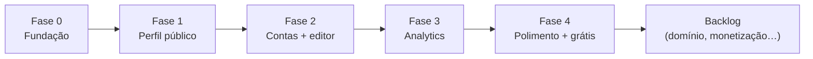

# 03 — Roadmap do MVP

> Ordem de construção do ligcentro, em fases. Cada fase entrega algo **utilizável**
> e verificável. As entregas viram tickets (`/ticket`) e correm pelo
> [/dev-loop](../../.claude/skills/dev-loop/SKILL.md). Sem datas fixas — o
> encadeamento importa mais que o calendário.

## Fase 0 — Fundação
*Objetivo: o esqueleto sobe, o time de agentes consegue trabalhar.*

- [ ] Bootstrap Next.js + TypeScript + Tailwind; convenções de lint/format.
- [ ] Projeto Supabase (dev) + conexão; primeira migração vazia versionada.
- [ ] CI (lint + typecheck + testes) e deploy de preview na Vercel.
- [ ] `docker compose` local (Postgres + app) para desenvolvimento e QA.
- [ ] Design tokens + temas claro/escuro; i18n pt-BR/en-US ligado.
- **Pronto quando:** app "hello world" builda, sobe local e na Vercel, CI verde.

## Fase 1 — Perfil público (leitura)
*Objetivo: uma página link-in-bio existe e é rápida — mesmo sem editor ainda.*

- [ ] Modelo de dados: `profiles` + `blocks` (ver [doc 04](./04-data-model.md)).
- [ ] Página pública `/[handle]` com SSG + revalidação, mobile-first.
- [ ] Renderização de blocos: link simples, ícone social, botão de contato.
- [ ] Catálogo de botões de marca (ícone/cor oficiais, inspirado no LittleLink).
- [ ] Open Graph + `<title>`/meta + QR code da página.
- [ ] Perfil de exemplo via seed (para QA/manual antes do editor existir).
- **Pronto quando:** um perfil semeado abre em < 1,2 s (LCP mobile p75) e compartilha bem.

## Fase 2 — Contas e editor (escrita)
*Objetivo: qualquer um cria a própria página.*

- [ ] Auth: cadastro/login e-mail + OAuth (Google/GitHub); claim de handle.
- [ ] RLS em todas as tabelas + teste de acesso cruzado.
- [ ] Editor: avatar, título, bio; CRUD de blocos com **reordenação drag-and-drop**.
- [ ] Revalidação do perfil público ao salvar.
- [ ] Temas prontos + customização básica (cor de fundo, fonte, formato de botão).
- [ ] Agendamento de link (mostrar/esconder por data).
- **Pronto quando:** cadastro → perfil publicado com ≥3 links em < 2 min (fluxo e2e verde).

## Fase 3 — Analytics honesto
*Objetivo: o diferencial "analytics por link no grátis" existe.*

- [ ] Ingestão de eventos (visita de página, clique de bloco) não-bloqueante.
- [ ] Agregação (visitas, cliques, CTR) por link e por página, respeitando LGPD (ver [doc 05](./05-analytics-privacy.md)).
- [ ] Painel de analytics no dashboard (série temporal + top links).
- [ ] Exportação de dados do perfil (JSON).
- **Pronto quando:** um clique no perfil público aparece agregado no dashboard, sem PII de visitante.

## Fase 4 — Polimento e lançamento do grátis
*Objetivo: pronto para usuários reais no plano grátis.*

- [ ] Onboarding guiado (primeiro perfil em poucos passos).
- [ ] Acessibilidade AA nos dois temas; navegação por teclado.
- [ ] Página de marketing / landing.
- [ ] Manual do usuário gerado por Playwright ([`/user-manual`](../../.claude/skills/user-manual/SKILL.md)).
- [ ] Auditoria de segurança (squad `agents/security/`) + revisão de performance.
- **Pronto quando:** o grátis é um produto completo e defensável (sem branding forçado, com analytics por link).

## Além do MVP (backlog priorizado, não comprometido)

Reavaliar após validar o grátis com usuários reais:

1. **Domínio próprio** — sem pedágio abusivo (diferencial vs. incumbentes).
2. **Monetização 0% de taxa** — links de pagamento/produtos simples (ver [doc 06](./06-monetization.md)).
3. **Mais blocos** — embeds (Spotify, formulário, mapa), captura de e-mail.
4. **Temas avançados** / marketplace de temas.
5. **Multi-perfil / equipes.**

> **Regra de escopo:** nada da lista "além do MVP" entra antes de a Fase 4 estar
> `done`. Pedido fora do plano volta ao Douglas com recomendação (aceitar/adaptar/
> recusar) — nunca é implementado silenciosamente (regra do
> [tech-lead](../../agents/tech-lead.md)).

## Dependências entre fases

## Próximo documento

→ [04 — Modelo de dados](./04-data-model.md)
