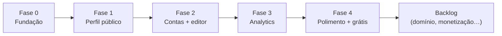

# 03 — Roadmap do MVP

> **Estado em 2026-08-01.** Cada item marcado `[x]` tem evidência executável
> (teste, saída de comando ou SQL) registrada no `log.md` do ticket que o
> entregou. Item aberto traz o ticket responsável entre parênteses. Itens que
> dependem de credencial de produção estão listados como "Validação em produção
> pendente" no ticket correspondente — o ticket em si está fechado.

> Ordem de construção do ligcentro, em fases. Cada fase entrega algo **utilizável**
> e verificável. As entregas viram tickets (`/ticket`) e correm pelo
> [/dev-loop](../../.agents/skills/dev-loop/SKILL.md). Sem datas fixas — o
> encadeamento importa mais que o calendário.

## Fase 0 — Fundação

_Objetivo: o esqueleto sobe, o time de agentes consegue trabalhar._

- [x] Bootstrap Next.js + TypeScript + Tailwind; convenções de lint/format.
- [x] Projeto Supabase (dev) + conexão; primeira migração vazia versionada.
- [x] CI (lint + typecheck + testes) e deploy de preview na Vercel.
- [x] `docker compose` local (Postgres + app) para desenvolvimento e QA.
- [x] Design tokens + temas claro/escuro; i18n pt-BR/en-US ligado.
- **Pronto quando:** app "hello world" builda, sobe local e na Vercel, CI verde.

## Fase 1 — Perfil público (leitura)

_Objetivo: uma página link-in-bio existe e é rápida — mesmo sem editor ainda._

- [x] Modelo de dados: `profiles` + `blocks` (ver [doc 04](./04-data-model.md)).
- [x] Página pública `/[handle]` com SSG + revalidação, mobile-first.
- [x] Renderização de blocos: link simples, ícone social, botão de contato.
- [x] Catálogo de botões de marca (ícone/cor oficiais, inspirado no LittleLink).
- [x] Open Graph + `<title>`/meta + QR code da página.
- [x] Perfil de exemplo via seed (para QA/manual antes do editor existir).
- **Pronto quando:** um perfil semeado abre em < 1,2 s (LCP mobile p75) e compartilha bem.

## Fase 2 — Contas e editor (escrita)

_Objetivo: qualquer um cria a própria página._

- [x] Auth: cadastro/login e-mail + OAuth (Google/GitHub); claim de handle. Sessão renovada por refresh token; sessão mock recusada em produção (TCK-0009).
- [x] RLS em todas as tabelas + teste de acesso cruzado automatizado, com role de aplicação sem bypass (TCK-0011).
- [x] Editor: avatar, título, bio; CRUD de blocos com **reordenação drag-and-drop**. Storage de avatar no Supabase (TCK-0010).
- [x] Revalidação do perfil público ao salvar.
- [x] Temas prontos + customização (cor de fundo, cor de botão, fonte, formato de botão) e catálogo de cores de marca (TCK-0014).
- [x] Agendamento de link (mostrar/esconder por data).
- [x] Controle de publicar/despublicar no dashboard (TCK-0013).
- **Pronto quando:** cadastro → perfil publicado com ≥3 links em < 2 min (fluxo e2e verde). **Atingido**: `e2e/critical-flow.spec.ts` cobre cadastro → editar → publicar → ver público → registrar clique (TCK-0016).

## Fase 3 — Analytics honesto

_Objetivo: o diferencial "analytics por link no grátis" existe._

- [x] Ingestão de eventos (visita de página, clique de bloco) não-bloqueante, validada no banco e com limite de taxa sem identificar visitante (TCK-0012).
- [x] Agregação (visitas, cliques, CTR) por link e por página, respeitando LGPD (ver [doc 05](./05-analytics-privacy.md)).
- [x] Painel de analytics no dashboard (série temporal + top links) — voltou a abrir no TCK-0012.
- [x] Exportação de dados do perfil (JSON).
- [x] Retenção aplicada de fato (`npm run analytics:purge`, TCK-0012).
- **Pronto quando:** um clique no perfil público aparece agregado no dashboard, sem PII de visitante. **Atingido**, coberto pelo e2e do fluxo crítico.

## Fase 4 — Polimento e lançamento do grátis

_Objetivo: pronto para usuários reais no plano grátis._

- [x] Onboarding guiado (primeiro perfil em poucos passos).
- [x] Exclusão de conta e dados, par da exportação (LGPD — TCK-0015).
- [~] Acessibilidade AA nos dois temas; navegação por teclado. O catálogo de cores de marca tem contraste AA verificado por teste (TCK-0014) e os controles novos são elementos nativos focáveis; **falta uma auditoria AA da interface inteira**.
- [x] Página de marketing / landing.
- [ ] Manual do usuário gerado por Playwright ([`/user-manual`](../../.agents/skills/user-manual/SKILL.md)) — **aberto**, agora viável: existe suíte e2e e o app sobe sozinho.
- [ ] Auditoria de segurança (squad `agents/security/`) + revisão de performance — **aberto**. O LCP mobile p75 < 1,2 s (regra 5) nunca foi medido.
- **Pronto quando:** o grátis é um produto completo e defensável (sem branding forçado, com analytics por link).

## Além do MVP (backlog priorizado, não comprometido)

Reavaliar após validar o grátis com usuários reais:

1. **Domínio próprio** — sem pedágio abusivo (diferencial vs. incumbentes).
2. **Monetização 0% de taxa** — links de pagamento/produtos simples (ver [doc 06](./06-monetization.md)).
3. **Mais blocos** — embeds (Spotify, formulário, mapa), captura de e-mail.
4. **Temas avançados** / marketplace de temas.
5. **Multi-perfil / equipes.**

> **Regra de escopo:** nada da lista "além do MVP" entra antes de a Fase 4 estar
> `done`. Pedido fora do plano volta ao Douglas com recomendação (aceitar/adaptar/
> recusar) — nunca é implementado silenciosamente (regra do
> [tech-lead](../../agents/tech-lead.md)).

## Dependências entre fases

```mermaid
flowchart LR
    F0["Fase 0<br/>Fundação"] --> F1["Fase 1<br/>Perfil público"]
    F1 --> F2["Fase 2<br/>Contas + editor"]
    F2 --> F3["Fase 3<br/>Analytics"]
    F3 --> F4["Fase 4<br/>Polimento + grátis"]
    F4 --> BACK["Backlog<br/>(domínio, monetização…)"]
```

## Próximo documento

→ [04 — Modelo de dados](./04-data-model.md)
