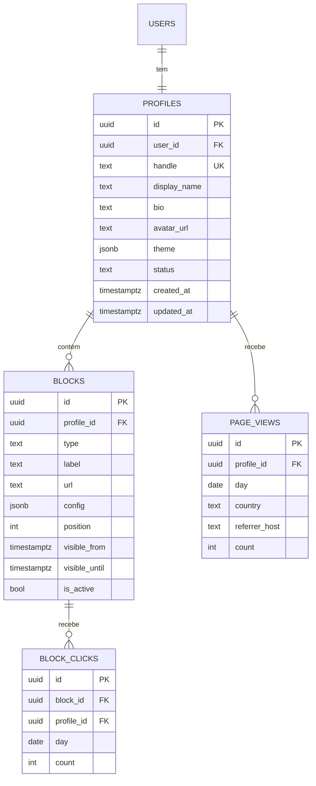

# 04 — Modelo de Dados

> Esboço do esquema de dados do ligcentro. É **rascunho**: a migração real e as
> políticas de RLS nascem como tickets do backend-developer, com teste de acesso
> cruzado obrigatório. Banco único: **Postgres** (ver
> [arquitetura](./02-architecture.md)).

## Entidades principais

## Tabelas

### `profiles`
O perfil público de um usuário. **1:1 com o usuário no MVP** (multi-perfil é backlog).
- `handle` — único, minúsculo, `[a-z0-9_-]`, é a URL (`/usuario`). Reservar handles proibidos (admin, api, login…).
- `theme` (jsonb) — cor de fundo, fonte, formato de botão, tema base (claro/escuro).
- `status` — `draft` | `published`.

### `blocks`
Cada item da página. Polimórfico por `type`:
- `link` — link simples (`url`, `label`).
- `social` — ícone de rede do catálogo de marcas (`config.brand`).
- `contact` — WhatsApp / e-mail / telefone (`config`).
- `video` — embed do YouTube (`config.provider`, `config.videoId`).
- `header` — separador/título de seção.
- `position` — ordem (reordenação drag-and-drop reescreve).
- `visible_from` / `visible_until` — agendamento (nulo = sempre visível).

> Extensão futura de tipo de bloco **não** muda o schema (novo `type` + `config`
> jsonb) — só a renderização e o editor evoluem.

### `page_views` / `block_clicks` — analytics agregado
**Agregado por dia**, não evento cru por visitante (LGPD — ver [doc 05](./05-analytics-privacy.md)):
- Sem PII do visitante: guardamos contagem por dia, país (nível grosso) e host do referrer.
- Ingestão incrementa o contador do dia (upsert), nunca guarda IP/identificador do visitante.

## Segurança — RLS (regra dura)

- **Toda tabela tem RLS ligada.** Sem exceção.
- `profiles` / `blocks`: dono (`auth.uid() = user_id`) faz tudo; leitura pública
  **apenas** de perfis `published` (via view/policy de leitura anônima controlada,
  ou leitura server-side com service role restrito à renderização).
- `page_views` / `block_clicks`: **sem leitura anônima**; escrita só pela rota de
  ingestão (server-side); leitura só pelo dono do perfil.
- Toda migração acompanha **teste de acesso cruzado**: usuário A nunca lê/escreve
  dados de B. Migração sem esse teste não sobe (regra do
  [backend-developer](../../agents/backend-developer.md)).

## Índices e performance

- `profiles.handle` único (lookup do perfil público é o caminho mais quente).
- `blocks (profile_id, position)` para montar a página em ordem.
- `page_views (profile_id, day)` e `block_clicks (block_id, day)` para o painel.
- Busca de handle/nome, se necessária: `tsvector`/`pg_trgm` — sem Elasticsearch no MVP.

## Migrações e seeds

- Migrações SQL versionadas (`supabase/migrations/`), com rollback testado no
  `docker compose` local.
- Seeds: perfis de exemplo para desenvolvimento, QA e geração do manual (a Fase 1
  precisa de perfil semeado antes de o editor existir).

## Próximo documento

→ [05 — Analytics e privacidade](./05-analytics-privacy.md)
