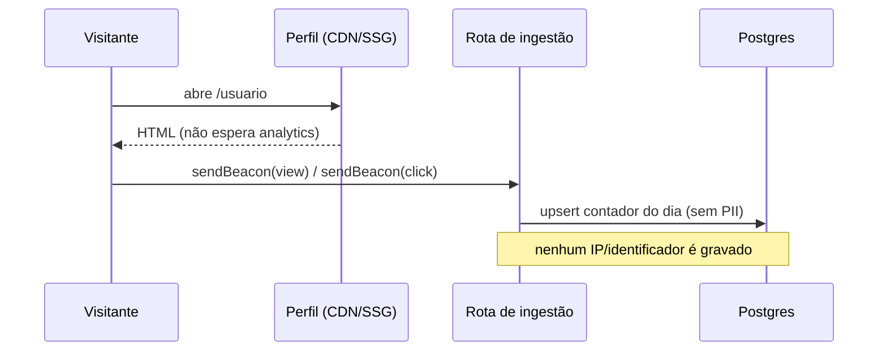

# 05 — Analytics e Privacidade

> O analytics é ao mesmo tempo **feature de diferenciação** (por link, no grátis) e
> **risco de conformidade** (LGPD). Este documento define como medir sem trair o
> visitante.

## Princípio: medir o suficiente, guardar o mínimo

O criador precisa saber **o que funciona** (quais links são clicados, de onde vem o
tráfego). Não precisamos — e não queremos — perfilar o visitante individual.

- **Agregado por dia**, não evento cru por pessoa.
- **Sem PII do visitante**: nada de IP armazenado, nada de fingerprint, nada de
  cookie de rastreamento entre sites.
- **Sem revender dados** — o dado é do criador, para o criador.

Isso é ao mesmo tempo a postura correta de privacidade e um **argumento de marca**
contra os incumbentes (a "sensação open source" — ver [open
source](../market-research/competitors/open-source.md#o-que-o-ligcentro-aproveita)).

## O que medimos

| Evento | Dado guardado | O que NÃO guardamos |
|---|---|---|
| Visita de perfil | contador/dia, país (nível grosso via edge), host do referrer | IP, user-agent completo, identificador do visitante |
| Clique em bloco | contador/dia por bloco | quem clicou |

Métricas derivadas para o painel: visitas, cliques totais, **CTR por link**, top
links, série temporal por dia, principais origens (hosts de referrer).

## Como coletamos (sem atrapalhar a página)

1. Renderização do perfil público **não bloqueia** na ingestão.
2. Cliques/visitas usam `navigator.sendBeacon` (ou `fetch keepalive`) para a rota de
   ingestão — fire-and-forget.
3. A rota de ingestão faz **upsert incremental** no contador do dia
   (`page_views` / `block_clicks`) — ver [modelo de dados](./04-data-model.md).
4. País derivado de metadado de edge (grosso, ex.: "BR"), nunca de geolocalização
   fina nem de IP persistido.

## LGPD — conformidade prática

- **Base legal:** dados agregados sem identificação de pessoa natural saem do escopo
  mais pesado da LGPD; ainda assim, tratamos como compromisso público.
- **Transparência:** política de privacidade clara ("medimos cliques de forma
  agregada e anônima; não usamos cookies de rastreamento").
- **Sem consentimento intrusivo:** por não usar cookie de rastreamento nem PII de
  visitante, evitamos o banner de cookies agressivo.
- **Direitos do criador (titular dos dados da conta):** exportação (JSON) e exclusão
  de conta/perfil implementadas como feature, não como pedido manual.
- **Retenção:** analytics agregado tem janela de retenção definida (ex.: 24 meses);
  dados além disso são consolidados ou descartados.

## Antipadrões proibidos (dark patterns)

Herdado das regras de produto: **nada de dark pattern**.
- Sem inflar métricas para parecer melhor do que é.
- Sem esconder a exclusão de conta.
- Sem "grátis" que vira armadilha (o grátis é honesto — ver [visão](./01-vision-and-scope.md)).

## Verificação (como o QA valida)

- Um clique no perfil público aparece **agregado** no painel do dono — e em
  **nenhum** lugar como evento identificável de visitante.
- Inspeção do banco confirma ausência de IP/identificador de visitante nas tabelas
  de analytics.
- Teste de acesso cruzado: criador A não vê analytics de B.

## Próximo documento

→ [06 — Monetização](./06-monetization.md)
