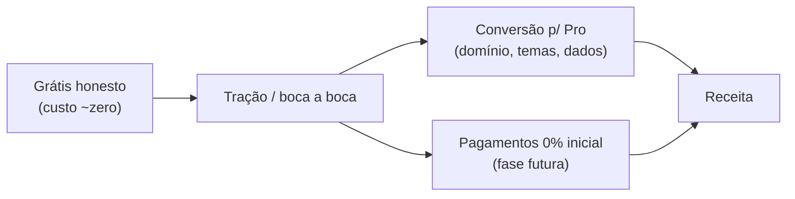

# 06 — Monetização

> Como o ligcentro se sustenta **sem trair o "grátis honesto"**. Este é um plano de
> fase futura — o MVP (Fases 0–4) foca em entregar o grátis excelente. Monetização
> entra depois de o grátis provar tração.

## Tese

Os incumbentes monetizam **capando o grátis** (branding forçado, analytics raso) e
**cobrando taxa alta sobre vendas** (Linktree 12% no free, Beacons 9%; ver [análise
competitiva](../market-research/competitors/competitive-analysis.md)). O ligcentro
faz o oposto: **grátis generoso** + **taxa baixa/zero**, e monetiza em
**conveniência e escala**, não em pedágio.

## Modelo de planos (proposta)

| Plano | Preço | Para quem | O que inclui |
|---|---|---|---|
| **Free** | R$ 0 | Todos | Links ilimitados, blocos, **analytics por link**, temas prontos, QR code, **sem branding forçado** |
| **Pro** | mensal baixo | Profissional/creator | Domínio próprio, temas avançados, mais blocos/embeds, analytics estendido (retenção maior, origens detalhadas) |
| **(futuro) Business** | mensal | Negócio/equipe | Multi-perfil, colaboração, marca própria |

> O grátis **não** existe para frustrar e forçar upgrade — ele é um produto
> completo. O Pro vende **conveniência e alcance** (domínio, temas, dados), não
> desbloqueia o básico que deveria ser grátis.

## Monetização de criadores (fase mais adiante)

Se/quando entrarmos em links de pagamento / produtos digitais simples:
- **0% de taxa de plataforma nas faixas iniciais** — o diferencial declarado contra
  9–12% dos concorrentes (o [Stan Store usa 0% como
  bandeira](https://stan.store/blog/stan-store-vs-beacons/); nós aplicamos isso já
  nas faixas baixas).
- Repassamos apenas o custo real do processador de pagamento (transparente).
- **Não** viramos marketplace/plataforma de cursos — isso é território de
  Beacons/Stan e sai da tese de "link-in-bio rápido e honesto".

## Por que isso fecha a conta

O grátis generoso só é sustentável porque o **custo de operação é baixo** (free
tier, perfil público em CDN, analytics agregado em Postgres — ver
[arquitetura](./02-architecture.md)). Cada perfil ativo custa perto de zero, então o
grátis não sangra; a receita vem da fração que quer domínio próprio, temas e dados
estendidos (Pro), e mais tarde da conveniência de receber pagamentos com taxa mínima.

## Antipadrões proibidos

- **Nada de branding forçado no grátis** para empurrar upgrade.
- **Nada de esconder analytics básico** atrás de paywall.
- **Nada de taxa predatória** sobre o que o criador ganha.
- **Nada de dark pattern** no funil de upgrade (ver [analytics e
  privacidade](./05-analytics-privacy.md#antipadrões-proibidos-dark-patterns)).

## Status

Planejamento. Nenhuma dependência paga é requisito do MVP; monetização vira ADR +
specs próprios quando a Fase 4 estiver `done` e o grátis tiver usuários reais.

## Volta ao índice

→ [Índice dos planos de implementação](./README.md)
