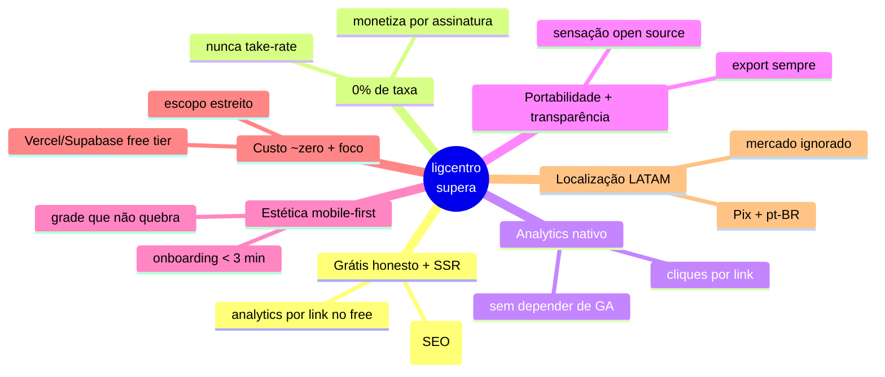

# 07 — Vantagem Competitiva: como o ligcentro supera todos

> Este documento é a **tese de superação**: para cada concorrente que reversamos em
> [`../market-research/reverse-engineering/`](../market-research/reverse-engineering/README.md),
> onde o ligcentro ganha — e como isso vira uma estratégia única, viável a **custo
> zero** (free tier), com deploy na **Vercel hoje** e caminho para **VPS amanhã**.
>
> A regra que amarra tudo: **não vencemos fazendo mais** que os concorrentes;
> vencemos **fazendo o essencial melhor, honesto e localizado** — dentro de um
> escopo deliberadamente estreito que a nossa restrição orçamentária sustenta.

## Como superamos, concorrente por concorrente

### vs. Linktree (o incumbente)
- **Brecha:** o grátis é isca — branding forçado, analytics raso, **12% de taxa** sobre vendas.
- **Superação:** grátis honesto (sem marca forçada), **analytics de cliques por link já no free**, **0% de taxa**. Igualamos a onipresença de features básicas e ganhamos exatamente onde o grátis dele frustra.

### vs. Beacons (suíte de criador)
- **Brecha:** renderização client-side → **SEO fraco**; **9% de taxa** no free; IA racionada; foco US, **sem Pix/BRL**.
- **Superação:** **perfil público SSR/SSG** (descoberta orgânica que o Beacons não tem); monetização por assinatura (0–5%, nunca 9%); **Pix e conteúdo pt-BR** para dominar LATAM, mercado que ele ignora. Não copiamos a suíte inchada — ficamos enxutos.

### vs. Bento (estética em grade) — *o concorrente morto*
- **Brecha:** **comprado pelo Linktree e desligado em fev/2026, com dados apagados**; a grade quebrava no mobile; setup de 10–15 min.
- **Superação:** entregar a estética em grade que o público amava, mas **mobile-first** (degrada para coluna legível) e com **onboarding em <3 min**. Oportunidade datada: **importador "vindo do Bento"** para capturar a coorte órfã migrando agora, com **exportação de dados sempre disponível** como promessa anti-shutdown.

### vs. Carrd (site-builder de 1 página)
- **Brecha:** link-in-bio é caso de uso *secundário* e improvisado; **analytics terceirizado** (GA/Plausible).
- **Superação:** foco vertical no link-in-bio com **UX de gestão de links** (drag-and-drop, blocos sociais, deep-links) e **analytics de cliques nativo** — as duas coisas que o Carrd relega. Copiamos a disciplina dele (escopo estreito, edge estático barato, preço acessível), não a ambição de "faça qualquer site".

### vs. Stan Store (comércio de criador)
- **Brecha:** **não tem plano grátis** (US$29/mês); SEO fraco; complexo.
- **Superação:** **free-first** sobre Vercel+Supabase (o funil de entrada que falta ao Stan) + SEO por SSR. Adotamos a **lição do 0% de taxa** (monetizar por assinatura, jamais take-rate) sem cair na armadilha de **virar plataforma de cursos/LMS** — que estoura qualquer free tier e é outro produto.

### vs. LinkStack (open source self-hosted)
- **Brecha:** exige **operar um servidor**; UX aquém; sem monetização nem descoberta.
- **Superação:** entregar a **"sensação open source"** — controle, transparência, 0% de taxa, portabilidade — num **SaaS gerenciado que simplesmente funciona**, eliminando a única dor que a comunidade LinkStack tolera. Multi-tenant nativo em vez de "operador de instância".

## A estratégia consolidada (os 7 pilares da superação)

1. **Grátis honesto + perfil SSR/SSG indexável.** Bate o grátis capado de Linktree e o SEO fraco de Beacons/Stan de uma vez.
2. **0% de taxa, monetização por assinatura/feature.** A lição de Stan e LinkStack; o oposto dos 9–12% de Beacons/Linktree. O preço vira ativo de marketing.
3. **Analytics de cliques por link, nativo e no grátis.** O que Carrd terceiriza e o free do Linktree não dá.
4. **Portabilidade + transparência.** Export de dados sempre disponível, política clara (LGPD). Captura órfãos de shutdowns (Bento) e a comunidade pró-privacidade (LinkStack).
5. **Estética em grade mobile-first + onboarding relâmpago.** Herda o que o Bento tinha de bom, corrige o que tinha de ruim.
6. **Custo ~zero + escopo estreito.** Free tier (Vercel+Supabase) sustenta o grátis generoso; a disciplina do Carrd evita o scope creep que encarece.
7. **Localização LATAM (Pix + pt-BR).** Brecha aberta que os players US-centric deixam.

## Matriz de superação (resumo)

| Pilar | Supera quem | Como se prova |
|---|---|---|
| Grátis honesto | Linktree, Stan | Sem branding forçado; analytics por link no free |
| SEO por SSR/SSG | Beacons, Stan | Perfil indexável; LCP mobile p75 < 1,2 s |
| 0% de taxa | Linktree, Beacons | Monetização só por assinatura/feature |
| Analytics nativo | Carrd, Linktree(free) | Cliques por link sem ferramenta externa |
| Portabilidade | Bento, Linktree | Export JSON + importador "vindo do Bento" |
| Grade mobile-first | Bento | Grade degrada para coluna no celular |
| Custo ~zero + foco | todos | Roda em free tier; não vira LMS/site-builder |
| Pix + pt-BR | Beacons, Stan | Pagamento e conteúdo localizados |

## Armadilhas que NÃO vamos repetir

- **Não** cobrar taxa sobre venda (Linktree/Beacons) — mata a confiança.
- **Não** virar plataforma de cursos/LMS/marketplace (Stan/Beacons) — estoura o free tier e vira outro produto.
- **Não** virar site-builder genérico (Carrd) — perde o foco de link-in-bio.
- **Não** renderizar só no cliente (Beacons/Stan) — abre mão do SEO, nossa vantagem.
- **Não** exigir operação de servidor (LinkStack) — nosso valor é "simplesmente funciona".
- **Não** capar o grátis para forçar upgrade (todos) — o grátis é o produto.

## Viabilidade a custo zero: Vercel hoje, VPS amanhã

A superação inteira precisa caber no orçamento **zero**. Ela cabe porque:

- **Deploy hoje = Vercel (free tier), via integração Git** — o repositório já está conectado a `ligcentro.vercel.app`: push na `main` publica produção; PR publica preview. Zero custo, zero servidor.
- **Perfil público estático/ISR no edge** — como o Carrd (HTML no CDN), o custo por visita tende a zero, o que sustenta um grátis generoso.
- **Dados no Supabase (free tier)** — Postgres + Auth + Storage sem custo inicial.
- **Amanhã = VPS** — quando o volume justificar (ou por soberania de dados), o mesmo app sobe num `docker compose` (Postgres + app) num VPS barato, porque o específico de plataforma fica isolado em `adapters/` (ver [`02-architecture.md`](./02-architecture.md#portabilidade-não-amarrar-a-fornecedor)). A migração Vercel→VPS é uma decisão de infra, não uma reescrita.

> Em uma frase: **o ligcentro supera todos entregando o essencial (página bonita,
> rápida, indexável, com analytics honesto e 0% de taxa) de graça e localizado —
> algo que a estrutura de custo dos incumbentes não deixa eles fazerem.**

## Volta ao índice

→ [Índice dos planos de implementação](./README.md)
