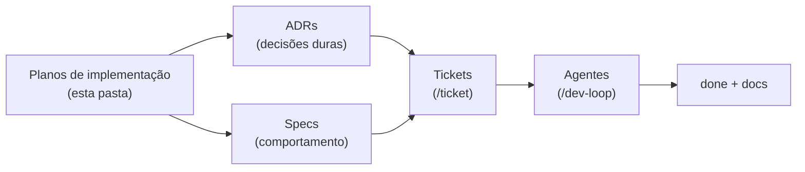

# Planos de Implementação — ligcentro

> O *produto*. Enquanto [`../market-research/`](../market-research/) reúne o que já
> existe, esta pasta define **o que vamos construir e como**: visão, escopo de MVP,
> arquitetura, roadmap, modelo de dados, analytics e monetização do **ligcentro**.
>
> Estes documentos são o **plano**, não a lei imutável. Quando a construção começar,
> cada decisão dura vira um **ADR** e cada comportamento a construir vira uma
> **spec**, e o trabalho passa pelo sistema de agentes/tickets em
> [`../../agents/`](../../agents/README.md) e [`../../tickets/`](../../tickets/).

## Índice

| # | Documento | O que responde |
|---|---|---|
| 01 | [Visão e escopo](./01-vision-and-scope.md) | Por que existe, para quem, o que entra no MVP e o que fica de fora |
| 02 | [Arquitetura](./02-architecture.md) | Stack, decisões técnicas, custo zero/free tier, portabilidade |
| 03 | [Roadmap do MVP](./03-mvp-roadmap.md) | Fases, entregas e ordem de construção |
| 04 | [Modelo de dados](./04-data-model.md) | Entidades, esquema Postgres, RLS, multi-tenant |
| 05 | [Analytics e privacidade](./05-analytics-privacy.md) | Como medimos cliques/visitas sem trair o visitante (LGPD) |
| 06 | [Monetização](./06-monetization.md) | Modelo de negócio, planos, 0% de taxa como diferencial |

## Princípios que atravessam todos os planos

1. **Grátis honesto** — o plano free é um produto de verdade: sem branding forçado, com analytics por link. É a arma contra os incumbentes (ver [análise competitiva](../market-research/competitors/competitive-analysis.md)).
2. **Custo de operação baixo** — tudo começa em **free tier**; o grátis generoso só é sustentável se a operação custa perto de zero.
3. **Rápido por padrão** — o perfil público carrega em sub-segundo (SSR/SSG, payload mínimo, CDN). Performance é feature, não ajuste tardio.
4. **Portável** — nada de amarração dura a um fornecedor; adaptadores isolam o que é específico de plataforma (herança do referencial de arquitetura).
5. **Dados do usuário são do usuário** — exportação, domínio próprio sem pedágio, privacidade do visitante. A *sensação* open source em um produto gerenciado.
6. **Escopo disciplinado** — MVP faz *uma coisa muito bem* (link-in-bio rápido e bonito com analytics honesto). Marketplace/cursos/site-builder são fases futuras, não MVP.

## Como estes planos viram código

> A infraestrutura de execução (agentes, skills, protocolo de handoff, memória
> persistente) foi trazida do projeto irmão *lernema* e adaptada ao ligcentro —
> ver [`AGENTS.md`](../../AGENTS.md) na raiz.
