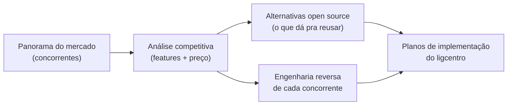

# Pesquisa de Mercado — ligcentro

> Base de conhecimento sobre o mercado de **link-in-bio** (agregadores de links "na bio")
> que fundamenta as decisões de produto do **ligcentro**. Aqui mora tudo que é
> *análise do que já existe*: o líder de mercado, os concorrentes diretos, as
> alternativas open source e a engenharia reversa da referência técnica.
>
> As **decisões e o plano de construção** do ligcentro ficam em
> [`../implementation-plan/`](../implementation-plan/). Esta pasta é o *insumo*;
> aquela é o *produto*.

## O que é o ligcentro

**ligcentro** (do esperanto *ligo* = "vínculo/link" + *centro* = "centro") é um
produto **link-in-bio**: uma única URL (`ligcentro.vercel.app/usuario`) que reúne todos
os links, redes, conteúdos e formas de contato/monetização de um criador em uma
página pública rápida, bonita e mensurável. É o mesmo espaço de produto do
Linktree, Beacons, Bento e afins.

## Organização desta pasta

| Subpasta | Pergunta que responde |
|---|---|
| [`competitors/`](./competitors/) | *Quem já faz isso, como cobram e onde deixam a desejar?* (largura) — panorama do mercado, análise competitiva e alternativas open source |
| [`reverse-engineering/`](./reverse-engineering/) | *Como cada concorrente é construído por dentro?* (profundidade) — engenharia reversa do Linktree (C4 + ADRs + specs), Beacons, Bento, Carrd, Stan Store e LinkStack |

## Fluxo de leitura recomendado

> **Nota de método:** os documentos de concorrentes combinam fatos públicos
> (páginas de preço, funcionalidades anunciadas) com sínteses de comparativos de
> mercado de 2026. Preços e limites mudam — cada afirmação sensível traz a fonte.
> A engenharia reversa do Linktree mistura observação pública com **inferências
> fundamentadas**, sinalizadas como tais nos próprios documentos.
