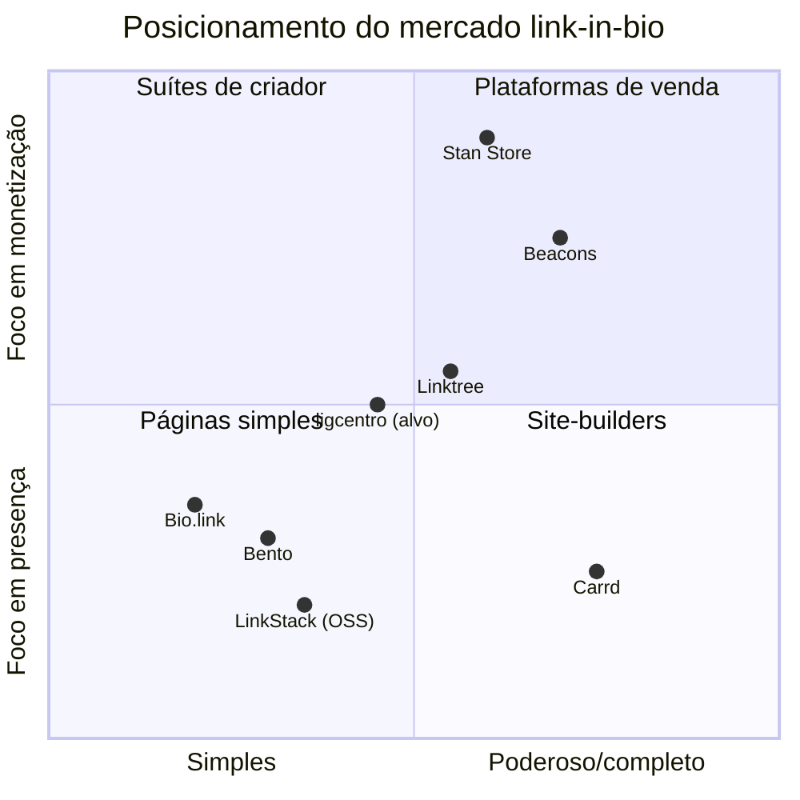

# Panorama do mercado link-in-bio (2026)

> Visão geral do mercado em que o ligcentro compete: o problema que a categoria
> resolve, por que as pessoas trocam de ferramenta, os arquétipos de produto e o
> espaço que o ligcentro pretende ocupar.

## O problema da categoria

Redes sociais (Instagram, TikTok, X, YouTube) permitem **um único link** na bio.
Criadores, negócios e profissionais têm, porém, muitos destinos: outras redes,
loja, portfólio, agenda, newsletter, conteúdos. A página **link-in-bio** resolve
isso: uma URL curta que abre uma página com todos os links, dá para trocar sem
mexer na bio da rede, e mede o que é clicado.

O que começou como "uma lista de botões" virou uma categoria com **analytics,
captura de leads, venda de produtos digitais, agendamento e IA**. Ferramentas
modernas transformam a visita passiva à bio em conversão.

## Por que as pessoas trocam de ferramenta

As razões de churn são notavelmente consistentes nos comparativos de 2026 — e
todas apontam para o plano **grátis** do líder:

| Motivo de troca | Detalhe |
|---|---|
| Grátis limitado | Analytics raso, sem métricas por link no free do Linktree |
| Branding forçado | Remover a marca "Linktree" exige plano pago |
| Domínio próprio pago | Custa a mais em quase todos os líderes |
| Taxa sobre vendas | Linktree cobra **12% no free**, 9% no Starter/Pro, 0% só no Premium (US$35/mês) |
| "Quero mais que uma lista" | Blocos, site real, monetização integrada |

> Fontes: [QR-Verse](https://qr-verse.com/en/blog/linktree-pricing-2026),
> [Linktree pricing](https://linktr.ee/s/pricing),
> [Rebrandly](https://www.rebrandly.com/blog/linktree-alternatives),
> [Jotform](https://www.jotform.com/blog/linktree-alternatives/).

## Arquétipos de produto

O mercado não é homogêneo — cada ferramenta otimiza para um perfil diferente:

1. **Páginas simples e grátis** — *Bio.link, Bento.* Bonito por padrão, grade
   arrumada, começar em segundos. Público: fundadores, profissionais, quem quer
   algo limpo sem esforço.
2. **Controle total de design** — *Carrd.* Mais que uma lista de links: um site de
   uma página totalmente customizável (layout, fonte, espaçamento). Barato
   (~10% do preço do Linktree Pro), com domínio e analytics inclusos.
3. **Monetização de criador** — *Beacons, Stan Store.* Beacons é uma suíte com
   afiliados, media kit e IA (free generoso + ~US$10/mês). Stan Store é feito para
   **vender** produtos digitais, cursos, coaching e memberships — e usa **0% de
   taxa** como bandeira (a partir de ~US$29/mês).
4. **Open source / self-hosted** — *LinkStack, LittleLink, Kytelink.* Controle
   total dos dados, sem taxa, autohospedável (Docker). Detalhe em
   [`open-source.md`](./open-source.md).

## Referência de líder de mercado

O **Linktree** é o incumbente e a referência técnica. A engenharia reversa da sua
arquitetura (stack, C4, decisões) está em
[`../reverse-engineering/linktree/`](../reverse-engineering/linktree/) e informa as
escolhas técnicas do ligcentro — inclusive onde **deliberadamente divergimos**
(serverless AWS + GraphQL + persistência poliglota fazem sentido na escala deles;
o ligcentro começa com um stack de free tier muito mais enxuto).

## Onde o ligcentro se encaixa

O ligcentro mira o **centro do quadrante**: presença + monetização leve, simples
mas extensível. A tese de diferenciação:

- **Grátis honesto** — sem branding forçado, com analytics por link no free.
- **Rápido e acessível** — perfil público com carga sub-segundo, SSR/SSG, AA de
  acessibilidade nos temas claro e escuro.
- **Custo de operação baixo** — construído para rodar em **free tier**, o que
  permite um plano grátis generoso sem sangrar unit economics.
- **Portabilidade e dados do usuário** — inspirado no open source: exportar dados,
  domínio próprio sem pedágio abusivo.
- **Monetização de baixa fricção** — caminho claro para vender/receber sem taxa
  predatória no grátis.

> Este posicionamento é a entrada para os [planos de
> implementação](../../implementation-plan/), onde ele vira escopo de MVP,
> arquitetura e roadmap.

## Fontes

- [Jotform — 7 best Linktree alternatives for 2026](https://www.jotform.com/blog/linktree-alternatives/)
- [Mobilo — 20+ Best Linktree Alternatives](https://www.mobilocard.com/post/linktree-alternatives)
- [Shelfy — Linktree vs Beacons vs Carrd (2026)](https://www.shelfy.today/blog/linktree-vs-beacons-vs-carrd)
- [own.page — Best Link in Bio Tools for Creators 2026](https://own.page/blog/best-link-in-bio-tools-creators)
- [ice.bio — Best Free Linktree Alternatives 2026](https://ice.bio/blog/linktree-alternatives)
