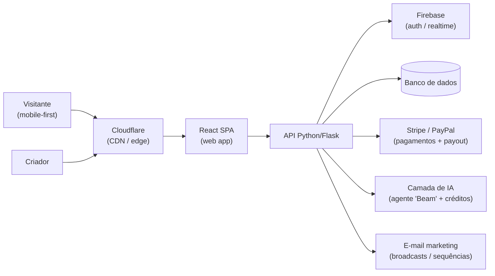

# Engenharia Reversa — Beacons (beacons.ai)

> **Nota de contexto (ligcentro):** pesquisa de mercado para o **ligcentro**. O
> Beacons é o principal concorrente "além do link-in-bio": posiciona-se como uma
> **suíte all-in-one para criadores** (link na bio + media kit + loja + e-mail
> marketing + afiliados) com uma camada pesada de **IA generativa** ("Beam"),
> enquanto o Linktree ainda é essencialmente um agregador de links.

> **Nota de método:** combina **fatos públicos observáveis** (headers HTTP, página
> de preços, central de ajuda, vagas de engenharia) com **inferências
> fundamentadas** — cada inferência está marcada como tal. Levantamento de
> **julho de 2026**; preços em USD conforme a página oficial na data.

## Posicionamento

O Beacons se vende como **"tudo que um criador precisa em um só lugar"**, mirando
especificamente criadores de **Instagram, TikTok e YouTube** ([beacons.ai](https://beacons.ai/)).
A proposta não é competir no link-in-bio genérico, e sim **substituir uma pilha de
ferramentas** (link na bio + Stan/Gumroad + ConvertKit + media kit + agência de
brand deals) por uma assinatura só — argumento explícito de que ferramentas
avulsas custariam "milhares por ano".

O diferencial de marca é a **IA como copiloto de negócio do criador**: o agente
**"Beam"** cobre estratégia de conteúdo, análise de crescimento, prospecção de
marcas, negociação de cachê e gestão de deals ([beacons.ai](https://beacons.ai/)).
É uma jogada de *land-and-expand*: free generoso para capturar o criador, e
monetização via **taxa sobre vendas** + upsell de IA/loja.

- **Empresa:** fundada em 2019, alumni Y Combinator; investidores incluem
  Andreessen Horowitz e Night Ventures. ~US$ 29,8M levantados em 3 rodadas
  (última de US$ 23M em abr/2022); ~132 funcionários em mai/2026
  ([Tracxn](https://tracxn.com/d/companies/beacons-ai/__n5rH6sDqPeGYtK7yR9FgLKWhdb88yZOC2WB1Qp56GGM),
  [Crunchbase](https://www.crunchbase.com/organization/beacons-ai)).
- **Escala:** vagas de engenharia falam em escalar o produto para
  "bilhões de page views por dia" — sinal de que o volume de tráfego de perfis
  públicos é o gargalo central ([YC Jobs](https://www.ycombinator.com/companies/beacons/jobs/BILGLqv-senior-software-engineer)).

## Stack tecnológica observada

| Camada | Tecnologia | Como se sabe / inferência |
|--------|-----------|---------------------------|
| CDN / Edge | **Cloudflare** | **Observável**: header `server: cloudflare` + `cf-ray` na resposta de `beacons.ai` ([host.io](https://host.io/beacons.ai), [Cloudflare Radar](https://radar.cloudflare.com/domains/domain/beacons.ai)) |
| Frontend | **React (JavaScript)** | **Observável (vagas)**: exigem React para o web app ([YC Jobs](https://www.ycombinator.com/companies/beacons/jobs/BILGLqv-senior-software-engineer)) |
| Padrão de render | **SPA client-side** (não SSR à la Next) | **Inferência fundamentada**: `curl` da home não expõe `__NEXT_DATA__` nem markup pré-renderizado grep-ável; conteúdo montado no cliente |
| Backend | **Python (Flask)** | **Observável (vagas)**: back-end Python, "familiaridade com Flask é um plus" ([YC Jobs](https://www.ycombinator.com/companies/beacons/jobs/BILGLqv-senior-software-engineer)) |
| Auth / realtime | **Firebase** | **Observável (vagas)**: "familiaridade com Firebase é um plus" — provável auth e/ou dados em tempo real ([YC Jobs](https://www.ycombinator.com/companies/beacons/jobs/BILGLqv-senior-software-engineer)) |
| Pagamentos | **Stripe + PayPal** | **Observável**: central de ajuda descreve processamento e payout via Stripe/PayPal ([help.beacons.ai](https://help.beacons.ai/en/articles/4698049)) |
| IA | **LLMs de terceiros** + sistema de "AI credits" | **Inferência fundamentada**: agente "Beam" e cotas de créditos diárias por plano; sem modelo próprio divulgado ([beacons.ai](https://beacons.ai/), [pricing](https://beacons.ai/i/pricing)) |
| Cloud / infra | **Nuvem pública (GCP provável, dado Firebase)** | **Inferência fundamentada**: uso de Firebase sugere ecossistema Google Cloud; não confirmado |
| Analytics | Painel próprio de tráfego/cliques/conversão | **Observável**: descrito na página de recursos e planos ([pricing](https://beacons.ai/i/pricing)) |

> **Confiabilidade:** o único fato *diretamente* verificável por inspeção é a
> borda Cloudflare. React/Python/Firebase/Stripe vêm de fontes públicas fortes
> (vagas oficiais, docs de ajuda). Provedor de nuvem e detalhes de dados são
> inferência.

## Arquitetura e abordagem de produto

O padrão inferido é o clássico de startup de criador em 2019-2022: **SPA React**
servida pela borda **Cloudflare**, conversando com uma **API Python/Flask**, com
**Firebase** para autenticação/estado em tempo real e **Stripe/PayPal** para o
dinheiro. A diferença estrutural para o Linktree (React SSR + Lambda + GraphQL) é
que o Beacons parece apostar em **SPA client-side** — mais simples de construir,
porém **pior para SEO** de perfis públicos (ver Pontos fracos).

A grande diferença de **abordagem de produto** é o escopo: o Beacons não é um
app, é uma **plataforma modular** (link na bio, loja de produtos digitais,
cursos/memberships, media kit auto-atualizável, marketplace de afiliados com
+12.000 marcas, e-mail marketing, auto-DM). A IA costura tudo, e a **taxa sobre
vendas** transforma o free em um canal de receita, não só de aquisição.

## Modelo de produto e monetização

**Features principais** (por [pricing](https://beacons.ai/i/pricing) e [beacons.ai](https://beacons.ai/)):
link na bio customizável, media kit auto-atualizável para brand deals, loja de
produtos digitais/merch/cursos, memberships, **marketplace de afiliados
(+12.000 marcas)**, e-mail marketing (broadcasts, listas, funis, sequências),
**auto-DM ("Smart Reply")** que converte comentários em vendas, analytics de
tráfego, e o agente de IA **"Beam"**.

| Plano | Preço mensal | Anual (equiv.) | Taxa sobre vendas | Destaques |
|-------|-------------|----------------|-------------------|-----------|
| **Free** | US$ 0 | US$ 0 | **9%** | 30 créditos de IA/dia, link na bio, media kit, produtos digitais ilimitados, afiliados, 50 e-mails/mês |
| **Creator** | US$ 10 | US$ 8,33 (US$ 100/ano) | **9%** | 300 créditos de IA/dia, domínio próprio grátis, 500 e-mails/mês, SEO avançado |
| **Creator Plus** | US$ 30 | US$ 25 (US$ 300/ano) | **0%** | IA ilimitada, 0% de taxa, BNPL, 100% de comissão de afiliado, cursos/memberships/e-mail ilimitados |
| **Creator Max** | US$ 90 | US$ 75 (US$ 900/ano) | **0%** | Tudo do Plus + Google Workspace, onboarding "white glove", suporte <6h, cartão NFC, acesso VIP |

Fontes: [página de preços](https://beacons.ai/i/pricing),
[taxas de transação (ajuda)](https://help.beacons.ai/en/articles/4700289).

**Lógica de monetização:** a **taxa de 9%** nos planos Free e Creator é o motor de
receita da base — o criador começa a vender sem pagar assinatura, e o Beacons fica
com um pedaço. O upsell é claro: quem vende mais de ~US$ 334/mês em digitais já
paga o Plus (US$ 30) só para zerar a taxa ([theleap.co](https://www.theleap.co/blog/beacons-pricing/)).
É um modelo de **take-rate**, diferente do Linktree (puramente por assinatura).

## Pontos fortes

- **Suíte completa de monetização** num só lugar: loja, cursos, memberships,
  afiliados e e-mail marketing — o criador não precisa de Gumroad + ConvertKit +
  planilha. O ligcentro **deve igualar pelo menos loja de produtos digitais +
  captura de e-mail** para não ser "só links".
- **IA como diferencial de marca ("Beam")**: media kit auto-atualizável,
  negociação de brand deals e auto-DM são features que geram percepção de valor
  alta a custo marginal baixo (chamadas de LLM). Bom vetor de diferenciação.
- **Free realmente generoso** — produtos digitais ilimitados e vendas já no plano
  grátis (mesmo com 9%): reduz atrito de entrada e cria efeito de rede.
- **Modelo de take-rate**: monetiza a base gratuita sem forçar assinatura;
  alinha receita do Beacons ao sucesso do criador.
- **Pagamentos maduros**: Stripe + PayPal com payout rápido ("cash out em 1 dia")
  transmite confiança para quem vende ([help.beacons.ai](https://help.beacons.ai/en/articles/4698049)).
- **Marketplace de afiliados** com +12.000 marcas: fonte de renda "plug-and-play"
  que trava o criador na plataforma.

## Pontos fracos e brechas

- **SEO fraco de perfis públicos** (**inferência fundamentada**): a página parece
  ser SPA client-side sem SSR/markup pré-renderizado — pior para indexação que o
  SSR do Linktree. **Brecha clara para o ligcentro**, que roda em Next.js e pode
  entregar SSR/SSG de graça no Vercel.
- **Taxa de 9% é cara e vira ruído de marca**: reviews externos rotulam como
  "custos ocultos" ([autoposting.ai](https://autoposting.ai/blog/beacons-ai-review),
  [niftysite](https://niftysite.co/resources/beacons-pricing)). Criador que vende
  bem paga muito antes de migrar de plano.
- **Complexidade / inchaço**: tantas features viram curva de aprendizado; quem só
  quer um link na bio bonito acha o produto pesado.
- **Créditos de IA racionados** no Free/Creator (30–300/dia) criam fricção e
  empurram upsell — frustrante para quem esperava "IA de graça".
- **Dependência de LLM de terceiros** (inferência): custo variável por uso e sem
  moat tecnológico próprio na IA.
- **Preço em USD, sem foco em LATAM/BRL**: pagamentos e afiliados giram em torno
  de Stripe/PayPal e marcas majoritariamente dos EUA — **brecha regional** para um
  concorrente brasileiro (Pix, marcas locais, conteúdo em pt-BR).

## O que o ligcentro copia / evita / supera

| Item | Decisão para o ligcentro |
|------|--------------------------|
| Link na bio + temas | **Copiar** — base da paridade; entregar bonito e rápido |
| SSR/SSG de perfis públicos | **Superar** — usar Next.js no Vercel para SEO forte (fraqueza do Beacons) |
| Loja de produtos digitais | **Copiar** (mínimo viável) — vender e-books/presets sem sair da plataforma |
| Captura de e-mail / newsletter | **Copiar** simplificado — lista + broadcast básico, sem virar ferramenta pesada |
| Media kit auto-atualizável | **Copiar** (v2) — diferencial barato que atrai criador que busca brand deals |
| IA "copiloto" (bio, temas, descrições) | **Copiar com parcimônia** — usar IA em pontos de alto valor; controlar custo de LLM no free tier |
| Taxa de 9% sobre vendas | **Evitar/superar** — take-rate menor (ex.: 0–5%) ou repassar só o custo do gateway como diferencial de marca |
| Créditos de IA racionados | **Evitar o atrito** — cotas generosas o suficiente para não irritar; limitar só o abuso |
| Pagamentos | **Copiar + localizar** — Stripe/PayPal **+ Pix** (superar em LATAM) |
| Marketplace de afiliados global | **Evitar (v1)** — alto custo de curadoria; considerar afiliados locais depois |
| Suíte inchada / muitas features | **Evitar** — manter enxuto e rápido (posicionamento free-tier); crescer por módulos |
| Onboarding "white glove", NFC, VIP | **Evitar** — custo operacional alto, fora do modelo enxuto |

## Fontes

- [beacons.ai — home / produto](https://beacons.ai/)
- [Beacons — página de preços](https://beacons.ai/i/pricing)
- [Beacons — taxas de transação (central de ajuda)](https://help.beacons.ai/en/articles/4700289)
- [Beacons — planos (central de ajuda)](https://help.beacons.ai/en/articles/4695681)
- [Beacons — pagamentos e payouts](https://help.beacons.ai/en/articles/4698049)
- [Beacons — vaga Senior Software Engineer (Y Combinator)](https://www.ycombinator.com/companies/beacons/jobs/BILGLqv-senior-software-engineer)
- [Cloudflare Radar — beacons.ai](https://radar.cloudflare.com/domains/domain/beacons.ai)
- [host.io — beacons.ai (Cloudflare)](https://host.io/beacons.ai)
- [Tracxn — perfil/funding Beacons AI](https://tracxn.com/d/companies/beacons-ai/__n5rH6sDqPeGYtK7yR9FgLKWhdb88yZOC2WB1Qp56GGM)
- [Crunchbase — Beacons](https://www.crunchbase.com/organization/beacons-ai)
- [The Leap — Beacons Pricing Review](https://www.theleap.co/blog/beacons-pricing/)
- [NiftySite — Beacons.ai Pricing 2026](https://niftysite.co/resources/beacons-pricing)
- [Autoposting.ai — Beacons.ai Review (custos ocultos)](https://autoposting.ai/blog/beacons-ai-review)
</content>
</invoke>
