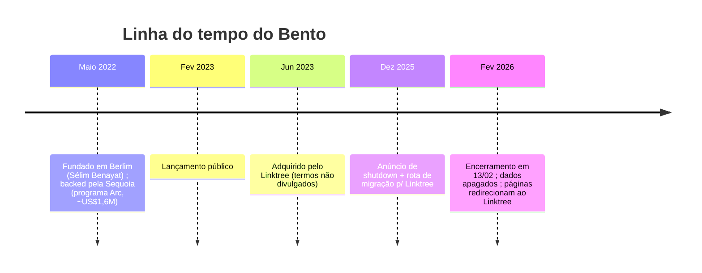
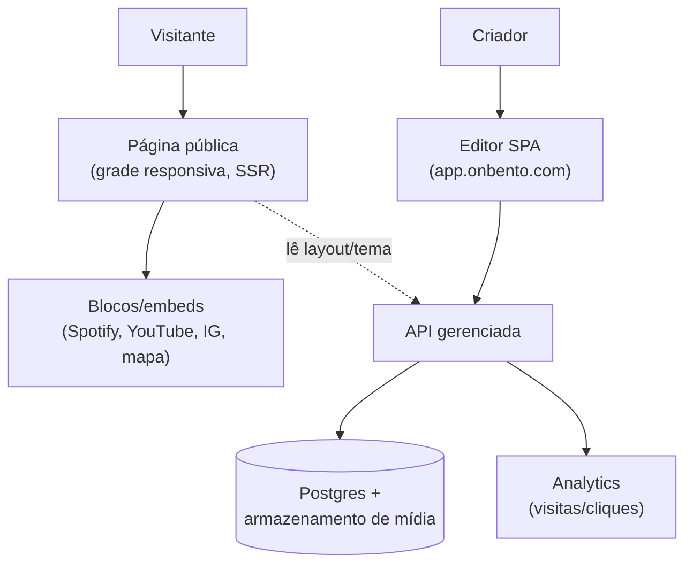

# Engenharia Reversa — Bento (bento.me)

> **Nota de contexto (pesquisa p/ ligcentro)**
> Este documento é **pesquisa de mercado** para o **ligcentro** (produto *link-in-bio*,
> concorrente do Linktree, rodando em *free tier*: Vercel + Supabase + Next.js). O objetivo
> é entender o **Bento (bento.me)** — o concorrente conhecido pela **estética em grade (grid)**,
> "bonito por padrão", popular entre fundadores e profissionais — para decidir o que o ligcentro
> **copia, evita ou supera**. Complementa a engenharia reversa do Linktree em
> [`./linktree/`](./linktree/) (mesma finalidade e estilo).

> **Nota de método (fatos + inferências, julho/2026)**
> O Bento **foi descontinuado em 13/02/2026** (ver [Posicionamento](#posicionamento)), então
> **não foi possível inspecionar o site público ao vivo** (o domínio redireciona ao Linktree).
> Tudo aqui combina: (a) **fatos** documentados em imprensa, Product Hunt, Crunchbase e reviews
> — sempre com fonte em link; e (b) **inferências fundamentadas** — marcadas explicitamente como
> `(inferência fundamentada)` — sobre stack e arquitetura, deduzidas do comportamento observado
> historicamente, do perfil da empresa e de convenções da categoria. Datas e preços refletem o
> período pré-*shutdown*.

---

## Posicionamento

O Bento vendia-se como **"a link in bio, but rich and beautiful"** — uma página pessoal em
**grade de cartões (bento grid)**, inspirada nas *marmitas* japonesas (compartimentos de tamanhos
diferentes), em oposição à **pilha vertical de botões** do Linktree. A promessa central não era
funcionalidade, era **estética garantida por padrão**: qualquer página, mesmo sem customização,
já "nascia bonita" — cartões grandes de destaque, tipografia limpa, respiro visual e **zero marca
da plataforma no plano gratuito** ([Product Hunt](https://www.producthunt.com/products/bento-22a484ea-84c2-42e5-9739-4bd97b040659), [UniLink](https://www.unilink.us/blog/bento-vs-linktree)).

Público-alvo: **criadores, fundadores, designers e profissionais** que queriam algo mais próximo
de um "mini-site portfólio" do que de uma lista de links. Ganhou o **Golden Kitty Award 2023** do
Product Hunt, sinal de forte adoção na comunidade *early-adopter*/tech ([Product Hunt](https://www.producthunt.com/products/bento-22a484ea-84c2-42e5-9739-4bd97b040659)).

**Trajetória (fato) — nascimento à descontinuação em ~4 anos:**

Fundado em **maio/2022 em Berlim** por **Sélim Benayat** (CEO/cofundador), com aporte **seed via
Sequoia Capital (programa Arc, ~US$1,6M)**; lançou publicamente em **fev/2023** e foi **adquirido
pelo Linktree em 06/06/2023**, ~13 meses após a fundação ([Tech.eu](https://tech.eu/2023/06/06/sequoia-backed-bento-boxed-up-by-linktree/), [Crunchbase](https://www.crunchbase.com/acquisition/linktree-acquires-creatorspace--b7f6d871)).
Em **13/02/2026** o Linktree **desligou o Bento**: contas encerradas, **dados apagados
permanentemente** e páginas passam a **redirecionar para o Linktree**, com oferta de migração e
Linktree Pro — mesmo padrão do Linktree após adquirir o Koji ([AlternativeTo](https://alternativeto.net/news/2025/12/bento-to-shut-down-in-2026-as-linktree-takes-over-and-offers-migration-path/), [own.page](https://own.page/blog/bento-alternatives)).

> **Implicação estratégica para o ligcentro:** o Bento provou que **existe demanda real por
> estética em grade** (o Linktree copiou "layouts visuais, blocos de conteúdo e embeds" inspirados
> nele), mas também que ser adquirido-e-desligado **abre uma janela de migração** de usuários órfãos
> — vários concorrentes lançaram guias "saindo do Bento" ([tini.bio](https://tini.bio/blog/migrate-from-bento), [popout.page](https://www.popout.page/blog/bento-alternatives)).

---

## Stack tecnológica observada

> ⚠️ Com o site desligado, **não há inspeção ao vivo possível**. As linhas abaixo são majoritariamente
> **inferências fundamentadas**, deduzidas do perfil da empresa (startup de design 2022, Berlim,
> equipe pequena, subdomínio de app `app.onbento.com`) e das convenções da categoria.

| Camada | Tecnologia (provável) | Como se sabe / inferência |
|--------|----------------------|---------------------------|
| Frontend (página pública) | **React** + framework SSR/SSG (Next.js provável) | *(inferência fundamentada)* — produto "design-first" com grade responsiva e embeds ricos; SPA/SSR é padrão da categoria; app separado em `app.onbento.com` sugere front dedicado ([onbento](https://www.onbento.com/)) |
| Editor / painel | **SPA React** em `app.onbento.com` / `app.bento.me` | *(inferência fundamentada)* — subdomínio de aplicação distinto da página pública indica editor SPA separado |
| Layout | **CSS Grid** com blocos de tamanhos variáveis (drag-and-drop) | Fato observado no produto: grade de cartões redimensionáveis ([UniLink](https://www.unilink.us/blog/bento-vs-linktree)) |
| Embeds | Spotify, YouTube, Instagram, mapas — via oEmbed/iframes | Fato: embeds gratuitos eram diferencial vs. Linktree ([UniLink](https://www.unilink.us/blog/bento-vs-linktree)) |
| Backend | API gerenciada (Node/serverless) + Postgres | *(inferência fundamentada)* — equipe enxuta 2022 tende a serverless + Postgres gerenciado |
| Hospedagem/CDN | PaaS de borda (Vercel/Netlify-like) | *(inferência fundamentada)* — coerente com Next.js e time pequeno; **não confirmado** |
| Auth | E-mail + social login | *(inferência fundamentada)* — padrão da categoria; onboarding com login social |
| Analytics | Analytics de visitas/cliques 1st-party | Fato: analytics de visitantes já no plano free ([linkinbiotools](https://linkinbiotools.com/bento-me/)) |

> **Nota de confiabilidade:** ao contrário do Linktree (cujo blog de engenharia expôs AWS Lambda,
> GraphQL, DynamoDB etc. — ver [`./linktree/README.md`](./linktree/README.md)), o Bento **nunca publicou
> detalhes de engenharia** e teve vida curta. Portanto a stack acima é **muito mais especulativa** que
> a do Linktree e **não deve ser tratada como fato**.

---

## Arquitetura e abordagem de produto

A arquitetura de produto do Bento girava em torno de **três decisões de design** que o diferenciavam:

1. **Grade em vez de lista.** O container é uma **grade responsiva de blocos** de tamanhos
   variáveis (grande destaque no topo, pequenos para redes sociais, largos para citação/embed).
   Isso torna a página um "layout de revista", não um empilhamento de botões
   ([UniLink](https://www.unilink.us/blog/bento-vs-linktree)).
2. **Padrões curados ("beautiful by default").** O sistema de temas impõe **tipografia, espaçamento
   e paleta coerentes** de saída, de modo que mesmo o usuário sem repertório de design produz algo
   apresentável. O valor é transferido do usuário para o *design system* do produto
   ([UniLink](https://app.unilink.us/blog/what-is-bento-me)).
3. **Blocos ricos de conteúdo/embeds nativos.** Fotos, vídeo, música, mapas e *embeds* de Spotify/
   YouTube/Instagram como blocos de primeira classe — não "links", mas **widgets** renderizados na
   própria página ([UniLink](https://www.unilink.us/blog/bento-vs-linktree)).

*(diagrama: inferência fundamentada sobre a topologia; apenas a divisão página pública ⇄ editor SPA e a presença de embeds/analytics são fatos observados)*

O **trade-off central** dessa abordagem: a grade é **linda no desktop**, mas **comprime mal em telas
pequenas** — vários reviews apontam que tiles ficam difíceis de escanear no celular, justamente onde
o tráfego "link na bio" é majoritário ([UniLink](https://www.unilink.us/blog/bento-vs-linktree)).

---

## Modelo de produto e monetização

Modelo **freemium** clássico, com o gratuito **generoso e sem marca da plataforma** (raro na
categoria — o Linktree carimba a própria marca no free). A conversão vinha de **domínio próprio,
templates, analytics avançado e monetização/vendas**.

> ⚠️ Fontes de terceiros **divergem** sobre a granularidade dos planos: algumas descrevem
> **Free + Pro (~US$5/mês)**; outras listam **Basic/Pro/Business** com features detalhadas
> (parte pode refletir estado tardio pós-Linktree ou conflação com concorrentes). Abaixo, a
> síntese conservadora — trate valores exatos como **aproximados**.

| Plano | Preço (aprox.) | Features principais |
|-------|----------------|---------------------|
| **Basic / Free** | US$ 0 | Grade de blocos, cores/fontes/botões customizáveis, links sociais, mapas interativos, **embeds gratuitos** (Spotify/YouTube/IG), **analytics de visitantes**, QR code, **sem marca da plataforma** |
| **Pro** | ~US$ 4–5/mês | Templates prontos, edição de HTML, pixels de rastreamento social, blocos agendados, estatísticas de engajamento |
| **Business** | ~US$ 8/mês | Múltiplas páginas, produtos digitais, formulários, **pagamentos**, CRM, **domínio próprio + SSL**, ferramentas de marketing |

Fontes: [linkinbiotools](https://linkinbiotools.com/bento-me/), [UniLink](https://www.unilink.us/blog/bento-vs-linktree), [SaaSworthy](https://www.saasworthy.com/product/bento.me/pricing).

**Leituras da monetização:**
- **Embeds e remoção de marca no free** eram *isca de aquisição*: o Linktree cobra por ambos, o Bento
  dava de graça — estratégia de crescimento agressiva típica de startup *venture-backed* buscando
  adoção antes de receita ([UniLink](https://www.unilink.us/blog/bento-vs-linktree)).
- **Domínio próprio** era gancho pago — vetor de receita padrão da categoria.
- A monetização nunca amadureceu de forma independente: a empresa foi **adquirida em ~13 meses** e
  operada como *feature* do Linktree até o desligamento ([Tech.eu](https://tech.eu/2023/06/06/sequoia-backed-bento-boxed-up-by-linktree/)).

---

## Pontos fortes

- **Estética como padrão, não como esforço.** O maior diferencial: reduzir a página a "escolher e
  arrastar blocos" e ainda assim entregar algo bonito. Baixa o custo cognitivo do bom gosto
  ([UniLink](https://app.unilink.us/blog/what-is-bento-me)).
- **Grade expressiva** — parece um mini-portfólio/homepage, não uma lista utilitária; forte apelo
  para fundadores, designers e criadores ([Product Hunt](https://www.producthunt.com/products/bento-22a484ea-84c2-42e5-9739-4bd97b040659)).
- **Embeds ricos gratuitos** (Spotify, YouTube, Instagram, mapas) como blocos nativos — conteúdo
  vive *na* página ([UniLink](https://www.unilink.us/blog/bento-vs-linktree)).
- **Free sem marca da plataforma** — percepção premium mesmo no gratuito ([UniLink](https://app.unilink.us/blog/what-is-bento-me)).
- **Marca/comunidade fortes na bolha tech** — Golden Kitty 2023, respaldo Sequoia ([Product Hunt](https://www.producthunt.com/products/bento-22a484ea-84c2-42e5-9739-4bd97b040659), [Tech.eu](https://tech.eu/2023/06/06/sequoia-backed-bento-boxed-up-by-linktree/)).

---

## Pontos fracos e brechas

- **Grade quebra no mobile.** Tiles se comprimem e ficam difíceis de escanear em telas pequenas —
  problema estrutural num produto cujo tráfego é majoritariamente "link na bio" (mobile). **Maior
  brecha explorável** ([UniLink](https://www.unilink.us/blog/bento-vs-linktree)).
- **Setup mais lento.** 10–15 min para montar uma boa grade vs. ~3 min de lista no Linktree — atrito
  de ativação maior ([UniLink](https://www.unilink.us/blog/bento-vs-linktree)).
- **Monetização imatura / dependência de capital.** Adquirido cedo; nunca provou modelo sustentável
  isolado ([Tech.eu](https://tech.eu/2023/06/06/sequoia-backed-bento-boxed-up-by-linktree/)).
- **Descontinuado — risco de plataforma.** Aquisição → desligamento → **dados apagados**; abalou a
  confiança e **jogou milhares de usuários no mercado** procurando alternativa ([AlternativeTo](https://alternativeto.net/news/2025/12/bento-to-shut-down-in-2026-as-linktree-takes-over-and-offers-migration-path/), [tini.bio](https://tini.bio/blog/migrate-from-bento)).
- **Menos reconhecimento de marca** que Linktree fora da bolha tech ([UniLink](https://www.unilink.us/blog/bento-vs-linktree)).

---

## O que o ligcentro copia / evita / supera

| Aspecto do Bento | Decisão ligcentro | Racional |
|------------------|-------------------|----------|
| Grade de blocos "bento" | **Copia** (opcional, ao lado da lista) | Diferencial estético comprovado; oferecer grade **e** lista amplia o público |
| "Beautiful by default" (temas curados) | **Copia** | Baixar o custo do bom gosto casa com free tier e público não-designer |
| Embeds ricos gratuitos (Spotify/YT/IG) | **Copia com parcimônia** | Ótimo para percepção de valor, mas **iframes pesam**; carregar sob demanda/lazy p/ caber no free tier |
| Free sem marca da plataforma | **Avalia** (talvez marca leve) | Bento usou como isca *venture-backed*; ligcentro precisa de gancho de receita/crescimento sustentável |
| Grade que quebra no mobile | **Supera** | **Mobile-first**: grade que *degrada* para coluna única legível no celular — corrige a principal fraqueza do Bento |
| Setup de 10–15 min | **Supera** | Onboarding rápido + template inicial pré-preenchido; bonito em <3 min |
| Risco de plataforma (shutdown, dados apagados) | **Supera** | **Exportação de dados sempre disponível** e portabilidade como promessa de marca — captura órfãos do Bento |
| Monetização (domínio próprio, analytics) | **Copia adaptado** | Domínio próprio + analytics como upsell natural, dimensionado ao free tier (Vercel + Supabase) |
| Stack pesada / cara | **Evita** | Ao contrário do provável PaaS-com-capital do Bento, ligcentro mira **custo ~zero** (Vercel + Supabase) |

> **Oportunidade de timing:** o desligamento do Bento (fev/2026) criou uma **coorte de usuários
> migrando agora**. Um **importador "vindo do Bento"** + estética em grade **mobile-first** é um
> ângulo de aquisição concreto e datado para o ligcentro ([popout.page](https://www.popout.page/blog/bento-alternatives), [tini.bio](https://tini.bio/blog/migrate-from-bento)).

---

## Fontes

- [Bento — Product Hunt (perfil e prêmio Golden Kitty 2023)](https://www.producthunt.com/products/bento-22a484ea-84c2-42e5-9739-4bd97b040659)
- [Bento — alternativas (Product Hunt)](https://www.producthunt.com/products/bento-22a484ea-84c2-42e5-9739-4bd97b040659/alternatives)
- [Tech.eu — "Sequoia-backed Bento boxed up by Linktree" (06/2023)](https://tech.eu/2023/06/06/sequoia-backed-bento-boxed-up-by-linktree/)
- [Crunchbase — aquisição do Bento pelo Linktree](https://www.crunchbase.com/acquisition/linktree-acquires-creatorspace--b7f6d871)
- [AlternativeTo — Bento shutdown em 2026 + migração](https://alternativeto.net/news/2025/12/bento-to-shut-down-in-2026-as-linktree-takes-over-and-offers-migration-path/)
- [UniLink — Bento.me vs Linktree](https://www.unilink.us/blog/bento-vs-linktree)
- [UniLink — What Is Bento.me? (review 2026)](https://app.unilink.us/blog/what-is-bento-me)
- [LinkInBioTools — Bento.me features & pricing](https://linkinbiotools.com/bento-me/)
- [SaaSworthy — Bento.me pricing](https://www.saasworthy.com/product/bento.me/pricing)
- [own.page — Bento shutting down: alternatives & migration](https://own.page/blog/bento-alternatives)
- [tini.bio — migrar do Bento.me](https://tini.bio/blog/migrate-from-bento)
- [popout.page — 8 best Bento.me alternatives (2026)](https://www.popout.page/blog/bento-alternatives)
- [onbento.com — site institucional do Bento](https://www.onbento.com/)
- Engenharia reversa do Linktree (referência interna): [`./linktree/README.md`](./linktree/README.md)
