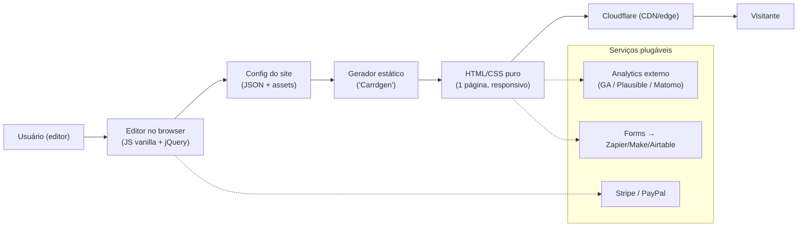

# Engenharia Reversa — Carrd (carrd.co)

> **Nota de contexto (pesquisa p/ ligcentro)**
> Este documento é **pesquisa de mercado** para o **ligcentro** (produto *link-in-bio*,
> concorrente do Linktree, rodando em *free tier* Vercel + Supabase + Next.js). O Carrd
> não é um concorrente direto de *link-in-bio puro*: é um **construtor de sites de uma
> página** ("one-page site builder"). Estudamos ele porque ocupa a fronteira adjacente —
> o usuário que quer "algo mais que uma lista de links, mas menos que um site inteiro" —
> e porque seu modelo de negócio (preço anual irrisório, operação de 1–2 pessoas, margem
> altíssima) é uma **referência de eficiência** valiosa para um produto de free tier enxuto.
> Complementa a [engenharia reversa do Linktree](./linktree/README.md).

> **Nota de método (fatos + inferências, julho 2026)**
> O texto separa **fatos observáveis/divulgados** (com fonte em link markdown) de
> **inferências fundamentadas** (sinalizadas como tal). A fonte primária mais rica é o
> próprio relato de construção do autor em [*Carrd: The Making Of*](https://themakingof.carrd.co/);
> preços e limites de plano vêm da [documentação oficial de planos](https://carrd.co/docs/pro/plans).
> Detalhes de infraestrutura não publicados são inferências e estão marcados como tal.

---

## Posicionamento

O Carrd se posiciona como **"simples, gratuito, sites de uma página totalmente responsivos
para praticamente qualquer coisa"** ([carrd.co](https://carrd.co/)). É um produto de nicho
deliberadamente estreito: **uma página, um layout em pilha (*stack*), preço anual simbólico**.

- **Categoria:** site-builder minimalista de página única (landing pages, perfis, portfólios,
  formulários simples, páginas de "link na bio" como caso de uso secundário).
- **Público:** criadores, freelancers, pequenos negócios e desenvolvedores que querem uma
  presença web rápida, barata e bonita, sem a complexidade de Wix/Squarespace nem a limitação
  de um agregador de links puro.
- **Proposta de valor:** custo quase nulo (a partir de **US$ 9/ANO**), rapidez de montagem,
  design responsivo garantido e **domínio próprio + analytics já inclusos** no plano intermediário.
- **Prova de tração:** operado por uma equipe de ~1–2 pessoas, **sem capital de risco, sem
  anúncios pagos**, cruzou a marca de **US$ 1,5M+ de ARR** e **4M+ de sites hospedados** por
  volta de 2024 ([Superframeworks](https://superframeworks.com/blog/carrd)). É o caso-modelo de
  *bootstrapped micro-SaaS* de alta margem.

**Contraste com o ligcentro (link-in-bio focado):** onde o Carrd entrega uma tela em branco
"faça o site que quiser numa página", o ligcentro entrega uma **experiência opinativa e
guiada** para o caso de uso específico de *link na bio* (lista de links, blocos sociais,
analytics de cliques). São filosofias opostas — controle total genérico *vs.* foco vertical —
e essa tensão é o tema da seção final.

---

## Stack tecnológica observada

| Camada | Tecnologia | Como se sabe / inferência |
|--------|-----------|---------------------------|
| Editor (frontend) | **JavaScript vanilla + jQuery**, `Skel.js`/`Skel.scss` (responsividade), plugin próprio `jquery.touch` (drag & drop) | Fato — relatado pelo autor em [*The Making Of*](https://themakingof.carrd.co/); abordagem deliberadamente "anti-framework" |
| Geração de sites | **Gerador estático próprio** ("Carrdgen"): consome JSON de configuração + assets → emite **HTML/CSS puro** | Fato — descrito em [*The Making Of*](https://themakingof.carrd.co/); sites ficam independentes do Carrd após gerados |
| Modelo de layout | **"Stack of elements"** — cada site é uma pilha vertical de elementos, com caixas (padrão, larga, alta) e controles de alinhamento | Fato — [*The Making Of*](https://themakingof.carrd.co/) |
| Hospedagem / CDN | **Cloudflare** servindo os HTMLs estáticos | Fato divulgado em análises ([Building Niche Websites](https://www.buildingnichewebsites.com/carrd/)); coerente com páginas estáticas em edge |
| Pagamentos | **Stripe** (assinaturas); **PayPal + cartão** para pagamentos avulsos | Fato — [*The Making Of*](https://themakingof.carrd.co/) |
| Backend / app | App server + banco para contas, assinaturas e armazenamento das configs JSON dos sites | **Inferência fundamentada** — não detalhado publicamente; o gerador é estático, mas contas/billing exigem backend transacional |
| Analytics | **Integração externa** (Google Analytics, Plausible, Matomo), não pipeline próprio | Fato — [docs de planos](https://carrd.co/docs/pro/plans); analytics é *plugável*, não construído internamente |
| Formulários | Element de formulário nativo (contato/inscrição); no topo, integrações Zapier/Make/n8n/Airtable | Fato — [docs de planos](https://carrd.co/docs/pro/plans) |

> **Insight de arquitetura:** o coração técnico é a separação **"config JSON → gerador estático
> → HTML/CSS servido por CDN"**. Isso é o que torna o produto barato de operar (edge estático,
> quase sem compute por request) e rápido para o visitante. É o oposto do Linktree, que serve
> perfis via SSR dinâmico com pipeline de eventos e persistência poliglota.

---

## Arquitetura e abordagem de produto

Princípios de produto que emergem da engenharia reversa (fonte-base: [*The Making Of*](https://themakingof.carrd.co/)):

1. **Restrição como feature.** Limitar cada site a *uma página* e a um *layout em pilha*
   simplificou radicalmente tudo — a UI do editor, o tratamento de responsividade, o motor de
   geração. A escassez de opções é intencional, não acidental.
2. **Ease of use acima de tudo.** O autor priorizou facilidade de uso "sobre praticamente todo o
   resto"; planejamento em papel/quadro branco antes de codar; testes em dispositivos reais.
3. **Saída independente e portátil.** O HTML gerado não depende do Carrd em runtime — no plano
   topo o usuário pode até **baixar o código-fonte não-minificado**. Isso reduz *lock-in* e,
   ironicamente, é um diferencial de confiança.
4. **Operação minúscula, margem enorme.** Stack simples + edge estático + zero marketing pago →
   ~1–2 pessoas sustentando milhões de sites ([Superframeworks](https://superframeworks.com/blog/carrd)).

---

## Modelo de produto e monetização

Preços **anuais** (não mensais — este é o diferencial-choque de posicionamento). Fonte:
[documentação oficial de planos](https://carrd.co/docs/pro/plans) e
[levantamentos de preço 2026](https://niftysite.co/resources/carrd-pricing).

| Plano | Preço | Sites | Principais recursos desbloqueados |
|-------|-------|-------|-----------------------------------|
| **Free (Basic)** | US$ 0 | 3 | Sites de uma página, responsivos, subdomínio `*.carrd.co`, badge "Made with Carrd" |
| **Pro Lite** | **US$ 9/ano** | 3 | Remove badge, URL premium, imagens em alta qualidade, elementos ilimitados, templates premium/customizados, upload de vídeo, slideshows, ícones, QR codes, transferência de sites |
| **Pro Standard** | **US$ 19/ano** | 10 | Tudo do Lite **+ domínio próprio com SSL, formulários (contato/inscrição), embeds de widgets de terceiros, código customizado embutido, integração de analytics, meta tags, fontes locais** |
| **Pro Plus** | **US$ 49/ano** | 25 | Tudo do Standard + formulários avançados (Zapier/Make/n8n/Airtable + pagamentos), "advanced settings", **download do fonte não-minificado**, redirects, proteção por senha, variáveis dinâmicas, canonical URLs |

**Leitura de monetização:**

- **Freemium com badge** como funil de topo (idêntico em espírito ao Linktree e ao ligcentro),
  porém o "gancho pago mínimo" (remover badge) custa **US$ 9/ANO** — psicologicamente ~US$ 0,75/mês.
- O plano que "importa de verdade" é o **Standard (US$ 19/ano)**, que reúne domínio próprio +
  forms + analytics ([No Code MBA](https://www.nocode.mba/articles/carrd-pricing)). É o teto de
  valor para a maioria dos usuários.
- **Analytics e pagamentos são terceirizados**, não monetizados internamente — o Carrd cobra pelo
  *builder*, não por serviços de dados. Isso mantém o custo operacional baixíssimo.
- **Preço anual** transfere a percepção de "assinatura recorrente cara" para "compra anual
  simbólica", reduzindo churn de decisão e atrito de conversão.

---

## Pontos fortes

- **Preço imbatível.** US$ 9–49/**ano** é uma fração do que qualquer site-builder cobra; remove a
  objeção de custo quase por completo ([Landingi](https://landingi.com/carrd/pricing/)).
- **Velocidade e simplicidade.** HTML estático servido por CDN → carregamento rápido, sem cold
  starts, ótimo Core Web Vitals por padrão.
- **Design responsivo garantido.** A pilha de elementos entrega um resultado bonito e mobile-first
  sem o usuário pensar em breakpoints.
- **Curva de aprendizado curta** para o caso simples; monta-se uma página em minutos.
- **Baixo lock-in.** Saída em HTML puro e, no topo, download do fonte — raro no segmento.
- **Eficiência operacional extrema** (referência de *bootstrapping*): milhões de sites, equipe
  minúscula, sem VC, sem ads ([Superframeworks](https://superframeworks.com/blog/carrd)).
- **Flexibilidade de analytics.** Deixa o usuário plugar GA/Plausible/Matomo — atende quem já tem
  ferramenta preferida.

---

## Pontos fracos e brechas

Fontes: [Site Builder Report](https://www.sitebuilderreport.com/carrd-review),
[OnePageTips](https://onepagetips.com/blog/carrd-limitations-and-workarounds),
[autoposting.ai](https://autoposting.ai/carrd-review/).

- **Uma página só.** Não há páginas separadas — apenas âncoras/seções na mesma página. Trava o
  crescimento de quem precisa de estrutura de site.
- **Sem blog e SEO fraco.** Estrutura de página única limita hierarquia de conteúdo, schema
  avançado e sitemap; não serve para *content marketing*.
- **Sem e-commerce real.** Integra Stripe/PayPal para pagamentos avulsos, mas **não há carrinho,
  estoque nem venda nativa de produtos digitais**.
- **Customização de design com teto.** Editor por blocos; para controle fino é preciso entender
  containers e classes CSS — pouco intuitivo para não-técnicos.
- **Sem salvamento de rascunho robusto.** Relatos de perda de trabalho por crash/timeout.
- **Suporte só por e-mail**, com reclamações de lentidão e respostas secas.
- **Não é link-in-bio de verdade.** Falta o que define a categoria: analytics de **cliques por
  link** nativo, blocos sociais prontos, gestão de muitos links com reordenação rápida, deep-links
  para apps. Faz "página de links" só como improviso.

---

## O que o ligcentro copia / evita / supera

| Dimensão | Carrd faz | Postura do ligcentro |
|----------|-----------|----------------------|
| **Preço** | US$ 9–49/**ano**, âncora psicológica baixíssima | **Copiar a filosofia** de preço acessível; avaliar tier anual barato. Free tier (Vercel/Supabase) permite margem parecida |
| **Saída estática + CDN** | HTML puro em Cloudflare, custo ~zero por request | **Copiar o espírito**: perfis públicos como páginas estáticas/ISR no edge da Vercel — barato e rápido |
| **Restrição como feature** | 1 página, layout em pilha | **Copiar a disciplina**: foco vertical e opinativo, resistir ao *scope creep* de virar site-builder |
| **Baixo lock-in** | Export de HTML/fonte | **Superar com transparência**: export de dados/links (portabilidade) como diferencial de confiança |
| **Analytics** | Terceirizado (GA/Plausible) | **Superar**: analytics de **cliques por link** nativo e simples (Supabase), que é justamente o que o Carrd não faz |
| **Link-in-bio nativo** | Improviso numa página genérica | **Superar por foco**: blocos sociais, ordenação drag-and-drop, deep-links, temas prontos para "bio" |
| **Multi-página / blog / e-commerce** | Ausente por design | **Evitar** — fora do escopo do link-in-bio; não perseguir |
| **Editor livre / CSS cru** | Poder com curva de aprendizado | **Evitar** o excesso; priorizar onboarding de minutos e defaults bonitos |

### Reflexão: link-in-bio focado *vs.* site-builder genérico

O Carrd prova que **restrição vende**: ao recusar ser um site-builder completo, virou o melhor da
sua categoria estreita, com margem extraordinária. O ligcentro deve internalizar a mesma lição —
mas escolhendo uma vertical **ainda mais estreita e mais bem servida**: o *link na bio*.

- Onde o Carrd é uma "tela em branco de uma página" que *pode* virar uma página de links, o
  ligcentro é uma **experiência guiada de link-in-bio** — menos flexível, porém muito mais rápida e
  certeira para o caso de uso do criador/influenciador.
- O ligcentro **não deve** tentar competir em "faça qualquer site". Deve competir em "a melhor,
  mais rápida e mais mensurável página de links" — entregando exatamente as duas coisas que o
  Carrd relega a terceiros ou improvisa: **analytics de cliques nativo** e **UX de gestão de links**.
- A lição de negócio (equipe minúscula, edge estático, sem VC, preço simbólico) casa perfeitamente
  com a restrição de *free tier* do ligcentro. O modelo do Carrd é a prova de que dá para ser
  sustentável sem infra cara — desde que o escopo permaneça deliberadamente pequeno.

---

## Fontes

- [Carrd — site oficial](https://carrd.co/)
- [Carrd: The Making Of (relato técnico do autor)](https://themakingof.carrd.co/)
- [Carrd — documentação oficial de planos](https://carrd.co/docs/pro/plans)
- [Superframeworks — "$1M ARR with single page site builder"](https://superframeworks.com/blog/carrd)
- [No Code MBA — Carrd Pricing 2026](https://www.nocode.mba/articles/carrd-pricing)
- [NiftySite — Carrd Pricing 2026 (oficial)](https://niftysite.co/resources/carrd-pricing)
- [Landingi — Carrd Pricing analyzed 2026](https://landingi.com/carrd/pricing/)
- [Site Builder Report — Carrd Review (prós e contras)](https://www.sitebuilderreport.com/carrd-review)
- [OnePageTips — Carrd limitations and workarounds](https://onepagetips.com/blog/carrd-limitations-and-workarounds)
- [autoposting.ai — Carrd Review (limitações)](https://autoposting.ai/carrd-review/)
- [Building Niche Websites — Carrd (hospedagem Cloudflare)](https://www.buildingnichewebsites.com/carrd/)
