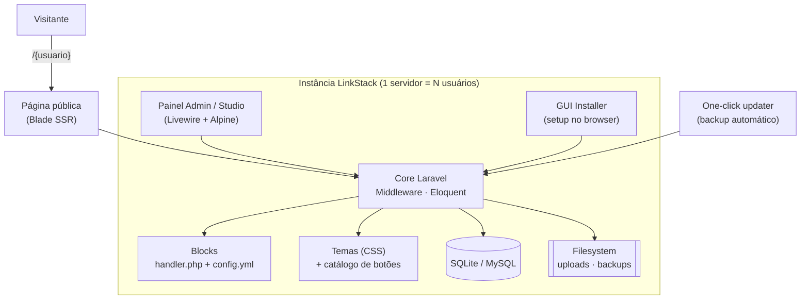

# Engenharia Reversa — LinkStack (linkstack.org, open source)

> **Nota de contexto (pesquisa p/ ligcentro)**
> Este documento faz parte da pesquisa de mercado do **ligcentro** (produto
> *link-in-bio*, concorrente do Linktree, rodando em *free tier* — Vercel +
> Supabase, Next.js). Enquanto a [engenharia reversa do Linktree](./linktree/)
> mapeia o **líder proprietário** da categoria como arquitetura de referência,
> este texto examina a **principal alternativa open source / self-hosted**: o
> **LinkStack**. O interesse estratégico é claro — o LinkStack conquistou uma
> comunidade fiel vendendo *controle, transparência e 0% de taxa*. A pergunta
> para o ligcentro é: **como entregar essa "sensação open source" num produto
> gerenciado que simplesmente funciona**, sem exigir que o usuário opere um
> servidor.

> **Nota de método (fatos + inferências, julho 2026)**
> Diferente da engenharia reversa do Linktree (baseada em observação de site e
> stack divulgada), aqui a maior parte é **FATO verificável**: o LinkStack é
> [código aberto sob AGPLv3](https://github.com/LinkStackOrg/LinkStack) e a
> stack está exposta no repositório. Afirmações sobre modelo de negócio,
> tração e limitações operacionais são marcadas como **inferência fundamentada**
> quando não vêm diretamente de fonte primária. Números de versão refletem o
> estado observado em fev–jul/2026 (v4.8.6, ~3,7k estrelas, ~2.318 commits,
> 109 releases).

---

## Posicionamento

O LinkStack se define como *"the self-hosted, open-source Linktree alternative"*
— um agregador de links "na bio" que o usuário **hospeda no próprio servidor**,
com foco explícito em **privacidade e propriedade dos dados**
([linkstack.org](https://linkstack.org/)). A promessa central é o oposto do
modelo SaaS proprietário: em vez de confiar seus dados e sua audiência a uma
empresa que pode vendê-los, "monetizá-los" ou desligar a conta, o usuário mantém
**controle total** e paga **0% de taxa** sobre qualquer conversão.

Origem e linhagem (FATO — [linkstack.org](https://linkstack.org/littlelink-custom-now-linkstack/), [AlternativeTo](https://alternativeto.net/software/littlelink-custom/about/)):

- **LittleLink** (Seth Cottle) — kit estático de botões/CSS, DIY, sem backend.
- **LittleLink Admin** (Khashayar Ghajar) — adiciona painel administrativo Laravel.
- **LittleLink Custom** (Julian Prieber, lançado em **23/02/2022**) — fork focado
  em facilidade de uso para quem tem pouca experiência com hospedagem/código.
- **LinkStack** — renome em **2023**, refletindo uma visão de produto mais ampla.

A herança do LittleLink explica um traço de UX importante: o LinkStack traz um
**catálogo enorme de "botões de marca"** (ícones/estilos oficiais de centenas de
serviços) pronto para uso — um diferencial visual barato e imediato.

**Público-alvo (inferência fundamentada):** entusiastas de *self-hosting*, times
técnicos, organizações preocupadas com privacidade/LGPD-GDPR, e provedores de
hospedagem que querem oferecer link-in-bio multiusuário como serviço. **Não** é
o criador de conteúdo médio, que quer abrir o app e ter uma página no ar em 30s.

---

## Stack tecnológica

Majoritariamente **FATO** — o código é aberto e inspecionável no
[repositório](https://github.com/LinkStackOrg/LinkStack).

| Camada | Tecnologia | Fonte |
|--------|-----------|-------|
| Linguagem | **PHP 8.2** (mínimo PHP 8) | [Docker/README LinkStack](https://github.com/LinkStackOrg/LinkStack) |
| Framework | **Laravel** (base Laravel 9 na origem; Middleware + Eloquent ORM) | [Viblo — análise de arquitetura](https://viblo.asia/p/open-source-235-linkstack-nen-tang-link-in-bio-tu-van-hanh-voi-kien-truc-laravel-9-livewire-va-he-thong-blocks-linh-hoat-AY4qQdnK4Pw) |
| Templating | **Blade** (~35% do repositório) | [GitHub — linguagens](https://github.com/LinkStackOrg/LinkStack) |
| Interatividade | **Livewire** (componentes reativos server-side) + **Alpine.js** — sem SPA/framework JS pesado | [Viblo](https://viblo.asia/p/open-source-235-linkstack-nen-tang-link-in-bio-tu-van-hanh-voi-kien-truc-laravel-9-livewire-va-he-thong-blocks-linh-hoat-AY4qQdnK4Pw) |
| Banco de dados | **SQLite** (padrão) · **MySQL/MariaDB** (opcional) — migrations Laravel | [GitHub](https://github.com/LinkStackOrg/LinkStack), [madewithlaravel](https://madewithlaravel.com/littlelink-custom) |
| Servidor web | Apache2 ou NGINX (qualquer servidor com PHP 8+) | [linkstack.org](https://linkstack.org/) |
| Containerização | Imagem **Docker oficial** `linkstack/linkstack` (Alpine Linux + Apache2 + PHP 8.2) | [GitHub](https://github.com/LinkStackOrg/LinkStack), [Hostinger](https://www.hostinger.com/applications/linkstack) |
| E-mail | **SMTP embutido** (verificação de conta, reset de senha) | [openapps.pro](https://openapps.pro/apps/linkstack) |
| Extensibilidade | Sistema de **Blocks** (`handler.php` + `config.yml` por bloco) | [Viblo](https://viblo.asia/p/open-source-235-linkstack-nen-tang-link-in-bio-tu-van-hanh-voi-kien-truc-laravel-9-livewire-va-he-thong-blocks-linh-hoat-AY4qQdnK4Pw) |
| Temas | Sistema de temas baseado em CSS, catálogo comunitário em `linkstack.org/themes`, upload via admin | [GitHub](https://github.com/LinkStackOrg/LinkStack) |
| Licença | **GNU AGPLv3** (copyleft de rede — modificações servidas via web devem ter código aberto) | [GitHub](https://github.com/LinkStackOrg/LinkStack) |

**Contraste com o ligcentro (Next.js + Supabase serverless).** LinkStack é um
**monólito PHP stateful** que pressupõe um servidor "sempre ligado" com sistema
de arquivos gravável (uploads, SQLite, backups). Esse modelo é **incompatível
com o free tier serverless** do ligcentro — o que reforça a decisão de
arquitetura do ligcentro (Postgres gerenciado + storage de objetos + funções
efêmeras). Ver [`../../implementation-plan/`](../../implementation-plan/).

---

## Arquitetura e abordagem de produto

**Características arquiteturais (FATO, salvo indicação):**

- **Multiusuário nativo.** Uma única instância hospeda muitos usuários com
  registro, login e páginas em `/{usuario}`. É explicitamente pensado para um
  admin operar uma instância para várias pessoas (família, time, clientes).
- **GUI Installer.** Instalação por assistente no navegador, sem linha de
  comando — remove a maior barreira do self-hosting para não-técnicos.
- **Renderização no servidor (Blade).** As páginas públicas são HTML renderizado
  pelo servidor; o painel usa Livewire para reatividade sem SPA. Isso mantém o
  peso de JS baixo e é bom para SEO das páginas públicas.
- **Sistema de Blocks.** Cada recurso é um módulo independente (lógica em
  `handler.php`, schema em `config.yml`), permitindo à comunidade estender sem
  tocar no core — é o mecanismo de extensibilidade do projeto.
- **IDs aleatórios no Model.** Em vez de auto-incremento sequencial, gera
  identificadores aleatórios para dificultar *scraping* e evitar vazar a escala
  da instância (nº de usuários/links) — decisão de privacidade/segurança
  ([Viblo](https://viblo.asia/p/open-source-235-linkstack-nen-tang-link-in-bio-tu-van-hanh-voi-kien-truc-laravel-9-livewire-va-he-thong-blocks-linh-hoat-AY4qQdnK4Pw)).
- **Impersonação de admin via Middleware** (assumir conta de usuário sem senha)
  — útil para suporte, mas exige confiança total no operador da instância.
- **Portabilidade de dados.** Export/import completo para migrar entre
  instâncias — reforça a promessa "seus dados são seus".
- **Updater de um clique com backup automático** — mitiga o medo de atualizar
  um app self-hosted e quebrar a instalação.

**Recursos de usuário final (FATO):** drag-and-drop de links, temas sem código,
catálogo de botões de marca, **QR code**, **vCard (.vcf)** gerado dinamicamente,
analytics de cliques/visitas embutido, verificação de e-mail via SMTP.

---

## Modelo de produto e sustentação

O LinkStack é **software livre AGPLv3** mantido primariamente por Julian Prieber
e uma comunidade de contribuidores/beta testers. A sustentação é um mix típico
de projeto open source com serviço gerenciado por cima:

| Fonte de sustentação | Como funciona | Fonte |
|----------------------|---------------|-------|
| **Doações** | GitHub Sponsors, Patreon, Liberapay, PayPal; apoiadores nomeados | [GitHub](https://github.com/LinkStackOrg/LinkStack) |
| **Instâncias gerenciadas (pagas)** | Hospedagem oficial em planos mensais (ver tabela abaixo) | [linkstack.org](https://linkstack.org/) |
| **Instâncias comunitárias gratuitas** | Terceiros/comunidade rodam instâncias abertas ao público | [linkstack.org](https://linkstack.org/) |
| **Trabalho voluntário** | Contribuições de código e temas da comunidade | [GitHub](https://github.com/LinkStackOrg/LinkStack) |
| **Ecossistema de hospedagem** | Provedores (Hostinger, Klutch, Cloudron, Rad Web) oferecem *one-click deploy* | [Hostinger](https://www.hostinger.com/applications/linkstack), [Klutch](https://docs.klutch.sh/guides/open-source-software/linkstack/) |

**Planos de hospedagem gerenciada oficiais** (observados em julho/2026 —
[linkstack.org](https://linkstack.org/); valores podem variar):

| Plano | Preço | Usuários | Domínio | SSL |
|-------|-------|----------|---------|-----|
| Single User | ~US$ 1/mês | 1 | subdomínio | incluso |
| Custom Domain | ~US$ 5/mês | até 10 | domínio próprio | incluso |
| Full-featured | ~US$ 8/mês | até 100 | domínio próprio | incluso |

**Leitura estratégica (inferência fundamentada):** o LinkStack já reconheceu que
*a maioria não quer operar um servidor* — por isso oferece instâncias
gerenciadas. Mas o produto gerenciado é **secundário e minimalista** (preço por
número de usuários, sem foco em onboarding de criador individual, sem app
mobile, sem monetização in-app). Existe aqui uma lacuna que o ligcentro pode
ocupar: **a experiência gerenciada é uma reflexão tardia do LinkStack, não seu
produto principal.**

---

## Pontos fortes

- **Privacidade e propriedade de dados reais.** Self-host = seus dados no seu
  servidor, sem terceiros. É a bandeira mais forte e um diferencial genuíno
  contra o Linktree.
- **0% de taxa, custo marginal ~zero.** Sem corte sobre vendas/afiliados; o
  custo é o do próprio servidor. Atraente para quem monetiza.
- **Transparência (AGPLv3).** Código auditável; a comunidade confia porque pode
  inspecionar tudo. Copyleft de rede impede *forks* proprietários fechados.
- **Multiusuário + GUI installer.** Um operador serve muitas pessoas com setup
  sem terminal — bom para agências, comunidades e provedores.
- **Catálogo de botões de marca + temas comunitários.** Riqueza visual imediata,
  herança do LittleLink, difícil de igualar do zero.
- **Sem *lock-in*.** Export/import e portabilidade entre instâncias.
- **Stack madura e barata de hospedar.** PHP/Laravel + SQLite roda em quase
  qualquer hospedagem compartilhada barata; Docker facilita o deploy.
- **Comunidade ativa.** ~3,7k estrelas, 109 releases, ~2.318 commits — projeto
  vivo, com cadência real de entregas ([GitHub](https://github.com/LinkStackOrg/LinkStack)).

---

## Pontos fracos e brechas

- **Esforço de operação (a maior brecha).** Self-host exige servidor, PHP,
  banco, TLS, backups, atualizações de segurança e monitoramento. Para o criador
  médio isso é **inviável** — o público que só quer "publicar minha bio" é
  perdido de saída. *(inferência fundamentada, mas amplamente aceita na categoria)*
- **Arquitetura stateful não escala trivialmente.** Monólito PHP com SQLite e
  filesystem local não é *cloud-native*; escalar horizontalmente exige migrar
  para MySQL e storage externo, com trabalho manual. Sem CDN/edge por padrão.
- **UX aquém do SaaS moderno.** Painel funcional (Livewire) mas sem o polimento,
  onboarding guiado, templates prontos e mobile-first dos líderes. Sem app
  nativo. *(inferência fundamentada)*
- **Segurança recai sobre o operador.** Instância desatualizada = superfície de
  ataque; impersonação de admin exige confiança total no operador.
- **Analytics básico.** Contagem de cliques/visitas, sem o pipeline de eventos,
  segmentação e insights de um SaaS de dados dedicado.
- **Sem rede/descoberta.** Cada instância é uma ilha; não há grafo social,
  descoberta de perfis nem efeito de rede como no Linktree.
- **Monetização inexistente para o usuário final.** Não há checkout, gorjetas,
  produtos digitais ou integração de pagamento nativa — só links.
- **AGPLv3 pode afastar uso comercial** que queira modificar sem abrir código.

---

## O que o ligcentro copia / evita / supera

**Tese central:** o ligcentro deve **entregar a "sensação open source"**
(controle, transparência, 0% de taxa, portabilidade) **dentro de um produto
gerenciado que simplesmente funciona** — eliminando o único grande custo do
LinkStack, que é *operar um servidor*. É pegar o que a comunidade LinkStack ama e
remover a dor que ela tolera.

| Aspecto | LinkStack | Postura do ligcentro | Racional |
|---------|-----------|----------------------|----------|
| **Propriedade dos dados** | Self-host total | **Copia a promessa** | Export completo + LGPD/GDPR explícito + "seus dados são seus, sem operar servidor" |
| **Taxa sobre conversões** | 0% | **Copia (0% de taxa)** | Diferencial anti-Linktree; monetização via assinatura, não corte de vendas |
| **Transparência** | AGPLv3, código aberto | **Supera na percepção** | Doc pública de stack/segurança, changelog aberto, política de dados clara — "transparência de produto" sem exigir self-host |
| **Portabilidade / anti-lock-in** | Export/import entre instâncias | **Copia** | Export de perfil/links/analytics como diferencial de confiança |
| **Operar servidor** | Obrigatório (ou instância gerenciada secundária) | **Evita totalmente** | Free tier gerenciado (Vercel + Supabase); zero infra para o usuário |
| **Stack** | Monólito PHP/Laravel stateful | **Evita** | Next.js SSR + Supabase serverless; *cloud-native*, escala e custo marginal ~zero no free tier |
| **Multiusuário por instância** | Núcleo do produto | **Reinterpreta** | Multi-tenant nativo do SaaS (cada conta isolada), sem "operador de instância" |
| **Catálogo de botões de marca** | Forte (herança LittleLink) | **Copia/supera** | Biblioteca de ícones/marcas + templates prontos; onboarding em segundos |
| **Temas** | CSS + upload manual | **Supera em UX** | Editor visual de tema, design tokens, preview ao vivo |
| **Analytics** | Contagem básica | **Supera** | Pipeline de eventos leve (cliques/visitas/origem) já no free tier |
| **Onboarding** | GUI installer (técnico) | **Supera** | Cadastro → página no ar em <1 min, mobile-first |
| **Monetização do usuário** | Inexistente | **Supera** | Espaço aberto: gorjetas/produtos/checkout como roadmap |
| **Descoberta / rede** | Ilhas isoladas | **Supera (potencial)** | Perfis num mesmo domínio → SEO e descoberta agregada |

**Mensagem de marca sugerida (inferência fundamentada):**
> "O controle e a transparência de uma solução open source — sem precisar
> manter um servidor. Seus dados, 0% de taxa, e uma página no ar em um minuto."

---

## Fontes

- [LinkStack — site oficial (linkstack.org)](https://linkstack.org/)
- [LinkStack — anúncio de renome "LittleLink Custom is now LinkStack"](https://linkstack.org/littlelink-custom-now-linkstack/)
- [GitHub — LinkStackOrg/LinkStack](https://github.com/LinkStackOrg/LinkStack)
- [Made with Laravel — LittleLink Custom / LinkStack](https://madewithlaravel.com/littlelink-custom)
- [OpenAlternative — LinkStack](https://openalternative.co/linkstack)
- [AlternativeTo — LinkStack (ex-LittleLink Custom)](https://alternativeto.net/software/littlelink-custom/about/)
- [Viblo — análise de arquitetura (Laravel 9, Livewire, sistema de Blocks)](https://viblo.asia/p/open-source-235-linkstack-nen-tang-link-in-bio-tu-van-hanh-voi-kien-truc-laravel-9-livewire-va-he-thong-blocks-linh-hoat-AY4qQdnK4Pw)
- [Hostinger — LinkStack VPS / one-click Docker](https://www.hostinger.com/applications/linkstack)
- [Klutch.sh Docs — Deploying LinkStack](https://docs.klutch.sh/guides/open-source-software/linkstack/)
- [Rad Web Hosting — Self-hosted LinkStack em AlmaLinux VPS](https://blog.radwebhosting.com/how-to-run-self-hosted-link-in-bio-tool-with-linkstack-on-almalinux-vps/)
- [openapps.pro — LinkStack (privacidade, SMTP embutido)](https://openapps.pro/apps/linkstack)
- [Cloudron Forum — LinkStack (was Littlelink-Custom)](https://forum.cloudron.io/topic/7293/linkstack-was-littlelink-custom)
