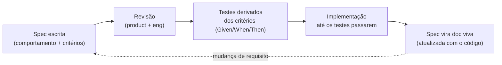

# SPEC-000 — Workflow de Spec-Driven Development

- **Status:** Aceito
- **Data:** 2026-07-19

## O que é Spec-Driven Development (SDD) aqui

No LikHub, **a especificação vem antes do código** e é a fonte da verdade do
comportamento. Uma spec descreve *o que* o sistema faz e *como se verifica que
está certo* — não *como está implementado* (isso é papel do C4 e das ADRs).

## Estrutura de cada spec

Toda spec neste diretório segue o mesmo esqueleto:

1. **Contexto e objetivo** — o problema do usuário e o valor entregue.
2. **User stories** — no formato *Como &lt;papel&gt;, quero &lt;ação&gt;, para &lt;benefício&gt;*.
3. **Critérios de aceitação** — em **Gherkin** (`Dado / Quando / Então`), testáveis.
4. **Contrato de API** — operações GraphQL / eventos envolvidos.
5. **Casos de borda e erros** — o que pode dar errado e o comportamento esperado.
6. **Requisitos não-funcionais** — desempenho, segurança, privacidade, acessibilidade.
7. **Fora de escopo** — o que esta spec *não* cobre.
8. **Rastreabilidade** — links para ADRs e componentes C4 relacionados.

## Convenções

- Critérios de aceitação são **a definição de pronto**. Se não há critério, não há
  como testar — logo, não está especificado.
- Cada critério deve virar ao menos um teste automatizado.
- Specs são versionadas com o código e atualizadas no mesmo PR que muda o
  comportamento.
- IDs são estáveis (`SPEC-00N`); requisitos internos recebem IDs (`AC-1`, `RNF-2`)
  para rastreabilidade em testes e PRs.

## Índice de specs

| ID | Título | Componente C4 principal |
|----|--------|-------------------------|
| [SPEC-001](./SPEC-001-perfil-publico.md) | Página de Perfil Público | [Public Profile Web](../c4/03-component-profile.md) |
| [SPEC-002](./SPEC-002-gestao-de-links.md) | Gestão de Links | [Creator Editor](../c4/04-component-editor.md) |
| [SPEC-003](./SPEC-003-aparencia-e-temas.md) | Aparência e Temas | [Creator Editor](../c4/04-component-editor.md) |
| [SPEC-004](./SPEC-004-analytics.md) | Analytics de Views e Cliques | [Analytics Pipeline](../c4/05-component-analytics.md) |
