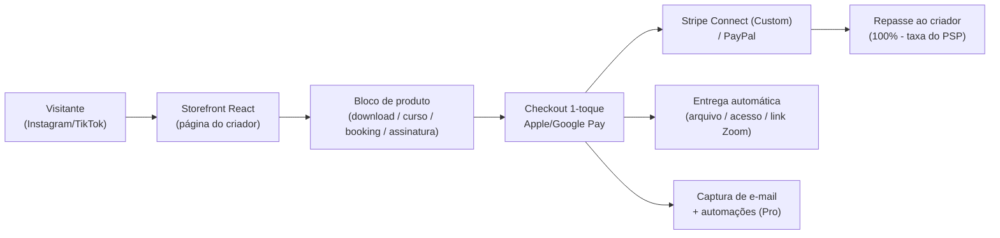

# Engenharia Reversa — Stan Store (stan.store)

> **Nota de contexto (pesquisa p/ ligcentro)**
> Este documento é **pesquisa de mercado** para o **ligcentro** (produto *link-in-bio*,
> concorrente do Linktree, rodando em *free tier*: Vercel + Supabase + Next.js). O
> Stan Store é o principal exemplo de *link-in-bio que virou plataforma de comércio*
> para criadores — o oposto da nossa aposta de MVP enxuto. Serve como **espelho
> estratégico**: mostra até onde a categoria pode ir (vender cursos, coaching,
> memberships) e, principalmente, **o que NÃO precisamos ser agora**. Casa de estilo
> com a engenharia reversa do Linktree em [`./linktree/`](./linktree/).

> **Nota de método (fatos + inferências, julho 2026)**
> O texto separa **fatos observáveis/divulgados** (com fonte em link markdown) de
> **inferências fundamentadas** — sinalizadas explicitamente. A stack *interna* do
> Stan (nomes de serviços, hospedagem, banco) **não é pública**; o que existe é o
> comportamento observável (frontend React, processadores de pagamento) e dados de
> negócio divulgados em perfis de mercado. Trate as linhas de infraestrutura como
> inferência, salvo indicação de fonte. Preços e planos conferidos em julho de 2026.

---

## Posicionamento

O Stan (marca encurtada de "Stan Store") se posiciona como **"your creator store"**:
uma **loja completa que vive no link da bio**, não um mero agregador de links. A
promessa é permitir que o criador **venda direto do Instagram/TikTok** — produtos
digitais, cursos, coaching 1:1, comunidades e assinaturas — sem site externo e sem
mandar o público para um checkout de terceiros ([stan.store](https://www.stan.store/),
[whop.com — o que é o Stan Store](https://whop.com/blog/what-is-stan-store/)).

Três eixos definem o posicionamento:

1. **All-in-one para monetização**, não vitrine de links. Onde o Linktree é
   "descoberta/tráfego", o Stan é "conversão/receita".
2. **Bandeira dos "0% de taxa de transação"**: o criador fica com **100%** do valor
   da venda (fora a taxa do processador). É o principal diferencial de marketing
   contra marketplaces que cobram *take rate* (Gumroad, Whop, Patreon)
   ([sacra.com/c/stan](https://sacra.com/c/stan/)).
3. **Otimizado para o "momento de compra social"**: checkout mobile de 1 toque com
   Apple Pay / Google Pay, pensado para quem chega de um story ou vídeo
   ([hopp.co — review](https://www.hopp.co/post/what-is-stan-store)).

Modelo de negócio: **SaaS por assinatura** (US$29–99/mês), **sem comissão sobre GMV**.
Fundado em 2020 por John Hu e Vitalii Dodonov; ~US$5M de *seed* da Forerunner (2022);
~US$35M de ARR em 2025, ~80.000 criadores ativos, +US$100M de GMV acumulado, e
>50% do GMV vem de *downloads* digitais de US$4–30 ([sacra.com/c/stan](https://sacra.com/c/stan/)).

---

## Stack tecnológica observada

> A stack **de produto** (front) é parcialmente observável; a stack **de
> infraestrutura** (back/hospedagem/banco) **não é divulgada** e aparece abaixo como
> inferência fundamentada, coerente com um SaaS *capital-light* de ~US$35M ARR.

| Camada | Tecnologia | Como se sabe / inferência |
|--------|-----------|---------------------------|
| Frontend | React (SPA "React-first") | **Fato observável**: descrições de mercado tratam o storefront como app React; comportamento de página cliente-renderizada ([ecomm.design](https://ecomm.design/what-is-stan-store/)) |
| Renderização | App interativo (CSR) + páginas mobile-first | *Inferência fundamentada*: foco em app de loja, não em SEO/SSR pesado (SEO é ponto fraco reconhecido) |
| Backend / API | API HTTP para catálogo, pedidos, agendamentos, e-mail | *Inferência fundamentada*: não divulgado; poderia ser Node/Rails/Python — sem confirmação pública |
| Banco de dados | Relacional (pedidos/assinaturas) + storage de mídia | *Inferência fundamentada*: e-commerce de assinatura exige consistência transacional |
| Hospedagem / CDN | Nuvem pública + CDN (provável AWS/Cloudflare) | *Inferência fundamentada*: sem confirmação em fontes públicas; nenhuma página de engenharia divulgada |
| **Pagamentos (core)** | **Stripe** e **PayPal** como processadores | **Fato**: usuário conecta Stripe/PayPal na configuração ([help.stan.store — integrar Stripe/PayPal](https://help.stan.store/article/258-how-to-integrate-stan-with-stripe-or-paypal)) |
| **Pagamentos (arquitetura)** | **Stripe Connect** — conta **Custom** gerenciada pelo Stan | **Fato**: ao conectar, cria-se "a new Custom Stripe account managed by Stan" ([help.stan.store — conectar Stripe](https://help.stan.store/article/7-how-to-connect-stan-with-stripe)) |
| Checkout | 1-toque, Apple Pay / Google Pay | **Fato/observável**: destacado como diferencial de conversão ([hopp.co](https://www.hopp.co/post/what-is-stan-store)) |
| Agendamento | Booking nativo + geração automática de link Zoom | **Fato**: substitui Calendly para coaching 1:1 ([hopp.co](https://www.hopp.co/post/what-is-stan-store)) |
| Vídeo / cursos | Hospedagem de vídeo embutida (course builder básico) | **Fato**: vídeo próprio, sem depender de host externo ([hopp.co](https://www.hopp.co/post/what-is-stan-store)) |
| E-mail marketing | Broadcasts + automações (gated no plano Pro) | **Fato**: recurso do Creator Pro ([schoolmaker.com — pricing](https://www.schoolmaker.com/blog/stan-store-pricing)) |
| IA | "Stanley" — agente de IA (geração de texto, consultas básicas) | **Fato**: recurso recente de *cross-sell* ([sacra.com/c/stan](https://sacra.com/c/stan/), [creatorstackclub](https://www.creatorstackclub.com/software/stan-store)) |

> **Cuidado com colisão de nome**: existe "Stan" (streaming australiano) que usa
> Stripe Billing — **não é** o Stan Store. Fontes sobre esse outro "Stan" foram
> descartadas nesta pesquisa.

---

## Arquitetura e abordagem de produto

O Stan é, na prática, uma **plataforma de comércio para criadores disfarçada de
link-in-bio**. A entrada é a mesma do Linktree (uma página na bio), mas cada "link"
pode ser um **produto vendável** com checkout embutido.

Decisões arquiteturais notáveis (fatos + inferência):

- **Stripe Connect com conta Custom gerenciada pelo Stan** (fato): o Stan orquestra
  o fluxo de dinheiro sem custodiar diretamente — o criador fica dono da conta, mas
  o Stan controla a experiência de checkout e a lógica de produto. É o que permite a
  bandeira "0% de taxa" (a taxa que sobra é a do próprio Stripe/PayPal, ~2,9% + US$0,30).
- **Checkout como diferencial de produto** (fato): 1 toque + carteiras móveis reduz
  fricção no "momento social". Reviews citam ganho de conversão ao migrar de Linktree
  para Stan ([hopp.co](https://www.hopp.co/post/what-is-stan-store)).
- **Verticalização de ferramentas** (fato): booking (substitui Calendly), vídeo
  (substitui host externo), e-mail (substitui ESP básico) — tudo embutido. Reduz o
  número de assinaturas do criador e aumenta o *lock-in*.
- **CSR sobre SEO** (inferência): o produto prioriza app interativo e conversão; SEO
  fraco é aceito porque o tráfego vem das redes sociais, não da busca orgânica.

---

## Modelo de produto e monetização

**Features por categoria de oferta:**

| Categoria | O que vende | Observação |
|-----------|-------------|------------|
| Produtos digitais | e-books, guias, templates, downloads | >50% do GMV, tíquete US$4–30 ([sacra](https://sacra.com/c/stan/)) |
| Cursos / memberships | course builder básico + comunidade | 1 comunidade por loja; sem LMS/avaliações ([group.app](https://www.group.app/blog/stan-store-review/)) |
| Coaching / serviços | agendamento 1:1 + Zoom automático | substitui Calendly; sem portal do cliente |
| Assinaturas | receita recorrente mensal/anual | via Stripe/PayPal |
| Lead / e-mail | captura + automações | automação completa só no Pro |

**Planos, preços e política de taxa (julho/2026):**

| Item | Creator | Creator Pro |
|------|---------|-------------|
| Preço mensal | **US$29/mês** | **US$99/mês** |
| Preço anual | ~US$300/ano (~US$25/mês) | ~US$948/ano (~US$79/mês) |
| Teste grátis | 14 dias | 14 dias |
| **Taxa de plataforma s/ vendas** | **0%** | **0%** |
| Storefront + produtos digitais | Sim | Sim |
| Booking + course builder básico | Sim | Sim |
| Captura de e-mail | Sim | Sim |
| E-mail marketing (broadcasts/automações) | Não | **Sim** |
| Cupons de desconto, upsells, order bumps | Não | **Sim** |
| Programa de afiliados | Não | **Sim** |
| Remoção da marca "Stan" | Não | **Sim** |
| Domínio próprio / analytics avançado | Não | **Sim** |

Fontes de preço/plano: [schoolmaker.com](https://www.schoolmaker.com/blog/stan-store-pricing),
[help.stan.store — Creator vs Creator Pro](https://help.stan.store/article/31-creator-vs-creator-pro),
[stan.store/blog — pricing](https://stan.store/blog/stan-store-pricing/).

> **Política de "0% de taxa" — leitura crítica.** A bandeira é **0% de taxa de
> *plataforma*** sobre as vendas: o criador retém 100% do preço, menos a taxa do
> **processador** (Stripe/PayPal, ~2,9% + US$0,30), que é inevitável em qualquer
> plataforma. O Stan monetiza **na assinatura**, não no GMV — o oposto de Gumroad/
> Whop/Patreon, que cobram *take rate*. *Inferência fundamentada*: para o criador de
> alto volume, US$29–99/mês fixo é muito mais barato que 5–10% do faturamento; é aí
> que mora o apelo. **Nuance histórica**: alguns reviews antigos mencionam uma taxa
> de ~5% no plano base; a comunicação atual (2026) é 0% em ambos os planos — tratar o
> "5%" como estado histórico/legado, não vigente ([hopp.co](https://www.hopp.co/post/what-is-stan-store) vs. [schoolmaker.com](https://www.schoolmaker.com/blog/stan-store-pricing)).

---

## Pontos fortes

- **Proposta de valor clara e afiada**: "venda direto da bio, fique com 100%". Fácil
  de comunicar, difícil de refutar para quem já vende.
- **Modelo de receita alinhado ao criador**: assinatura fixa em vez de *take rate*.
  Quanto mais o criador vende, mais barata fica a plataforma relativamente — cria
  fãs, não ressentimento ([sacra](https://sacra.com/c/stan/)).
- **Checkout de baixíssima fricção**: 1 toque + Apple/Google Pay converte o impulso
  social em compra em segundos ([hopp.co](https://www.hopp.co/post/what-is-stan-store)).
- **All-in-one real**: booking, vídeo, e-mail e comunidade embutidos reduzem o custo
  total de ferramentas do criador e aumentam a retenção.
- **Foco de nicho vencedor**: 100% desenhado para o criador solo mobile-first; não
  tenta ser Shopify. Simplicidade é feature.
- **Tração e eficiência de capital**: ~US$35M ARR, ~40% de margem EBITDA, apenas
  US$5M levantados — validação forte do modelo ([sacra](https://sacra.com/c/stan/)).
- **Motor de crescimento embutido**: programa de afiliados com *revenue share* e
  boca-a-boca no TikTok/Instagram ([sacra](https://sacra.com/c/stan/)).

---

## Pontos fracos e brechas

- **Preço de entrada alto para o iniciante**: US$29/mês **sem** plano gratuito é
  proibitivo para quem ainda não vende nada. Aqui mora a maior brecha para um
  link-in-bio *free* ([creatingawebsitetoday](https://creatingawebsitetoday.com/stan-store-review/)).
- **Customização e branding limitados**: pouca liberdade de layout/tema; a marca
  "Stan" só sai no plano Pro ([hopp.co](https://www.hopp.co/post/what-is-stan-store)).
- **SEO fraco / sem multipágina**: não serve para quem quer presença web orgânica;
  depende 100% do tráfego social ([hopp.co](https://www.hopp.co/post/what-is-stan-store)).
- **Curso ≠ LMS**: course builder só funciona para vídeo autodirigido simples; sem
  avaliações, trilha de progresso ou certificação — não substitui Teachable/Thinkific
  ([group.app](https://www.group.app/blog/stan-store-review/)).
- **Comunidade e coaching rasos**: só 1 comunidade por loja; sem portal do cliente
  para notas/gravações — gestão pós-sessão vira e-mail manual ([group.app](https://www.group.app/blog/stan-store-review/)).
- **Analytics básico, integrações limitadas, limites de arquivo, suporte só por
  e-mail** ([hopp.co](https://www.hopp.co/post/what-is-stan-store)).
- **Sem produtos físicos**: fora do escopo (é digital-only).
- **Muitos recursos essenciais gated no Pro** (US$99): cupons, upsells, automação e
  afiliados só no tier caro — o "0% de taxa" vem acompanhado de *paywall* de features.
- **Dependência de Stripe/PayPal**: disponibilidade geográfica e regras do PSP
  limitam quem pode receber (relevante para o mercado BR do ligcentro — *inferência*).

---

## O que o ligcentro copia / evita / supera

| Aspecto | Postura do ligcentro | Racional |
|---------|----------------------|----------|
| **"0% de taxa de plataforma"** | **COPIA a lição** | É a bandeira mais forte do Stan. Se o ligcentro um dia habilitar venda/PIX, deve monetizar por **assinatura/feature**, nunca por *take rate*. Repassar 100% ao criador é argumento de aquisição imbatível. |
| Plano gratuito de verdade | **SUPERA** | O Stan **não tem free tier** (US$29/mês). O ligcentro nasce *free-first* sobre Vercel+Supabase — o funil de entrada que falta ao Stan. Ganhamos o iniciante que o Stan repele. |
| Checkout de 1 toque / carteiras | **EVITA no MVP** | Ótima ideia, mas exige integração de pagamento madura. Fica no *backlog* pós-MVP; não é foco do agregador de links inicial. |
| **Virar plataforma de cursos/LMS** | **EVITA (decisão firme)** | Ver lição abaixo. Course builder, vídeo hospedado e comunidade explodem custo de storage/banda — inviável no *free tier* e fora do escopo de um link-in-bio. |
| Booking / coaching / Zoom nativo | **EVITA no MVP** | Verticalização cara e de nicho; um bloco "link para Calendly" resolve 90% no MVP. |
| E-mail marketing embutido | **EVITA no MVP** | Custo e complexidade (deliverability, anti-spam) altos; melhor integrar/linkar ferramentas externas por enquanto. |
| Foco mobile-first no criador solo | **COPIA** | O nicho do Stan é o certo. Simplicidade e mobile são features, não limitações. |
| SEO / perfil público indexável | **SUPERA** | O SEO fraco é ponto fraco reconhecido do Stan. Com Next.js + SSR (como no referencial Linktree), o ligcentro entrega descoberta orgânica que o Stan não tem. |
| Branding gratuito sem "paywall" da marca | **SUPERA (tático)** | O Stan cobra US$99 para remover a marca. O ligcentro pode ser mais generoso no free tier como diferencial de aquisição. |
| Verticalização all-in-one | **EVITA** | O poder do Stan (lock-in) é também sua complexidade. O ligcentro compete por **simplicidade + free**, não por profundidade de features pagas. |

> **Lição estratégica nº 1 — o "0% de taxa".** O maior aprendizado não é técnico, é
> de **modelo de receita**: cobrar assinatura fixa e devolver 100% da venda ao criador
> transforma o preço num ativo de marketing. Se/quando o ligcentro monetizar, deve
> seguir esse caminho (assinatura/feature-gating), **jamais** um *take rate* sobre o
> que o criador fatura.

> **Lição estratégica nº 2 — por que NÃO viramos plataforma de cursos no MVP.** O Stan
> mostra o teto da categoria, mas atingi-lo custa caro: cursos, vídeo hospedado,
> memberships e coaching exigem **storage/banda, transcodificação, DRM leve, gestão de
> acesso e suporte** que **estouram qualquer *free tier*** (Vercel + Supabase têm
> limites duros de armazenamento/egress). Além disso, é um **produto diferente** — o
> Stan já perde para Teachable/Thinkific em profundidade de LMS. O ligcentro vence
> sendo o **melhor link-in-bio gratuito e indexável**, não uma imitação rasa do Stan.
> Cursos/venda ficam como **hipótese pós-PMF**, atrás de uma decisão de arquitetura
> própria (ver [`../../implementation-plan/`](../../implementation-plan/)).

---

## Fontes

- [Stan — página oficial](https://www.stan.store/) e [/about](https://www.stan.store/about)
- [stan.store/blog — Stan Store Pricing](https://stan.store/blog/stan-store-pricing/)
- [help.stan.store — Creator vs Creator Pro](https://help.stan.store/article/31-creator-vs-creator-pro)
- [help.stan.store — Como conectar o Stan ao Stripe (conta Custom gerenciada)](https://help.stan.store/article/7-how-to-connect-stan-with-stripe)
- [help.stan.store — Integrar Stripe ou PayPal](https://help.stan.store/article/258-how-to-integrate-stan-with-stripe-or-paypal)
- [Sacra — Stan: receita, ARR, GMV, funding, modelo](https://sacra.com/c/stan/)
- [SchoolMaker — Stan Store Pricing 2026 (planos, taxas)](https://www.schoolmaker.com/blog/stan-store-pricing)
- [Hopp.co — Stan Store Review 2025 (features, prós/contras, checkout)](https://www.hopp.co/post/what-is-stan-store)
- [Group.app — Honest Stan Store Review (limites de curso/comunidade)](https://www.group.app/blog/stan-store-review/)
- [Whop.com — What is Stan Store and how does it work (2026)](https://whop.com/blog/what-is-stan-store/)
- [ecomm.design — What is Stan Store ("React-first")](https://ecomm.design/what-is-stan-store/)
- [creatingawebsitetoday — Stan Store Review 2025](https://creatingawebsitetoday.com/stan-store-review/)
- [Forbes — Stan helps creators sell classes, coaching (2025)](https://www.forbes.com/sites/victoriafeng/2025/08/12/this-startup-helps-creators-sell-classes-coaching-and-more-to-their-fans/)
- [Forerunner Ventures — How John Hu scaled Stan](https://www.forerunnerventures.com/perspectives/how-stan-scaled-to-33m-in-arr-within-two-years-while-building-in-public)
