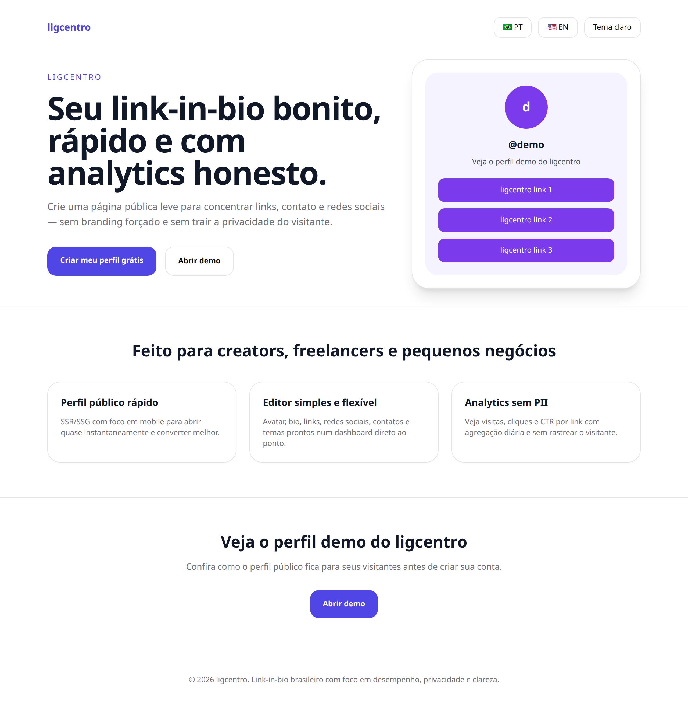
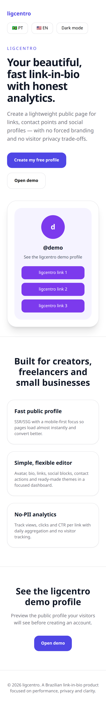

# 01 — Página inicial

A porta de entrada do ligcentro. Apresenta a proposta — uma única URL que reúne todos os seus links — e leva ao cadastro.

## O que dá para fazer aqui

- Ler o que o ligcentro faz antes de criar conta
- Ir para o cadastro pelo botão principal
- Ver um perfil de exemplo em funcionamento

## Outras versões desta tela

Tema escuro (celular)

Tema claro (computador)

Tema escuro (computador)

Em inglês (celular)

---

[← Voltar ao índice](./README.md)
