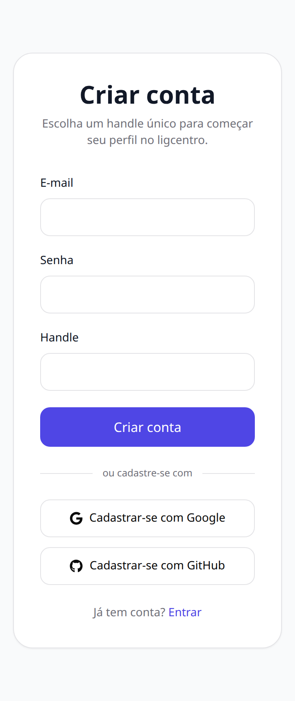
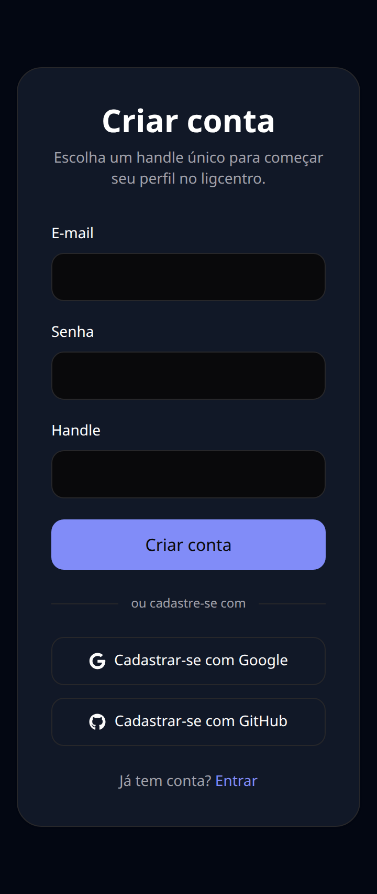
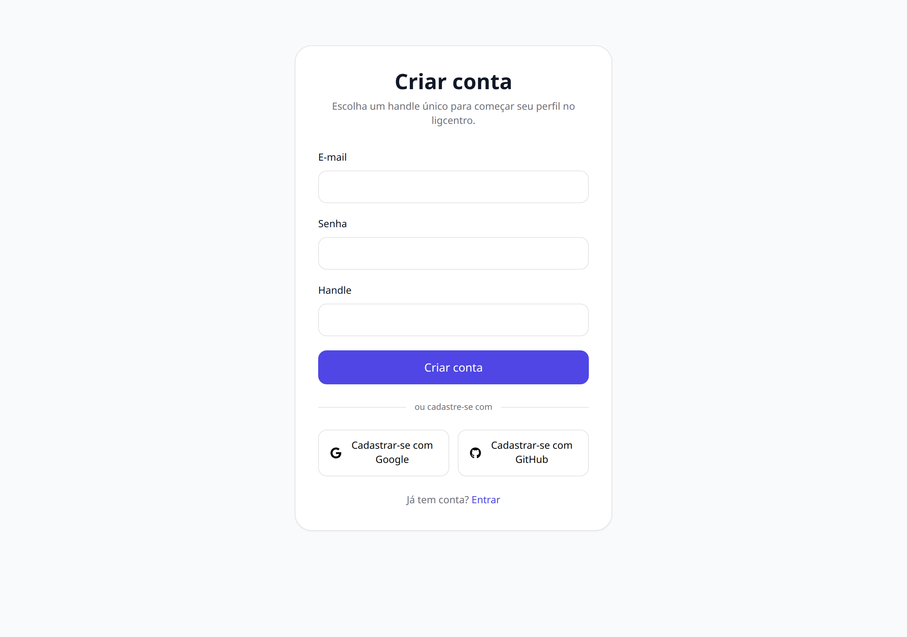
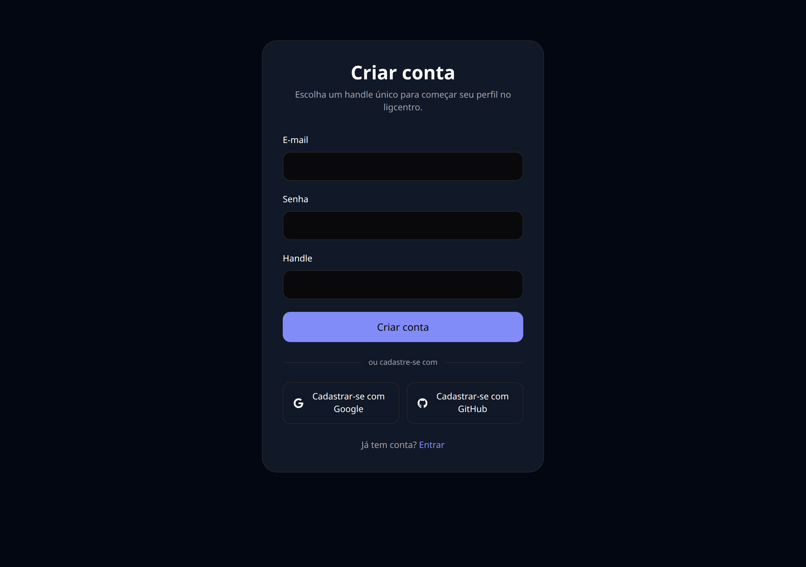
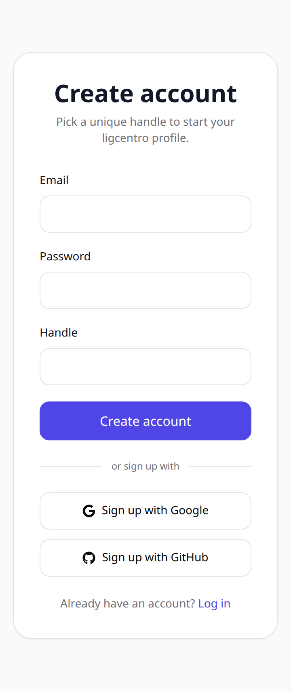

# 02 — Criar conta

Onde a conta nasce. Na mesma tela ficam os dois caminhos: e-mail e senha, ou entrar direto com Google ou GitHub — sem precisar navegar para outra página.

## O que dá para fazer aqui

- Criar conta com e-mail, senha e o handle desejado
- Ver na hora se o handle está disponível, enquanto digita
- Criar conta com Google ou com GitHub, sem preencher formulário
- Ir para a tela de login, se a conta já existir

## Outras versões desta tela

Tema escuro (celular)

Tema claro (computador)

Tema escuro (computador)

Em inglês (celular)

---

[← Voltar ao índice](./README.md)
