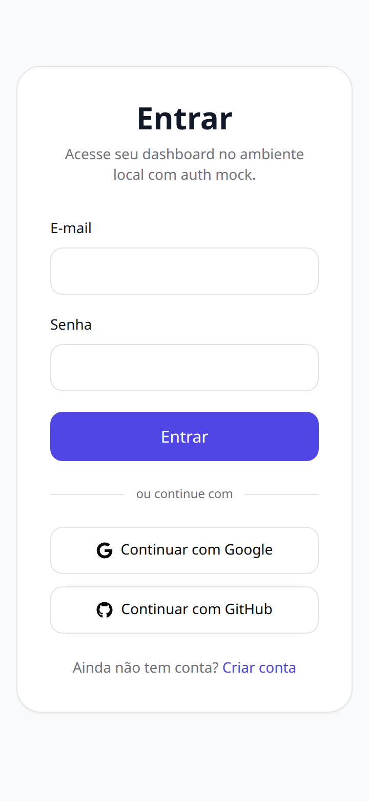
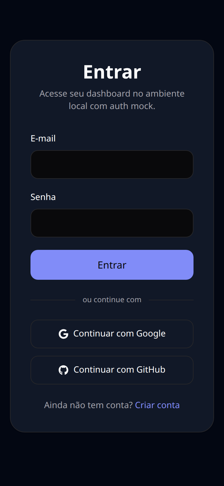
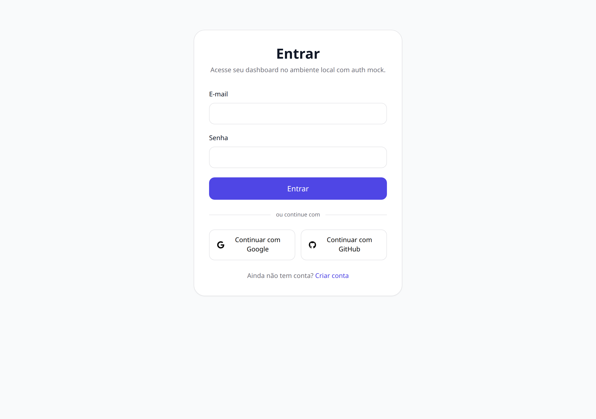
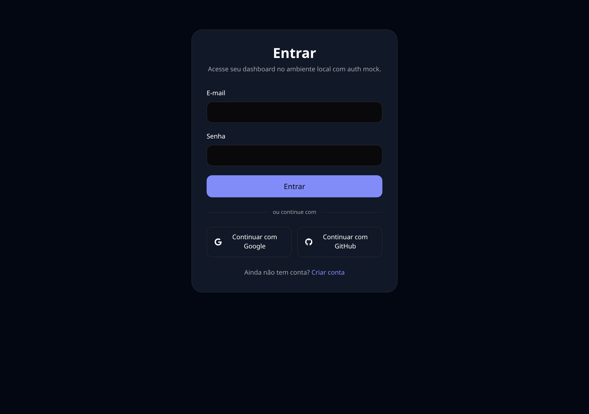
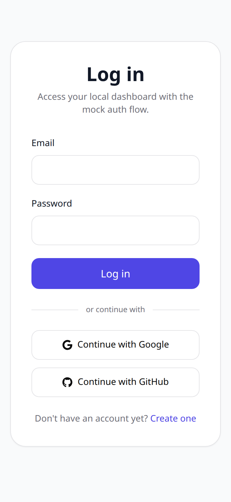

# 03 — Entrar

Retorno de quem já tem conta, pelos mesmos caminhos do cadastro.

## O que dá para fazer aqui

- Entrar com e-mail e senha
- Entrar com Google ou GitHub
- Ir para o cadastro, se ainda não tiver conta

## Outras versões desta tela

Tema escuro (celular)

Tema claro (computador)

Tema escuro (computador)

Em inglês (celular)

---

[← Voltar ao índice](./README.md)
