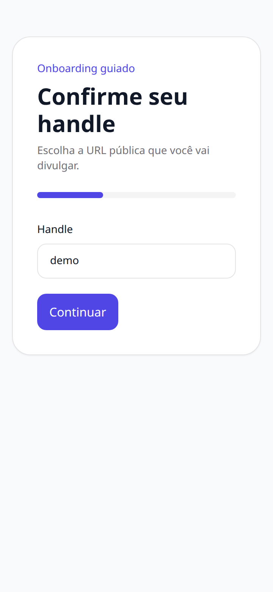
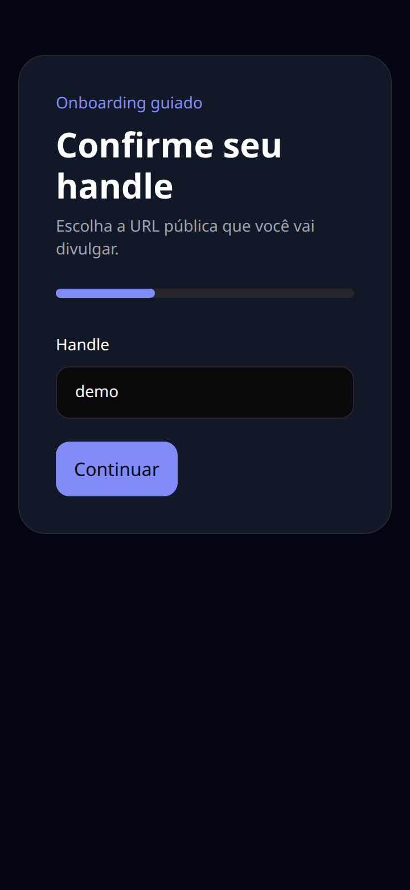
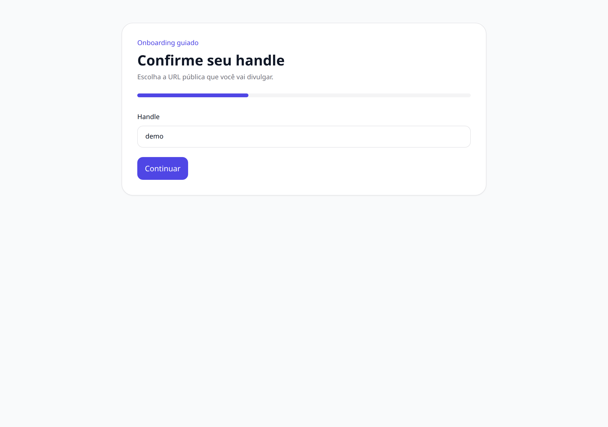
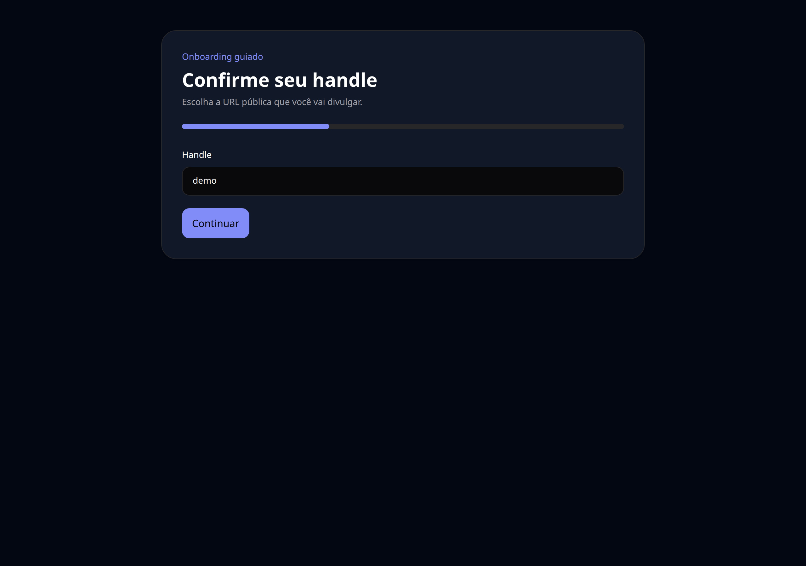
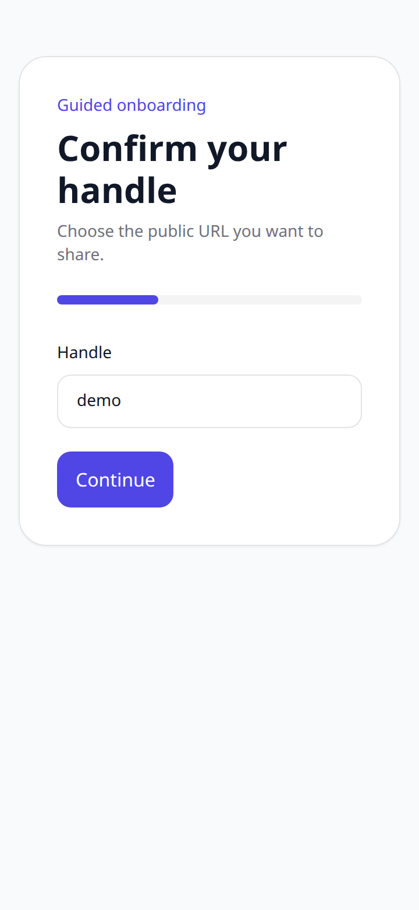

# 04 — Primeiros passos

O guia que aparece logo após o cadastro e leva do zero ao primeiro perfil publicado em poucos passos.

## O que dá para fazer aqui

- Preencher nome e bio do perfil
- Adicionar os primeiros links
- Concluir e cair no editor completo

## Outras versões desta tela

Tema escuro (celular)

Tema claro (computador)

Tema escuro (computador)

Em inglês (celular)

---

[← Voltar ao índice](./README.md)
