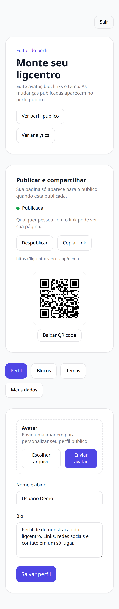
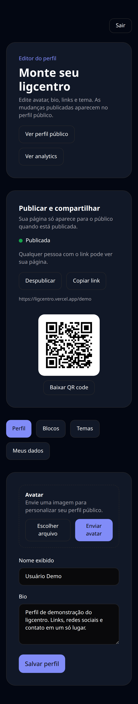
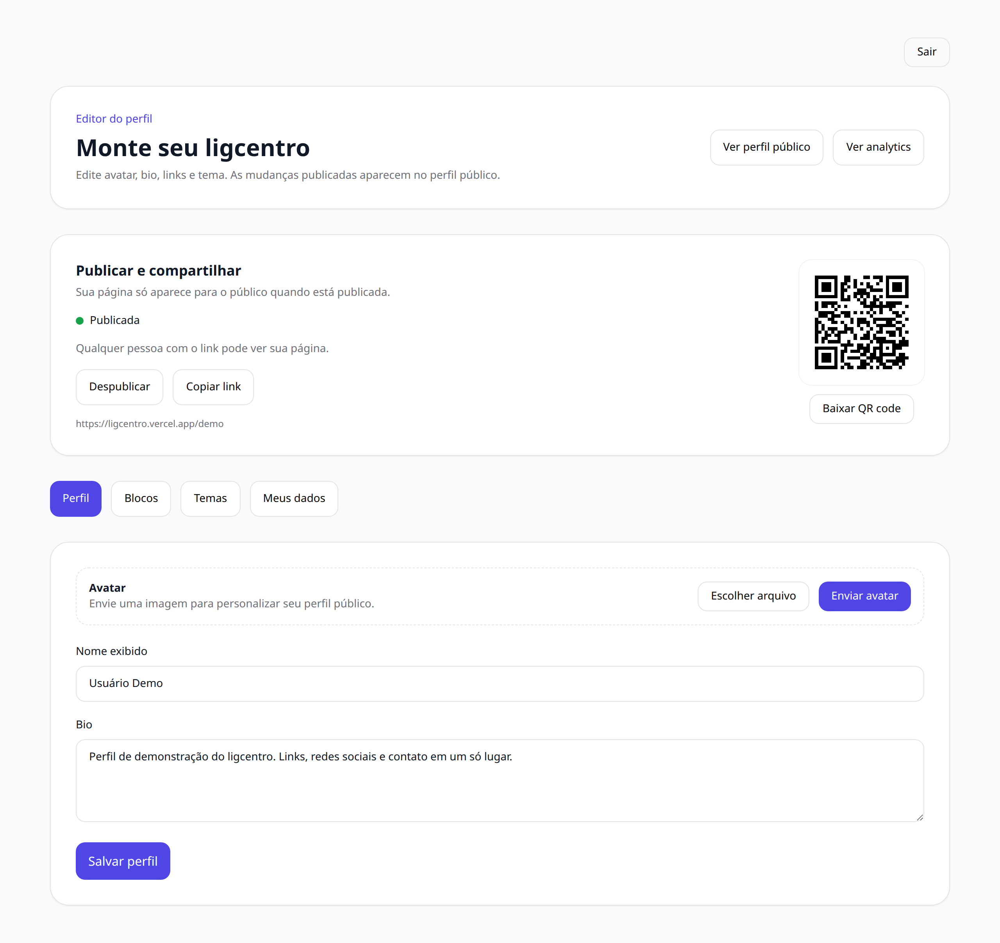
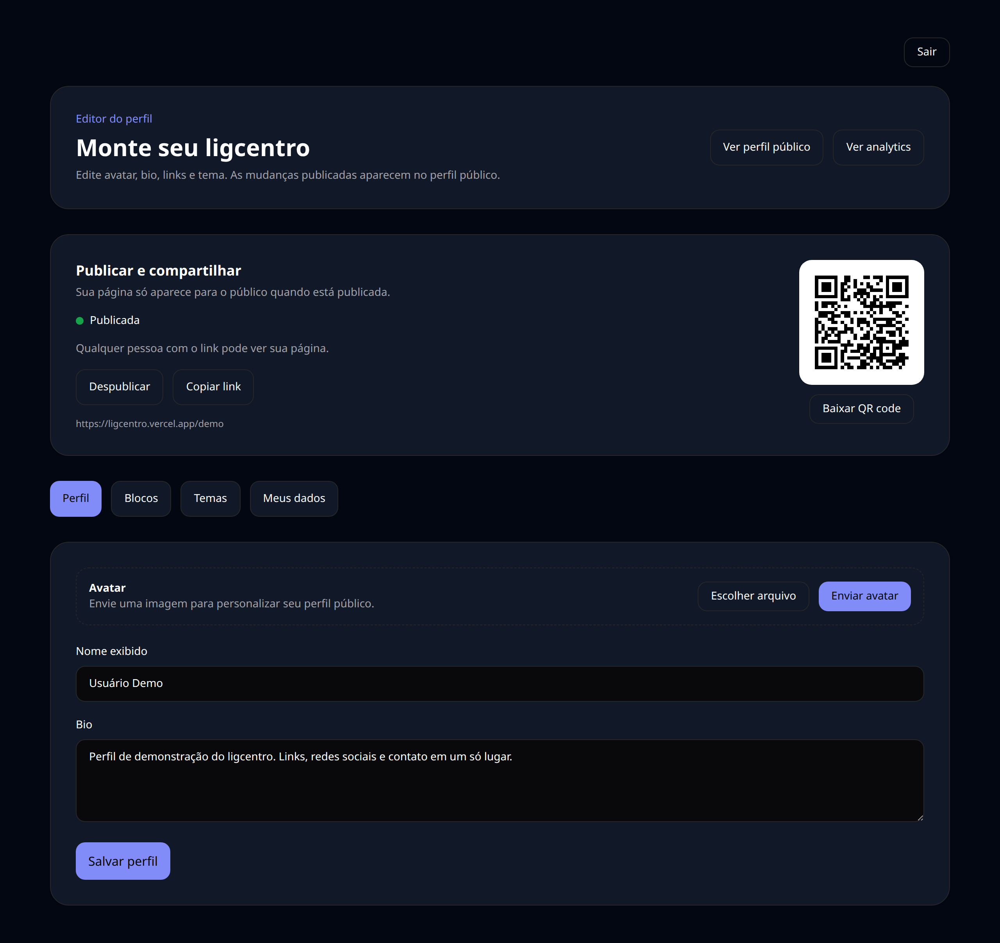
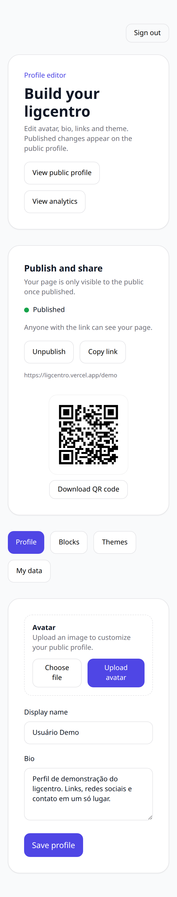

# 05 — Editor — Perfil

O centro do produto. A aba Perfil controla como você aparece: foto, nome exibido e bio.

## O que dá para fazer aqui

- Enviar ou trocar a foto de perfil
- Editar o nome exibido e a bio
- Publicar ou despublicar a página
- Abrir a página pública e compartilhar o QR code

## Outras versões desta tela

Tema escuro (celular)

Tema claro (computador)

Tema escuro (computador)

Em inglês (celular)

---

[← Voltar ao índice](./README.md)
