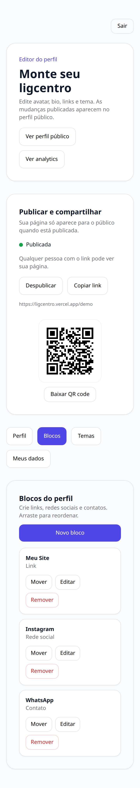
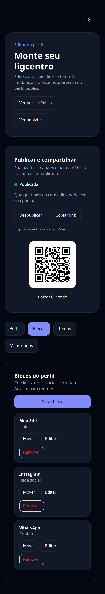
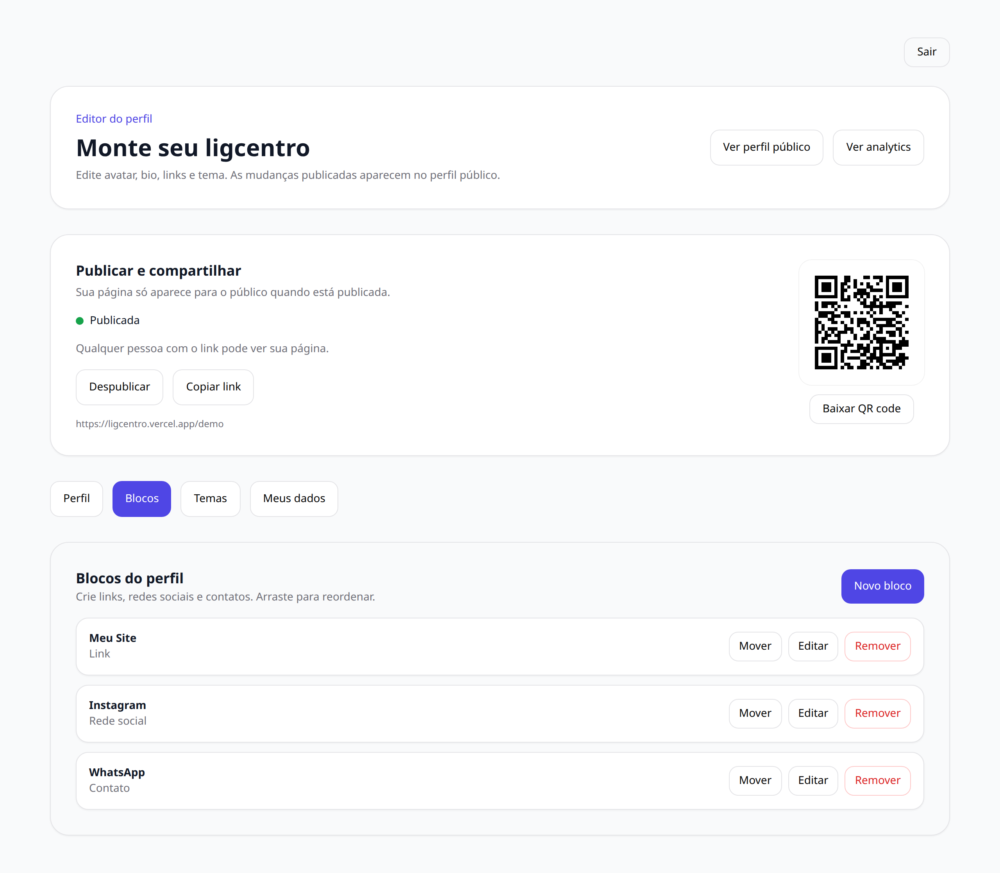
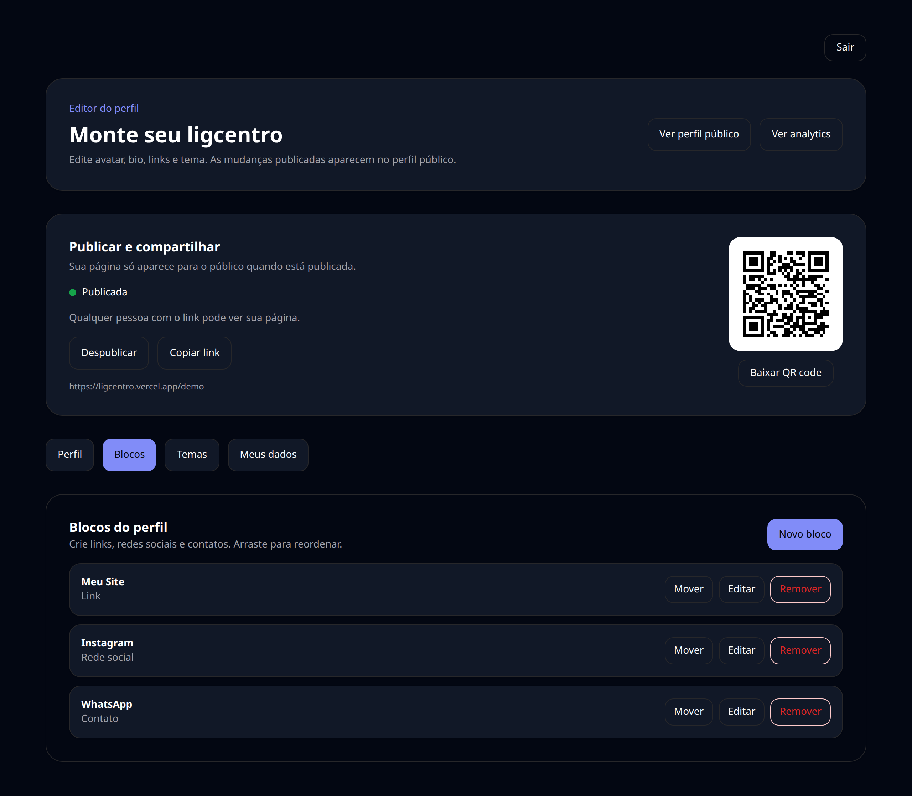
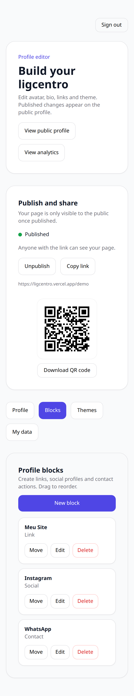

# 06 — Editor — Blocos

A lista de blocos é o conteúdo da sua página: links, redes sociais e formas de contato, na ordem que você definir.

## O que dá para fazer aqui

- Criar bloco de link, de rede social ou de contato
- Reordenar arrastando
- Agendar um link para aparecer ou sumir em uma data
- Editar ou remover um bloco existente

## Outras versões desta tela

Tema escuro (celular)

Tema claro (computador)

Tema escuro (computador)

Em inglês (celular)

---

[← Voltar ao índice](./README.md)
