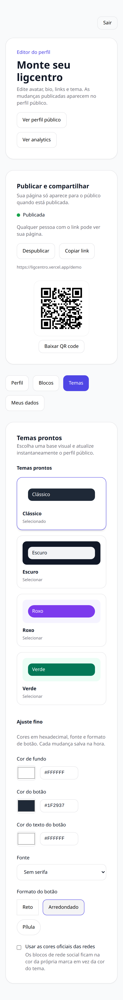
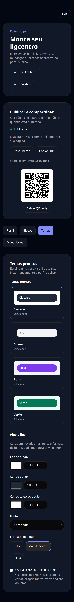
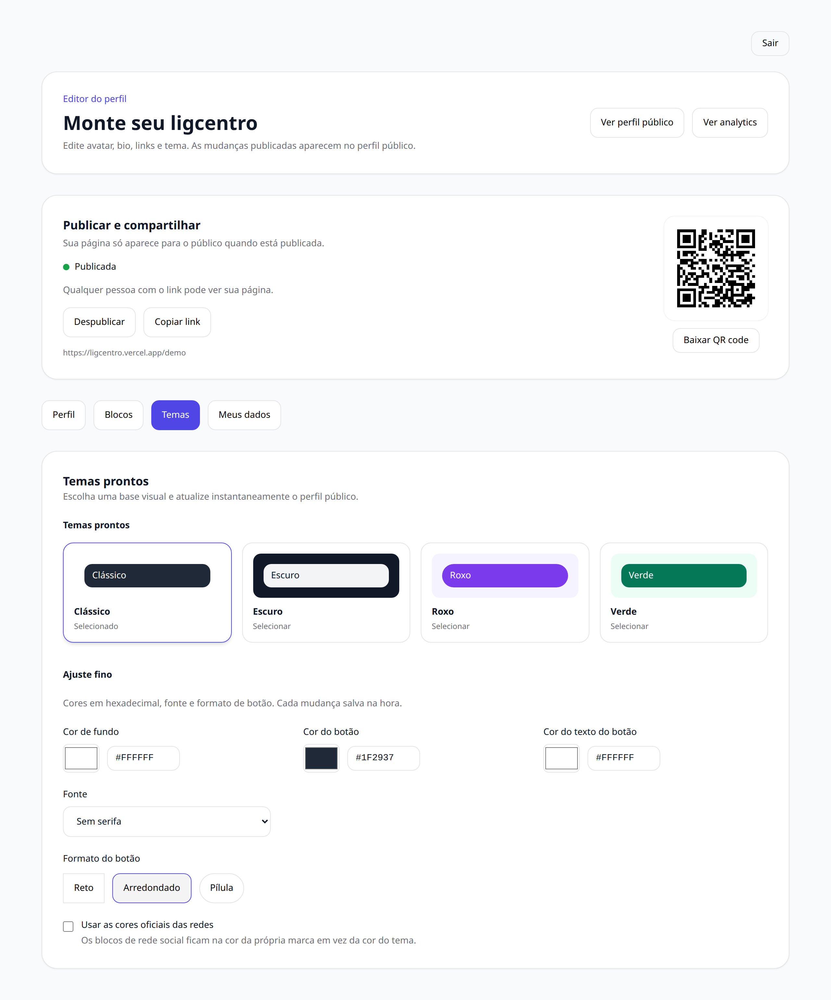
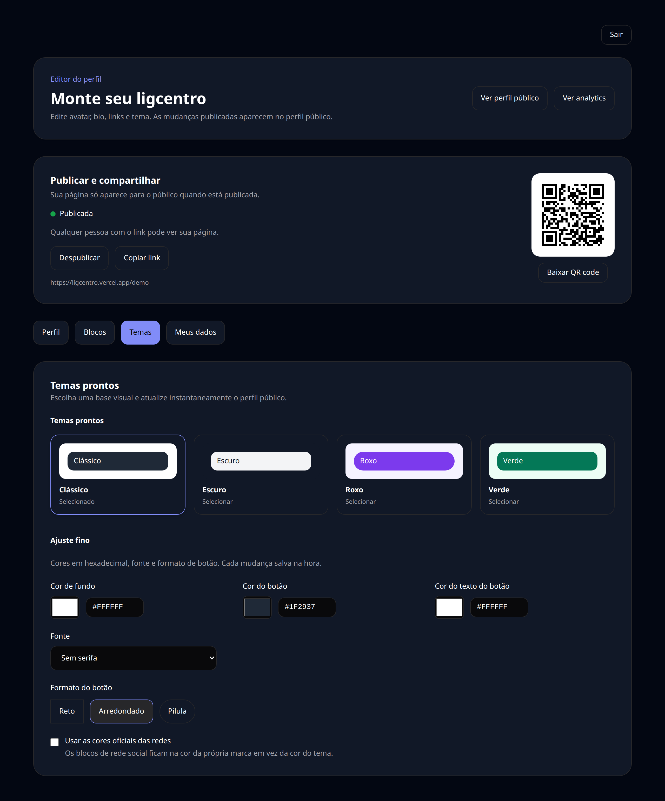
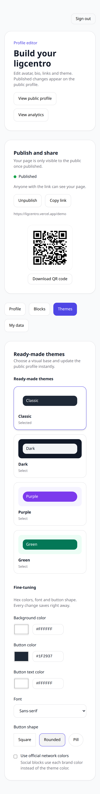

# 07 — Editor — Temas

A aparência da página pública: temas prontos e ajuste fino de cor de fundo, cor de botão, fonte e formato dos botões.

## O que dá para fazer aqui

- Escolher um tema pronto
- Ajustar cor de fundo e cor dos botões
- Trocar a fonte e o formato dos botões
- Usar as cores oficiais de cada rede nos botões sociais

## Outras versões desta tela

Tema escuro (celular)

Tema claro (computador)

Tema escuro (computador)

Em inglês (celular)

---

[← Voltar ao índice](./README.md)
