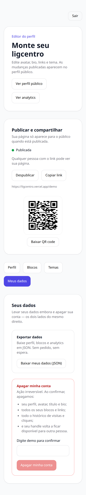
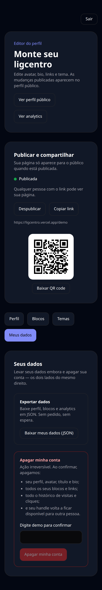
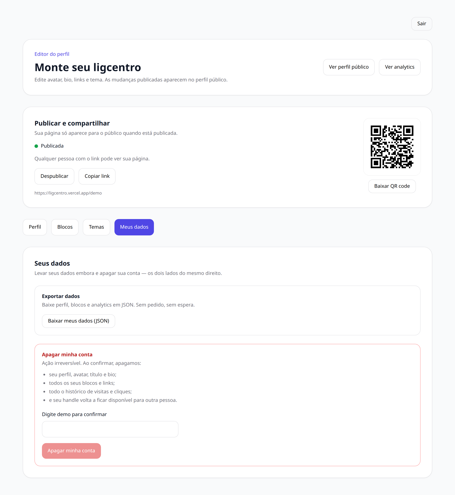
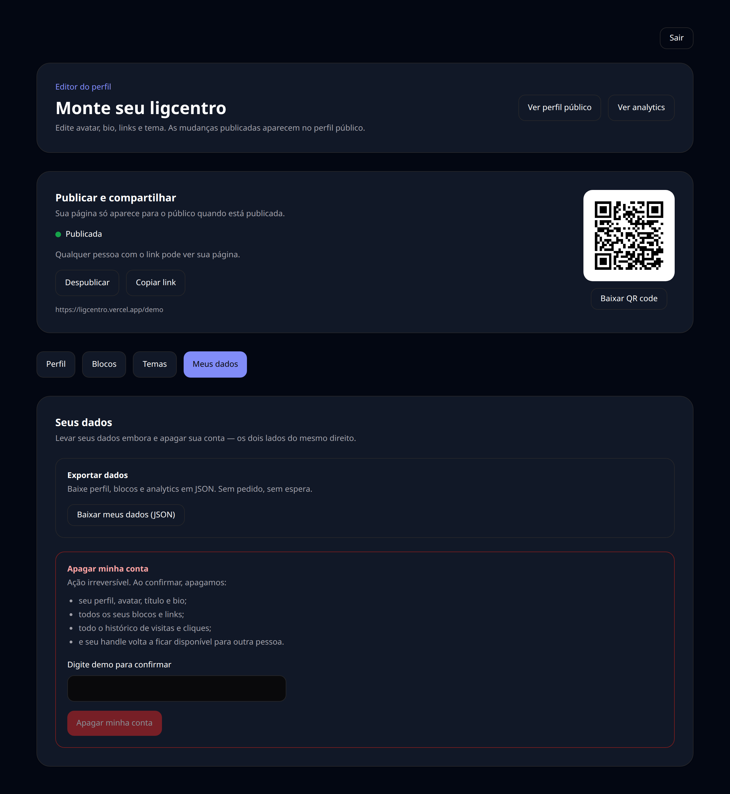
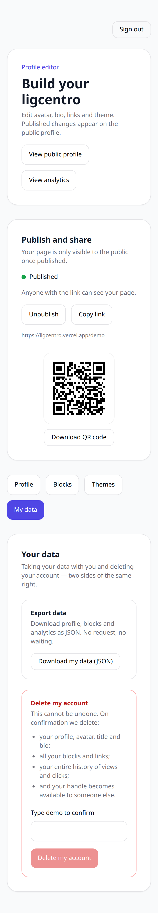

# 08 — Editor — Meus dados

Seus direitos sobre os próprios dados: exportar tudo o que o ligcentro guarda ou apagar a conta de vez.

## O que dá para fazer aqui

- Exportar o perfil e os blocos em JSON
- Excluir a conta e todos os dados associados

## Outras versões desta tela

Tema escuro (celular)

Tema claro (computador)

Tema escuro (computador)

Em inglês (celular)

---

[← Voltar ao índice](./README.md)
