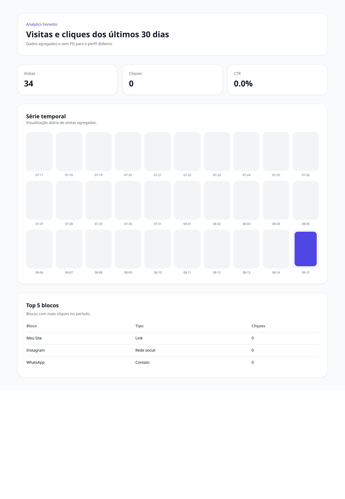
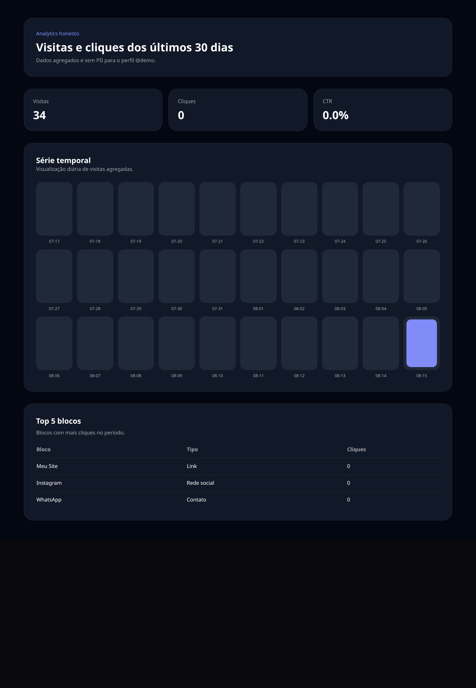

# 09 — Analytics

Quantas visitas e cliques sua página recebeu, e quais links funcionam melhor. Os números são agregados e não identificam quem visitou.

## O que dá para fazer aqui

- Ver visitas, cliques e taxa de clique do período
- Acompanhar a evolução diária no gráfico
- Descobrir os blocos com mais cliques

## Outras versões desta tela

Tema escuro (celular)

Tema claro (computador)

Tema escuro (computador)

Em inglês (celular)

---

[← Voltar ao índice](./README.md)
