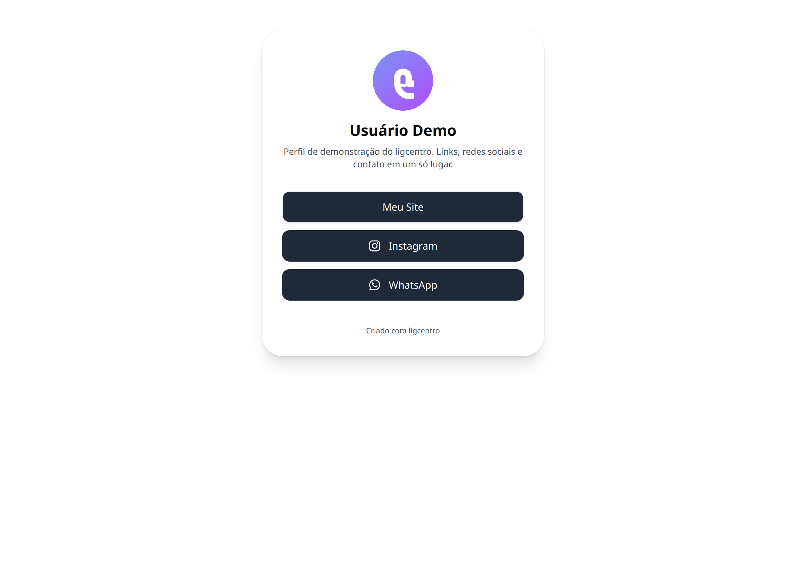
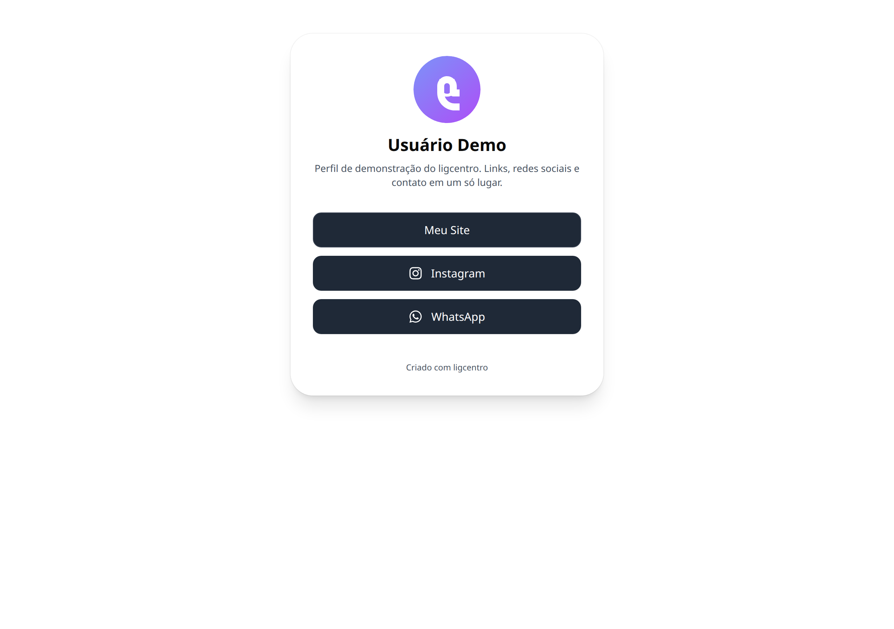
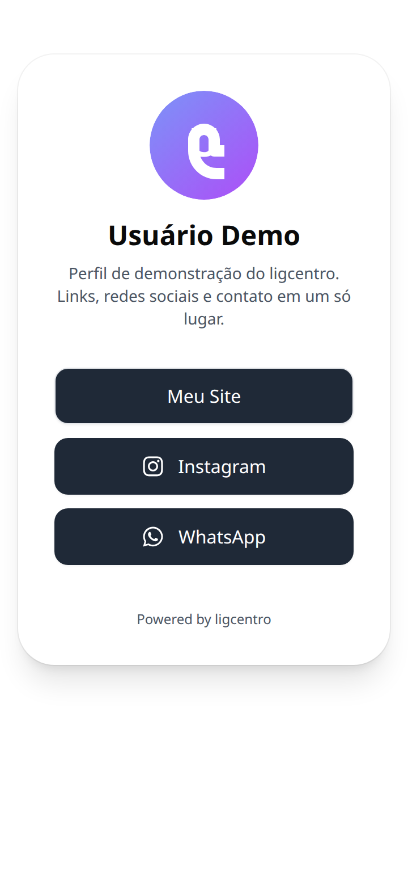

# 10 — Página pública

O que o mundo vê quando abre o seu link. Carrega rápido, funciona bem no celular e usa o tema que você escolheu.

## O que dá para fazer aqui

- Abrir qualquer um dos seus links
- Entrar em contato pelos blocos de contato
- Compartilhar o endereço ou o QR code da página

## Outras versões desta tela

Tema escuro (celular)

Tema claro (computador)

Tema escuro (computador)

Em inglês (celular)

---

[← Voltar ao índice](./README.md)
